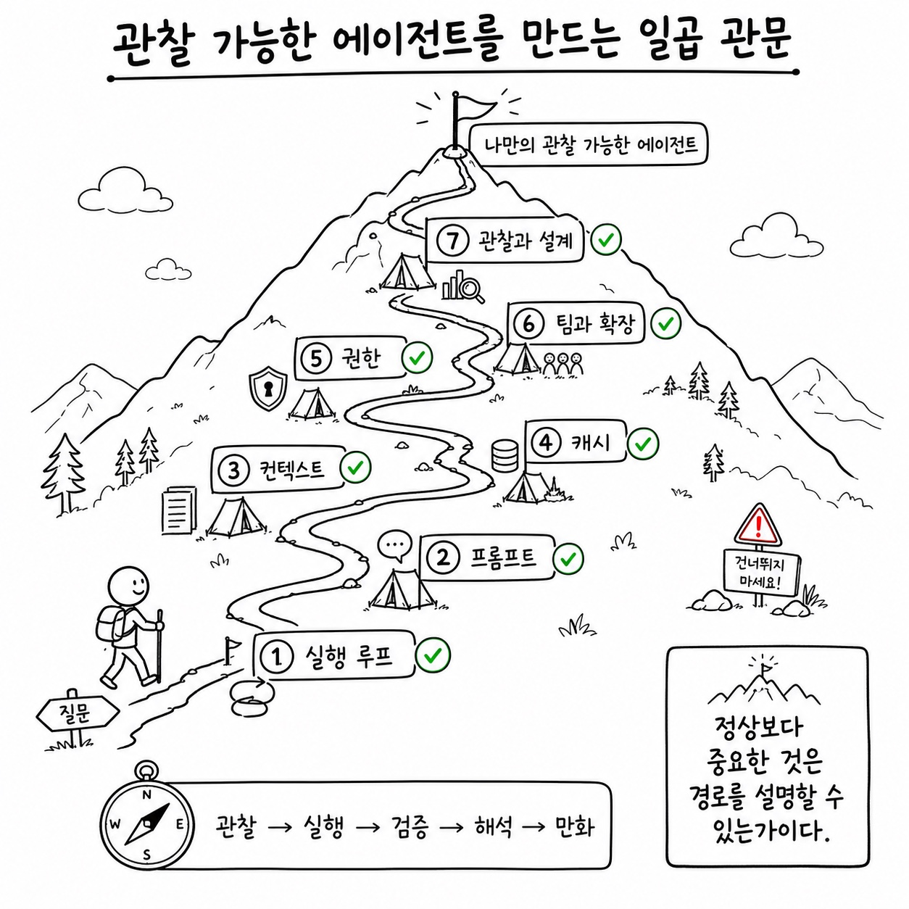
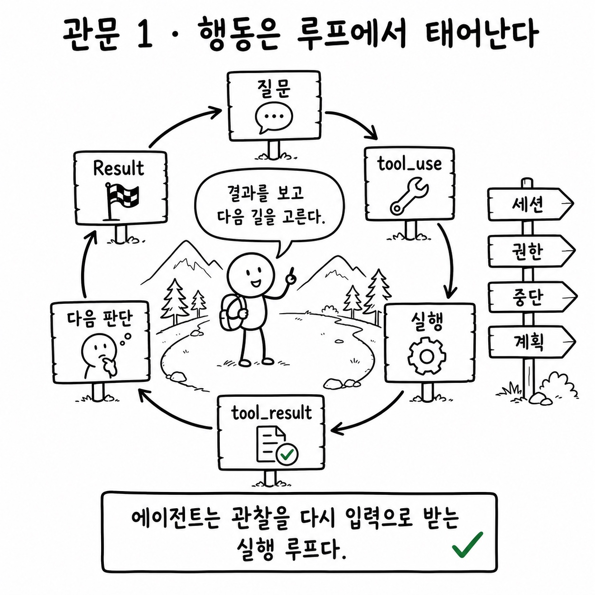
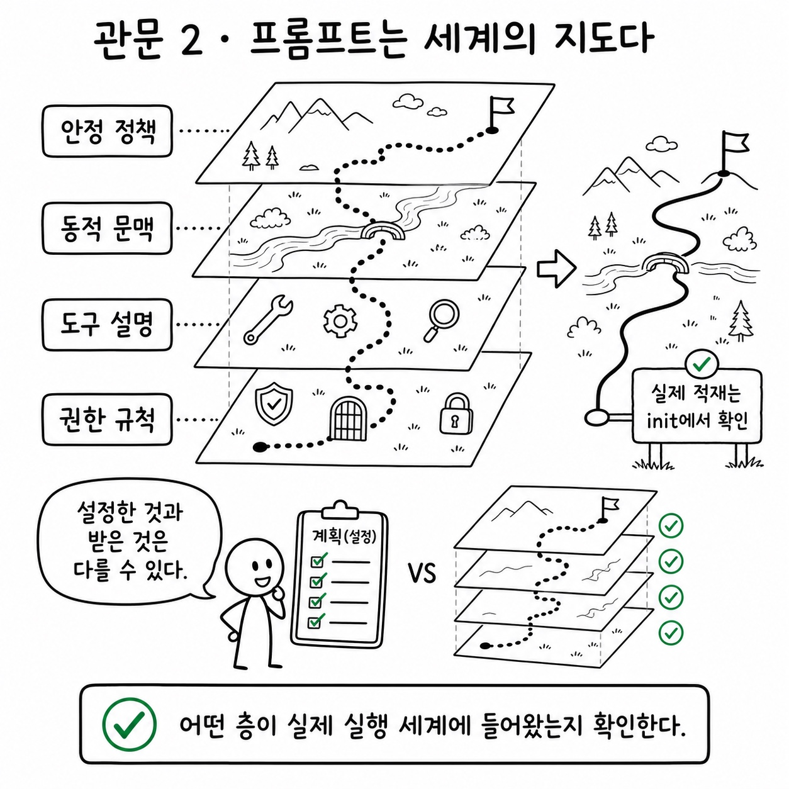
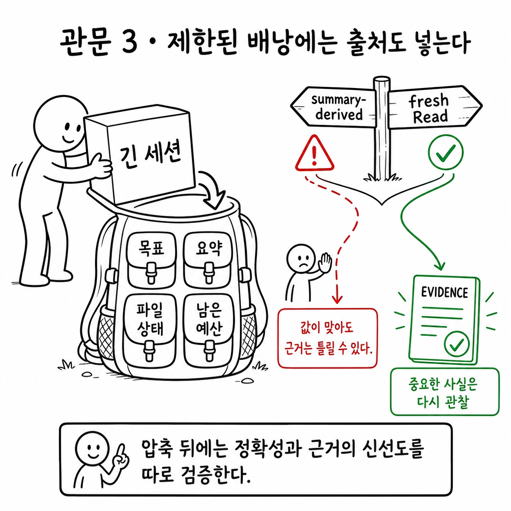
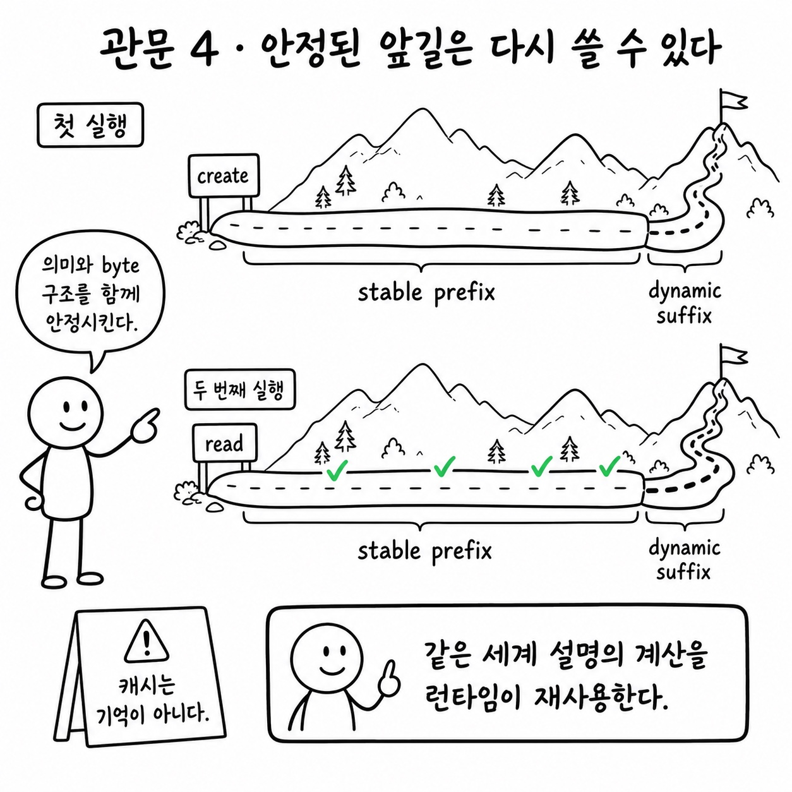
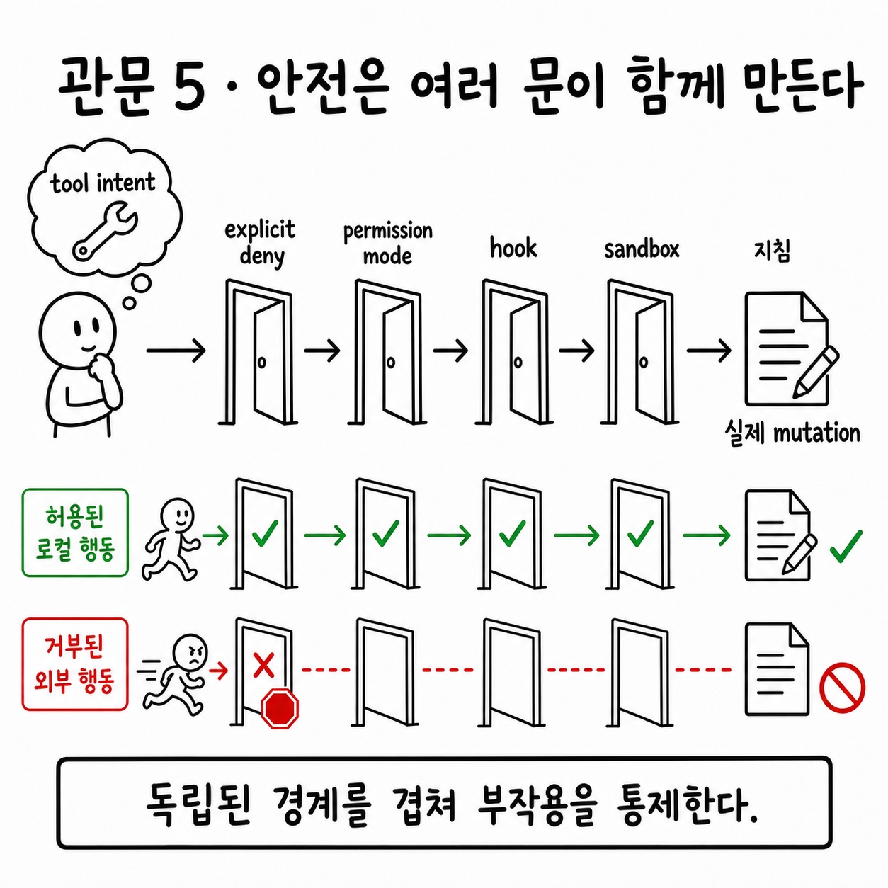
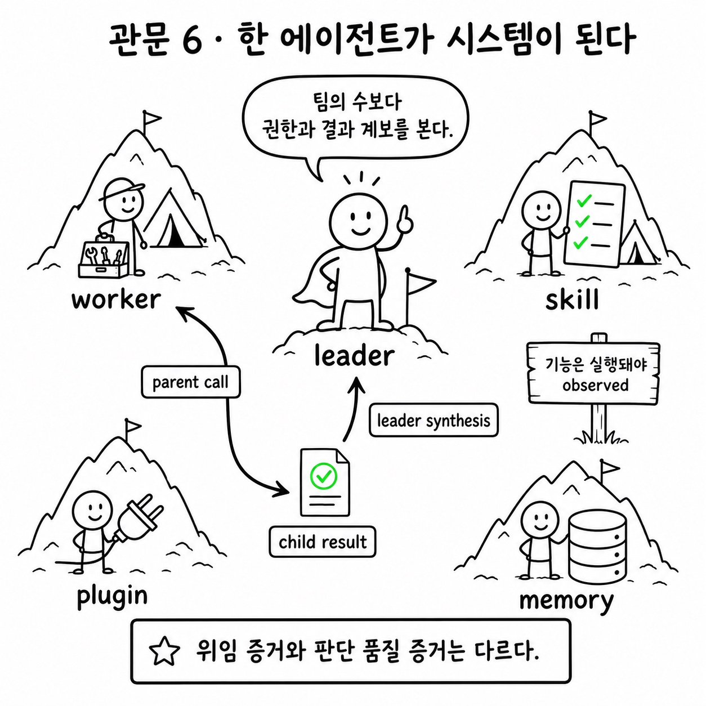
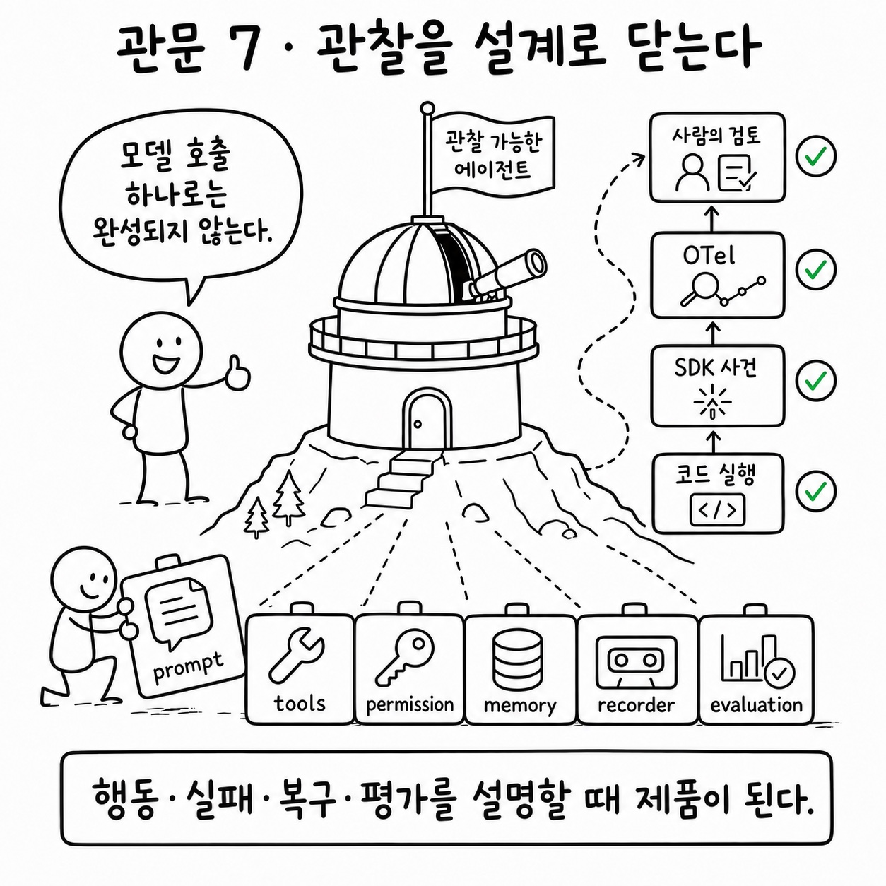

# 책 본문

이 섹션은 한국어 Claude Agent SDK 책의 장 구조를 유지하면서, 각 장을 공개 Python cookbook과 공식 SDK 문서에 맞춰 다시 쓴 공개판입니다.

1장은 수동으로 상세 작성했고, 나머지 장은 `docs/data/book_projection.yml`의 근거와 원문 절 구조를 기반으로 생성했습니다. 각 장은 cookbook 링크, 공식 문서 링크, 공개 경계, 실습 방향을 함께 제공합니다.

<!-- BOOK-SDK-JOURNEY:START -->

## 먼저 보는 전체 등산 지도



이 책의 42개 장은 서로 떨어진 기능 목록이 아니에요. 질문에서 출발해 실행 루프를 이해하고,
프롬프트와 컨텍스트를 설계한 뒤, 캐시와 권한 경계를 지나 팀과 확장 기능을 연결하고,
마지막에는 관찰 가능한 에이전트를 직접 설계하는 하나의 산행입니다.

산길을 걸을 때는 모든 장에서 같은 나침반을 사용합니다.

```text
관찰 -> 실행 -> 검증 -> 1인칭 해석 -> 만화
```

원문의 주장은 출발 지도이고, 직접 실행한 코드는 실제 산길입니다. SDK 사건과 OTel은 어느
길을 걸었는지 보여 주며, 최종 검토는 지도와 현실이 달랐던 지점을 설명합니다. 1인칭 서술과
만화는 숨은 사고 과정을 복원하는 장치가 아니라, 관찰된 행동에서 재구성한 에이전트의 작동
세계를 사람이 다시 볼 수 있게 하는 마지막 단계입니다.

## 이 책의 일곱 관문

아래 일곱 그림은 42개 장을 대신해 결론을 단순화하려는 요약본이 아닙니다. 각 부에서 계속
반복되는 질문을 대표 장 하나에 모은 **산행 표지판**입니다. 먼저 그림으로 전체 방향을 잡고,
의심스러운 경계와 실제 증거는 연결된 대표 장과 주변 장에서 다시 확인하세요.

### 관문 1: 실행 루프 — 1장부터 4b장



[3장 에이전트 루프](part1/ch03.md)를 중심으로 기술 스택, 도구, 권한, 스트리밍, 중단과
플랜 모드를 함께 봅니다. 도구 결과가 다음 판단의 입력이 된다는 순환을 이해하면 제1부의
나머지 구성 요소가 어디에 놓이는지 보이기 시작합니다.

### 관문 2: 프롬프트 제어 — 5장부터 8f장



[5장 시스템 프롬프트 아키텍처](part2/ch05.md)를 중심으로 안정 정책, 동적 문맥, 도구 설명,
스킬·플러그인과 권한 규칙을 겹쳐 봅니다. 사람이 설정했다고 생각한 세계와 `init`에서 실제로
적재된 세계는 다를 수 있다는 점이 이 부의 출발점입니다.

### 관문 3: 컨텍스트와 컴팩션 — 9장부터 12장



[9장 자동 컴팩션](part3/ch09.md)을 중심으로 세션, 파일 상태, 요약과 토큰 예산을 제한된
배낭에 어떻게 보존할지 살펴봅니다. 답의 값이 맞는지와 그 값을 새로 관찰했는지는 별개의
검증 항목입니다.

### 관문 4: 캐시 안정성 — 13장부터 15장



[13장 캐시 아키텍처](part4/ch13.md)를 중심으로 안정된 prefix와 매번 바뀌는 suffix를
분리합니다. 캐시는 모델의 기억이 아니라, 같은 세계 설명을 전달하는 계산을 런타임이 다시
사용하는 인프라입니다.

### 관문 5: 권한과 안전 — 16장부터 19장



[16장 권한 시스템](part5/ch16.md)을 중심으로 명시적 deny, permission mode, hook,
sandbox와 지침을 독립된 경계로 봅니다. 모델의 도구 의도, 호스트의 결정과 실제 부작용은
같은 상태가 아니므로 승인 버튼 하나만으로 안전을 설명할 수 없습니다.

### 관문 6: 팀과 확장 — 20장부터 24장



[20장 에이전트 생성과 오케스트레이션](part6/ch20.md)을 중심으로 worker, skill, plugin,
기능 플래그와 memory를 연결합니다. 팀의 수보다 부모 호출, 자식 실행, 결과 회수와 리더의
종합이 남긴 계보를 먼저 확인해야 합니다.

### 관문 7: 관찰에서 설계로 — 25장부터 30장



[30장 나만의 AI 에이전트 만들기](part7/ch30.md)를 정상으로 삼아 하니스, 프로덕션 패턴,
한계, 텔레메트리와 평가를 하나의 시스템으로 닫습니다. 모델 호출 하나가 아니라 행동, 실패,
복구와 평가를 설명할 수 있는 계약이 완성될 때 비로소 관찰 가능한 에이전트가 됩니다.

<!-- BOOK-SDK-JOURNEY:END -->

## 제1부: 아키텍처

- [1장: AI 코딩 에이전트의 전체 기술 스택](part1/ch01.md)
- [2장: 도구 시스템 — 모델의 손이 되는 40개 이상의 도구](part1/ch02.md)
- [3장: 에이전트 루프 - 사용자 입력에서 모델 응답까지의 전체 생명주기](part1/ch03.md)
- [4장: 도구 실행 오케스트레이션 - 권한, 동시성, 스트리밍, 인터럽트](part1/ch04.md)
- [4b장: 플랜 모드 - 뛰기 전에 살펴보기](part1/ch04b.md)

## 제2부: 프롬프트 엔지니어링

- [5장: 시스템 프롬프트 아키텍처](part2/ch05.md)
- [6장: 프롬프트를 통한 동작 제어](part2/ch06.md)
- [6b장: API 통신 계층 - 재시도, 스트리밍, 성능 저하 대응](part2/ch06b.md)
- [7장: 모델별 튜닝과 A/B 테스트](part2/ch07.md)
- [8장: 마이크로 하니스로서의 도구 프롬프트](part2/ch08.md)
- [8c장: 정적 시스템 프롬프트 - SDK에서 보이는 기본 성격](part2/ch08c.md)
- [8d장: 동적 프롬프트 레이어 - 세션, 메모리, 팀, MCP가 뒤에 붙는 법](part2/ch08d.md)
- [8e장: 도구 설명 프롬프트 - Bash, Read, Grep, Agent는 어떻게 행동을 유도하나](part2/ch08e.md)
- [8f장: 권한/분류기 프롬프트 - 자동 승인, CLAUDE.md prefix, deny 규칙의 숨은 제어 평면](part2/ch08f.md)

## 제3부: 세션과 메시지 관측

- [9장: 자동 컴팩션 - 언제, 어떻게 컨텍스트가 압축되는가](part3/ch09.md)
- [10장: 컴팩션 이후의 파일 상태 보존](part3/ch10.md)
- [11장: 마이크로 컴팩션 - 정밀한 컨텍스트 가지치기](part3/ch11.md)
- [12장: 토큰 예산 전략](part3/ch12.md)

## 제4부: 프롬프트 캐싱

- [13장: 캐시 아키텍처와 브레이크포인트 설계](part4/ch13.md)
- [14장: 캐시 브레이크 감지 시스템](part4/ch14.md)
- [15장: 캐시 최적화 패턴](part4/ch15.md)

## 제5부: 안전성과 권한

- [16장: 권한 시스템](part5/ch16.md)
- [17장: YOLO 분류기](part5/ch17.md)
- [17b장: 프롬프트 인젝션 방어](part5/ch17b.md)
- [18장: 훅 - 사용자 정의 가로채기 지점](part5/ch18.md)
- [18b장: 샌드박스 시스템 - 격리된 실행 환경](part5/ch18b.md)
- [19장: CLAUDE.md - 사용자 지침의 오버라이드 계층](part5/ch19.md)

## 제6부: 고급 서브시스템

- [20장: 에이전트 생성과 오케스트레이션](part6/ch20.md)
- [20b장: 팀과 멀티프로세스 협업](part6/ch20b.md)
- [20c장: Ultraplan - 원격 멀티 에이전트 계획 수립](part6/ch20c.md)
- [21장: Effort, Fast Mode, 그리고 Thinking](part6/ch21.md)
- [22장: Skills 시스템 - 기본 제공에서 사용자 정의까지](part6/ch22.md)
- [22b장: 플러그인 시스템 - 패키징에서 마켓플레이스 확장 엔지니어링까지](part6/ch22b.md)
- [23장: 비공개 기능 파이프라인 - 기능 플래그와 재현 조건](part6/ch23.md)
- [23b장: 기능 플래그의 생명주기 - 실험에서 재현 조건까지](part6/ch23b.md)
- [24장: 세션 간 메모리 - 망각에서 지속적 학습으로](part6/ch24.md)

## 제7부: AI 에이전트 구축자를 위한 교훈

- [25장: 하니스 엔지니어링 원칙](part7/ch25.md)
- [26장: 핵심 역량으로서의 세션과 메시지 관측](part7/ch26.md)
- [27장: 프로덕션급 AI 코딩 패턴](part7/ch27.md)
- [28장: Claude Code의 한계](part7/ch28.md)
- [29장: 옵저버빌리티 엔지니어링 - raw SDK에서 OTel까지](part7/ch29.md)
- [30장: 나만의 AI 에이전트 만들기 - Claude Code 패턴에서 실전까지](part7/ch30.md)

## 부록

- [부록 A: 주요 파일 인덱스](appendix/appendix-a.md)
- [부록 B: 환경 변수 참조](appendix/appendix-b.md)
- [부록 C: 용어집](appendix/appendix-c.md)
- [부록 D: 기능 플래그 전체 목록](appendix/appendix-d.md)
- [부록 E: 버전 진화 로그](appendix/appendix-e.md)
- [부록 F: 엔드투엔드 사례 추적](appendix/appendix-f.md)
- [부록 G: 인증 및 구독 시스템](appendix/appendix-g.md)
- [부록 H: 프롬프트 표면 인덱스](appendix/appendix-h.md)
- [부록 I: 강좌 플러그인 배포 청사진](appendix/appendix-i.md)
- [부록 J: 비공식 프롬프트 자료 독해](appendix/appendix-j.md)
- [부록 K: Fable 5 하니스 독해](appendix/appendix-k.md)
- [부록 L: Fable 5와 Opus 5 비교](appendix/appendix-l.md)
- [부록 M: 프롬프트 버전 진화](appendix/appendix-m.md)
- [부록 N: 비공식 선택 연구 자료](appendix/appendix-n.md)
- [부록 O: TradingAgents 멀티에이전트 금융 워크플로 읽기](appendix/appendix-o.md)
- [부록 P: 공개 GitHub Pages 통합 목차](appendix/appendix-p.md)
