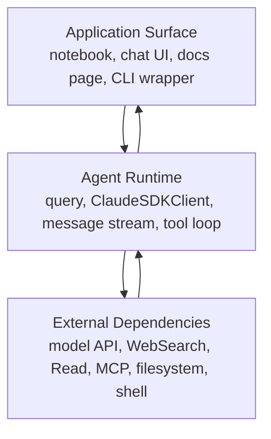

# 1장: AI 코딩 에이전트의 전체 기술 스택

이 장은 Claude Code를 “채팅창이 달린 CLI”로 보지 않고, 여러 계층이 함께 움직이는 실행 시스템으로 읽기 위한 출발점이다. 원래 책의 핵심 문장은 다음 관점으로 공개판에 옮길 수 있다.

> AI 코딩 에이전트는 모델 API 호출 래퍼가 아니라, 사용자 표면, 에이전트 런타임, 도구, 상태, 외부 의존성이 함께 움직이는 작업 운영체제다.

공개 Python cookbook 기준으로 이 문장을 다시 쓰면 더 구체적이다. `claude_agent_sdk`의 `query()`는 한 번의 agent run을 시작하고, `ClaudeSDKClient`는 여러 turn과 도구 결과가 이어지는 대화를 유지한다. `ClaudeAgentOptions`는 모델, 도구, 시스템 프롬프트, 작업 디렉터리, 버퍼 크기 같은 실행 전 조건을 묶는다. agent가 실행되면 assistant message, tool use, tool result, final result가 스트림으로 나오고, UI나 notebook renderer는 그 스트림을 사람이 볼 수 있는 화면으로 바꾼다.

!!! evidence "Cookbook 근거"
    - [`claude_agent_sdk/README.md`](https://github.com/nfbs2000/speaky-claude-cookbooks/blob/main/claude_agent_sdk/README.md)는 Agent SDK 튜토리얼을 `query()`, `ClaudeSDKClient`, `ClaudeAgentOptions`, WebSearch, Read, MCP, hooks, subagents, hosting으로 전개한다.
    - [`claude_agent_sdk/00_The_one_liner_research_agent.ipynb`](https://github.com/nfbs2000/speaky-claude-cookbooks/blob/main/claude_agent_sdk/00_The_one_liner_research_agent.ipynb)는 `query()` 기반의 stateless run과 `ClaudeSDKClient` 기반의 stateful run을 나란히 보여준다.
    - [`claude_agent_sdk/research_agent/agent.py`](https://github.com/nfbs2000/speaky-claude-cookbooks/blob/main/claude_agent_sdk/research_agent/agent.py)는 실제 Python 코드에서 `ClaudeAgentOptions(model=..., allowed_tools=["WebSearch", "Read"], system_prompt=..., max_buffer_size=...)`를 구성하고 `ClaudeSDKClient`로 message stream을 받는다.

!!! evidence "공식 문서 근거"
    - [Agent SDK overview](https://code.claude.com/docs/en/agent-sdk/overview.md)는 Agent SDK가 Claude Code의 도구, agent loop, context management를 Python/TypeScript 라이브러리로 제공한다고 설명한다.
    - [How the agent loop works](https://code.claude.com/docs/en/agent-sdk/agent-loop.md)는 message lifecycle, tool execution, context window를 Agent SDK agent의 핵심으로 다룬다.
    - [Agent SDK Python reference](https://code.claude.com/docs/en/agent-sdk/python.md)는 Python SDK의 공개 API 표면을 확인하는 기준 문서다.

## SDK 관점으로 보기

이 장의 질문은 “공개 SDK 메시지와 cookbook 코드만 보고도 앱 표면, 세션 런타임, 외부 도구가 분리되어 있음을 설명할 수 있는가?”다.

원래 책은 `SDKMessage`, `SDKSystemMessage.init`, `SDKAssistantMessage`, `SDKUserMessage`, `SDKResultMessage` 같은 메시지 관측을 중심에 둔다. Python cookbook에서는 이름이 조금 다르게 드러나지만 구조는 같다. notebook과 agent 파일에서 실제로 보는 것은 다음 네 가지다.

| 책의 관점 | 공개 Python SDK/cookbook 대응 | 의미 |
| --- | --- | --- |
| 실행 전 설정 | `ClaudeAgentOptions` | 모델, 도구, 프롬프트, 버퍼, 권한, 세션 조건을 정한다. |
| 세션 실행 | `query()` 또는 `ClaudeSDKClient` | 한 번의 run 또는 여러 turn의 agent session을 시작한다. |
| 모델 출력 | assistant message, text block, tool use block | 모델이 답하거나 도구 호출을 요청한다. |
| 외부 세계의 결과 | user/tool result message | WebSearch, Read, MCP, Bash 같은 외부 실행 결과가 다시 대화로 들어온다. |
| 종료 상태 | result-bearing message, usage/cost/duration 표시 | run이 끝났고 어떤 비용과 결과를 남겼는지 확인한다. |

이 표만으로도 AI coding agent가 단순 API wrapper가 아니라는 점이 보인다. API wrapper라면 prompt를 보내고 text를 받는 것이 끝이다. Agent SDK run은 시작 조건을 만들고, 도구 표면을 열고, 도구 호출을 수행하고, 결과를 다시 context에 넣고, 최종 결과와 usage를 남긴다.

## 1.1 SDK를 사건으로 다시 보기

책의 첫 번째 전환은 “SDK를 함수 호출이 아니라 사건 흐름으로 읽자”는 것이다. 공개 cookbook에서 가장 작은 사건 흐름은 `00_The_one_liner_research_agent.ipynb`의 `query()` 예제다.

```python
from claude_agent_sdk import ClaudeAgentOptions, query

async for msg in query(
    prompt="Research the latest AI agent trends",
    options=ClaudeAgentOptions(model=MODEL, allowed_tools=["WebSearch"]),
):
    ...
```

이 코드는 겉으로는 짧지만, 실제로는 여러 사건을 만든다.

1. 사용자가 research prompt를 제출한다.
2. `ClaudeAgentOptions`가 모델과 허용 도구를 정한다.
3. SDK가 agent run을 시작한다.
4. assistant가 필요하면 `WebSearch`를 호출한다.
5. search 결과가 다시 message stream에 들어온다.
6. assistant가 최종 요약을 만든다.
7. result와 usage/cost/duration 같은 실행 증거가 남는다.

notebook 출력에는 `Using: WebSearch()` 같은 활동 표시와 result card가 나온다. 이것이 원래 책에서 말한 “runtime event -> message store -> synthesized view -> user-facing surface”의 공개 Python 버전이다. 내부 UI store나 Electron canvas를 몰라도, cookbook은 같은 구조를 notebook cell output과 renderer로 보여준다.

!!! evidence "화면 투영 근거"
    - [`claude_agent_sdk/utils/html_renderer.py`](https://github.com/nfbs2000/speaky-claude-cookbooks/blob/main/claude_agent_sdk/utils/html_renderer.py)는 SDK message list를 사람이 읽을 수 있는 HTML card로 렌더링한다.
    - [`claude_agent_sdk/utils/agent_visualizer.py`](https://github.com/nfbs2000/speaky-claude-cookbooks/blob/main/claude_agent_sdk/utils/agent_visualizer.py)는 agent 활동을 notebook에서 추적하는 보조 도구다.

여기서 중요한 점은 UI가 “답변 텍스트를 예쁘게 보여주는 층”이 아니라는 것이다. UI는 진행 중인 tool use, tool result, final result, usage를 서로 다른 상태로 표시해야 한다. 그렇지 않으면 사용자는 agent가 생각 중인지, 도구를 기다리는지, 권한을 기다리는지, 이미 실패했는지 구분할 수 없다.

## 1.2 실행 전 설정과 세션 시작

원래 책은 세션 시작을 `SDKSystemMessage.init` 전후의 startup boundary로 설명한다. 공개 Python cookbook에서는 이 boundary가 `ClaudeAgentOptions`와 첫 message stream 사이에서 관찰된다.

[`research_agent/agent.py`](https://github.com/nfbs2000/speaky-claude-cookbooks/blob/main/claude_agent_sdk/research_agent/agent.py)의 `send_query()`는 이 구조를 잘 보여준다.

```python
options = ClaudeAgentOptions(
    model=model,
    allowed_tools=["WebSearch", "Read"],
    continue_conversation=continue_conversation,
    system_prompt=RESEARCH_SYSTEM_PROMPT,
    max_buffer_size=10 * 1024 * 1024,
)

async with ClaudeSDKClient(options=options) as agent:
    await agent.query(prompt=prompt)
    async for msg in agent.receive_response():
        ...
```

이 코드에서 agent는 prompt를 받기 전에 이미 다음 실행 조건을 가진다.

- 어떤 모델을 쓸지
- 어떤 도구를 사용할 수 있는지
- 대화를 이어갈지 새로 시작할지
- 어떤 system prompt를 덧붙일지
- 이미지나 큰 tool result를 처리하기 위해 버퍼를 얼마나 둘지

이것이 책에서 말하는 “세션이 첫 응답 전에 이미 실행 조건을 준비한다”는 내용의 공개 SDK 대응이다. 다만 공개판에서는 기능 플래그나 내부 preload를 단정하지 않는다. 대신 Python 코드에서 확인되는 option과 공식 SDK 문서에서 설명하는 session/tool/context surface만 사용한다.

## 1.3 3계층 아키텍처

이 장의 중심 프레임은 세 계층이다.



### 애플리케이션 표면

애플리케이션 표면은 사용자가 직접 만지는 층이다. cookbook에서는 Jupyter notebook이 이 역할을 한다. 사용자는 cell에 prompt를 넣고, 결과 card를 보고, WebSearch가 호출됐는지 확인한다. 나중에 같은 구조는 web app, Slack bot, hosted HTTP API, book canvas로 바뀔 수 있다.

이 층의 책임은 다음과 같다.

- prompt 입력을 받는다.
- 실행 옵션을 선택하게 한다.
- tool progress와 result를 보여준다.
- 최종 artifact를 연결한다.
- 실패나 권한 대기 상태를 사용자에게 설명한다.

`html_renderer.py`와 notebook output은 이 계층이 단순 로그 출력보다 더 구조화되어야 함을 보여준다.

### 에이전트 런타임

런타임 계층은 `query()`와 `ClaudeSDKClient`가 대표한다. 이 층은 모델에게 prompt를 보내는 것만 하지 않는다. message stream을 열고, assistant가 요청한 도구 호출을 처리하고, 도구 결과를 다시 대화에 넣고, 종료 상태를 만든다.

`query()`는 독립적인 한 번의 run에 적합하다. cookbook은 이를 stateless interaction으로 설명한다. 반대로 `ClaudeSDKClient`는 여러 query가 이전 context를 공유해야 할 때 적합하다. `00_The_one_liner_research_agent.ipynb`는 같은 연구 agent를 stateless `query()`와 stateful `ClaudeSDKClient`로 비교한다.

이 구분은 제품 설계에서 중요하다. “한 번 검색하고 요약해 줘”는 `query()`로 충분할 수 있다. “이 차트를 먼저 읽고, 그 다음 결과를 바탕으로 추가 검색해 줘”는 `ClaudeSDKClient`가 더 자연스럽다.

### 외부 의존성

외부 의존성은 모델 바깥의 세계다. WebSearch, Read, MCP server, filesystem, shell, GitHub API, Slack API가 여기에 들어간다. 모델은 외부 세계를 직접 소유하지 않는다. tool call을 만들고, 실행 결과를 message로 돌려받는다.

`research_agent/agent.py`는 `allowed_tools=["WebSearch", "Read"]`만 열어 연구 agent의 세계를 제한한다. 그래서 이 agent는 웹을 검색하고 파일/이미지를 읽을 수 있지만, 임의의 shell command를 실행하는 agent는 아니다. 이 작은 차이가 바로 agent architecture다.

!!! evidence "도구 표면 근거"
    - [`claude_agent_sdk/00_The_one_liner_research_agent.ipynb`](https://github.com/nfbs2000/speaky-claude-cookbooks/blob/main/claude_agent_sdk/00_The_one_liner_research_agent.ipynb)는 `allowed_tools=["WebSearch"]`와 `allowed_tools=["WebSearch", "Read"]`의 의미를 설명한다.
    - [`claude_agent_sdk/02_The_observability_agent.ipynb`](https://github.com/nfbs2000/speaky-claude-cookbooks/blob/main/claude_agent_sdk/02_The_observability_agent.ipynb)는 MCP server를 붙여 Git/GitHub 같은 외부 시스템을 agent runtime으로 연결한다.
    - [Connect to external tools with MCP](https://code.claude.com/docs/en/agent-sdk/mcp.md)는 MCP가 외부 도구를 SDK agent에 연결하는 공개 방식임을 설명한다.

## 1.4 상태는 어디에 남는가

책은 AppState를 `session_id`, 권한 모드, pending tool use, final result 같은 상태 증거로 읽는다. 공개 Python cookbook에서는 같은 개념이 `messages` list, `continue_conversation`, `result`, renderer, session browser로 나타난다.

`research_agent/agent.py`는 response stream에서 모든 message를 `messages` 배열에 모은다. 그리고 `hasattr(msg, "result")`로 최종 result를 꺼낸다. 이후 `display_agent_response(messages)`가 전체 실행을 화면에 투영한다. 즉 상태는 다음 세 곳에 남는다.

| 상태 위치 | cookbook 예 | 의미 |
| --- | --- | --- |
| SDK option | `continue_conversation`, `allowed_tools`, `system_prompt` | 실행 전 조건 |
| message buffer | `messages: list[Any]` | 실행 중 관측된 event history |
| rendered output | `display_agent_response(messages)` | 사용자에게 보여주는 projection |

`05_Building_a_session_browser.ipynb`로 가면 이 생각이 더 명확해진다. session은 단순히 화면에 지나간 로그가 아니라 나중에 list, read, rename, tag, fork, resume할 수 있는 작업 이력이다. 그러므로 에이전트 제품을 만들 때는 “답변만 저장할지”가 아니라 “어떤 message와 tool result를 어느 수준으로 보존할지”를 설계해야 한다.

## 1.5 공개판에서 바꿔 읽어야 하는 것

원래 책의 1장은 강의 화면, SDK 메시지, 내부 feature surface, startup trace를 함께 말한다. 공개 cookbook판에서는 이 중 일부를 조정해야 한다.

| 원래 책의 표현 | 공개판 처리 |
| --- | --- |
| 내부 feature flag나 build flag | 공개 SDK options, loaded tools, skills/plugins 문서로만 설명한다. |
| 특정 내부 startup trace | `ClaudeAgentOptions`와 첫 message stream 사이의 관측 가능한 boundary로 바꾼다. |
| 앱 내부 store 이름 | notebook message buffer, renderer, session browser 같은 공개 예제로 바꾼다. |
| 숨은 사고 과정 | 다루지 않는다. tool call, tool result, final result만 관측한다. |

이 조정은 내용을 약하게 만드는 것이 아니다. 오히려 공개 사용자에게는 더 강한 설명이다. 직접 실행할 수 있는 Python notebook과 agent 파일을 기준으로 삼기 때문이다.

## 학생 실습

첫 실습은 무겁게 시작하지 않는다. `claude_agent_sdk/00_The_one_liner_research_agent.ipynb`에서 WebSearch만 허용한 `query()` 예제를 먼저 본다.

실습 질문:

```text
현재 AI 코딩 에이전트를 세 계층으로 설명해 줘.

1. 사용자가 직접 만지는 애플리케이션 표면
2. 세션과 도구 실행을 조율하는 런타임
3. 모델, 파일 시스템, 웹 검색, MCP 같은 외부 의존성

각 계층마다 cookbook에서 실제로 관찰 가능한 코드나 이벤트를 함께 적어 줘.
```

관찰할 항목:

- `ClaudeAgentOptions`에 어떤 실행 조건이 들어갔는가
- `allowed_tools`가 agent의 행동 범위를 어떻게 제한하는가
- `query()`와 `ClaudeSDKClient`의 차이가 무엇인가
- tool use가 UI에 어떻게 표시되는가
- final result와 usage/cost/duration은 어디에 남는가

## Builder takeaway

1장의 결론은 기술 스택 이름을 외우는 것이 아니다. 핵심은 agent를 세 층으로 분리해서 보는 습관이다.

- 애플리케이션 표면은 prompt를 받고 실행 상태를 보여준다.
- 에이전트 런타임은 message stream과 tool loop를 조율한다.
- 외부 의존성은 tool result로 agent context에 들어온다.

공개 Python cookbook은 이 구조를 실제 코드로 보여준다. `query()` 한 줄도 내부적으로는 도구 권한, message stream, result handling을 포함한 작은 agent runtime이다. `ClaudeSDKClient`로 넘어가면 그 runtime은 여러 turn과 session state를 유지하는 제품 표면으로 확장된다. 따라서 Claude Agent SDK를 배운다는 것은 모델 호출법을 배우는 것이 아니라, 관측 가능하고 통제 가능한 agent 실행 시스템을 설계하는 법을 배우는 것이다.
