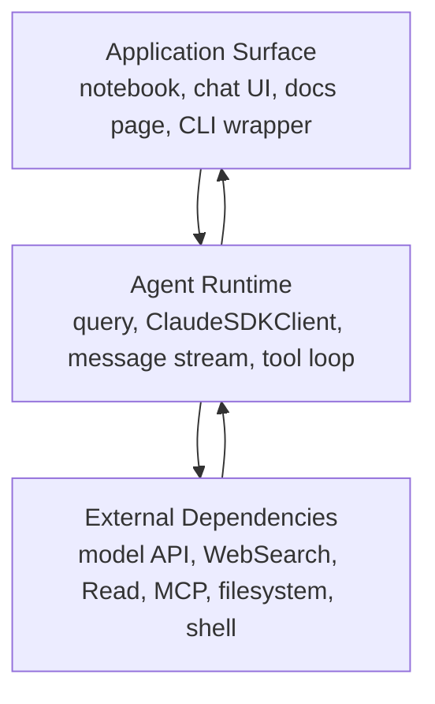
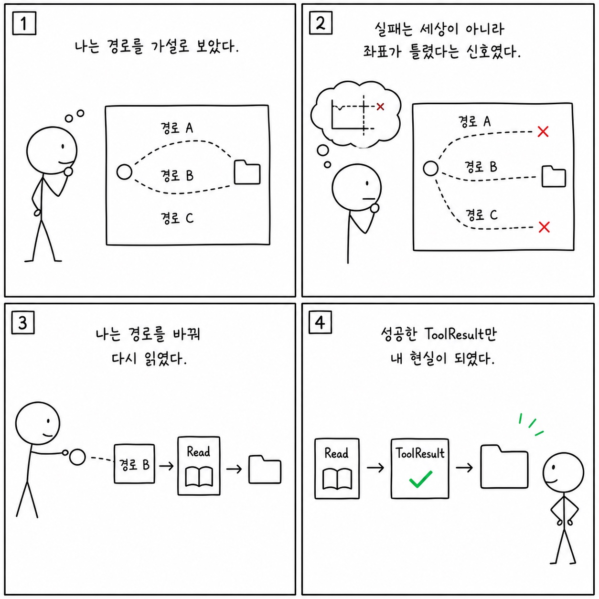

# 1장: AI 코딩 에이전트의 전체 기술 스택

이 장은 Claude Code를 “채팅창이 달린 CLI”로 보지 않고, 여러 계층이 함께 움직이는 실행 시스템으로 읽기 위한 출발점이다. 원래 책의 핵심 문장은 다음 관점으로 공개판에 옮길 수 있다.

> AI 코딩 에이전트는 모델 API 호출 래퍼가 아니라, 사용자 표면, 에이전트 런타임, 도구, 상태, 외부 의존성이 함께 움직이는 작업 운영체제다.

공개 Python cookbook 기준으로 이 문장을 다시 쓰면 더 구체적이다. `claude_agent_sdk`의 `query()`는 한 번의 agent run을 시작하고, `ClaudeSDKClient`는 여러 turn과 도구 결과가 이어지는 대화를 유지한다. `ClaudeAgentOptions`는 모델, 도구, 시스템 프롬프트, 작업 디렉터리, 버퍼 크기 같은 실행 전 조건을 묶는다. agent가 실행되면 assistant message, tool use, tool result, final result가 스트림으로 나오고, UI나 notebook renderer는 그 스트림을 사람이 볼 수 있는 화면으로 바꾼다.

!!! evidence "Cookbook 근거"
    - [`claude_agent_sdk/README.md`](https://github.com/nfbs2000/speaky-claude-cookbooks/blob/main/claude_agent_sdk/README.md)는 Agent SDK 튜토리얼을 `query()`, `ClaudeSDKClient`, `ClaudeAgentOptions`, WebSearch, Read, MCP, hooks, subagents, hosting으로 전개한다.
    - [`claude_agent_sdk/00_The_one_liner_research_agent.ipynb`](https://github.com/nfbs2000/speaky-claude-cookbooks/blob/main/claude_agent_sdk/00_The_one_liner_research_agent.ipynb)는 `query()` 기반의 stateless run과 `ClaudeSDKClient` 기반의 stateful run을 나란히 보여준다.
    - [`claude_agent_sdk/research_agent/agent.py`](https://github.com/nfbs2000/speaky-claude-cookbooks/blob/main/claude_agent_sdk/research_agent/agent.py)는 실제 Python 코드에서 `ClaudeAgentOptions(model=..., allowed_tools=["WebSearch", "Read"], system_prompt=..., max_buffer_size=...)`를 구성하고 `ClaudeSDKClient`로 message stream을 받는다.

!!! evidence "공식 문서 근거"
    - [Agent SDK overview](https://code.claude.com/docs/en/agent-sdk/overview.md)는 Agent SDK가 Claude Code의 도구, agent loop, context management를 Python/TypeScript 라이브러리로 제공한다고 설명한다.
    - [How the agent loop works](https://code.claude.com/docs/en/agent-sdk/agent-loop.md)는 message lifecycle, tool execution, context window를 Agent SDK agent의 핵심으로 다룬다.
    - [Agent SDK Python reference](https://code.claude.com/docs/en/agent-sdk/python.md)는 Python SDK의 공개 API 표면을 확인하는 기준 문서다.

## SDK 관점으로 보기

이 장의 질문은 “공개 SDK 메시지와 cookbook 코드만 보고도 앱 표면, 세션 런타임, 외부 도구가 분리되어 있음을 설명할 수 있는가?”다.

원래 책은 `SDKMessage`, `SDKSystemMessage.init`, `SDKAssistantMessage`, `SDKUserMessage`, `SDKResultMessage` 같은 메시지 관측을 중심에 둔다. Python cookbook에서는 이름이 조금 다르게 드러나지만 구조는 같다. notebook과 agent 파일에서 실제로 보는 것은 다음 네 가지다.

| 책의 관점 | 공개 Python SDK/cookbook 대응 | 의미 |
| --- | --- | --- |
| 실행 전 설정 | `ClaudeAgentOptions` | 모델, 도구, 프롬프트, 버퍼, 권한, 세션 조건을 정한다. |
| 세션 실행 | `query()` 또는 `ClaudeSDKClient` | 한 번의 run 또는 여러 turn의 agent session을 시작한다. |
| 모델 출력 | assistant message, text block, tool use block | 모델이 답하거나 도구 호출을 요청한다. |
| 외부 세계의 결과 | user/tool result message | WebSearch, Read, MCP, Bash 같은 외부 실행 결과가 다시 대화로 들어온다. |
| 종료 상태 | result-bearing message, usage/cost/duration 표시 | run이 끝났고 어떤 비용과 결과를 남겼는지 확인한다. |

이 표만으로도 AI coding agent가 단순 API wrapper가 아니라는 점이 보인다. API wrapper라면 prompt를 보내고 text를 받는 것이 끝이다. Agent SDK run은 시작 조건을 만들고, 도구 표면을 열고, 도구 호출을 수행하고, 결과를 다시 context에 넣고, 최종 결과와 usage를 남긴다.

## 1.1 SDK를 사건으로 다시 보기

책의 첫 번째 전환은 “SDK를 함수 호출이 아니라 사건 흐름으로 읽자”는 것이다. 공개 cookbook에서 가장 작은 사건 흐름은 `00_The_one_liner_research_agent.ipynb`의 `query()` 예제다.

```python
from claude_agent_sdk import ClaudeAgentOptions, query

async for msg in query(
    prompt="Research the latest AI agent trends",
    options=ClaudeAgentOptions(model=MODEL, allowed_tools=["WebSearch"]),
):
    ...
```

이 코드는 겉으로는 짧지만, 실제로는 여러 사건을 만든다.

1. 사용자가 research prompt를 제출한다.
2. `ClaudeAgentOptions`가 모델과 허용 도구를 정한다.
3. SDK가 agent run을 시작한다.
4. assistant가 필요하면 `WebSearch`를 호출한다.
5. search 결과가 다시 message stream에 들어온다.
6. assistant가 최종 요약을 만든다.
7. result와 usage/cost/duration 같은 실행 증거가 남는다.

notebook 출력에는 `Using: WebSearch()` 같은 활동 표시와 result card가 나온다. 이것이 원래 책에서 말한 “runtime event -> message store -> synthesized view -> user-facing surface”의 공개 Python 버전이다. 내부 UI store나 Electron canvas를 몰라도, cookbook은 같은 구조를 notebook cell output과 renderer로 보여준다.

!!! evidence "화면 투영 근거"
    - [`claude_agent_sdk/utils/html_renderer.py`](https://github.com/nfbs2000/speaky-claude-cookbooks/blob/main/claude_agent_sdk/utils/html_renderer.py)는 SDK message list를 사람이 읽을 수 있는 HTML card로 렌더링한다.
    - [`claude_agent_sdk/utils/agent_visualizer.py`](https://github.com/nfbs2000/speaky-claude-cookbooks/blob/main/claude_agent_sdk/utils/agent_visualizer.py)는 agent 활동을 notebook에서 추적하는 보조 도구다.

여기서 중요한 점은 UI가 “답변 텍스트를 예쁘게 보여주는 층”이 아니라는 것이다. UI는 진행 중인 tool use, tool result, final result, usage를 서로 다른 상태로 표시해야 한다. 그렇지 않으면 사용자는 agent가 생각 중인지, 도구를 기다리는지, 권한을 기다리는지, 이미 실패했는지 구분할 수 없다.

## 1.2 실행 전 설정과 세션 시작

원래 책은 세션 시작을 `SDKSystemMessage.init` 전후의 startup boundary로 설명한다. 공개 Python cookbook에서는 이 boundary가 `ClaudeAgentOptions`와 첫 message stream 사이에서 관찰된다.

[`research_agent/agent.py`](https://github.com/nfbs2000/speaky-claude-cookbooks/blob/main/claude_agent_sdk/research_agent/agent.py)의 `send_query()`는 이 구조를 잘 보여준다.

```python
options = ClaudeAgentOptions(
    model=model,
    allowed_tools=["WebSearch", "Read"],
    continue_conversation=continue_conversation,
    system_prompt=RESEARCH_SYSTEM_PROMPT,
    max_buffer_size=10 * 1024 * 1024,
)

async with ClaudeSDKClient(options=options) as agent:
    await agent.query(prompt=prompt)
    async for msg in agent.receive_response():
        ...
```

이 코드에서 agent는 prompt를 받기 전에 이미 다음 실행 조건을 가진다.

- 어떤 모델을 쓸지
- 어떤 도구를 사용할 수 있는지
- 대화를 이어갈지 새로 시작할지
- 어떤 system prompt를 덧붙일지
- 이미지나 큰 tool result를 처리하기 위해 버퍼를 얼마나 둘지

이것이 책에서 말하는 “세션이 첫 응답 전에 이미 실행 조건을 준비한다”는 내용의 공개 SDK 대응이다. 다만 공개판에서는 기능 플래그나 내부 preload를 단정하지 않는다. 대신 Python 코드에서 확인되는 option과 공식 SDK 문서에서 설명하는 session/tool/context surface만 사용한다.

## 1.3 3계층 아키텍처

이 장의 중심 프레임은 세 계층이다.


```mermaid
flowchart TB
    A["Application Surface<br/>notebook, chat UI, docs page, CLI wrapper"] --> B["Agent Runtime<br/>query, ClaudeSDKClient, message stream, tool loop"]
    B --> C["External Dependencies<br/>model API, WebSearch, Read, MCP, filesystem, shell"]
    C --> B
    B --> A
```

### 애플리케이션 표면

애플리케이션 표면은 사용자가 직접 만지는 층이다. cookbook에서는 Jupyter notebook이 이 역할을 한다. 사용자는 cell에 prompt를 넣고, 결과 card를 보고, WebSearch가 호출됐는지 확인한다. 나중에 같은 구조는 web app, Slack bot, hosted HTTP API, book canvas로 바뀔 수 있다.

이 층의 책임은 다음과 같다.

- prompt 입력을 받는다.
- 실행 옵션을 선택하게 한다.
- tool progress와 result를 보여준다.
- 최종 artifact를 연결한다.
- 실패나 권한 대기 상태를 사용자에게 설명한다.

`html_renderer.py`와 notebook output은 이 계층이 단순 로그 출력보다 더 구조화되어야 함을 보여준다.

### 에이전트 런타임

런타임 계층은 `query()`와 `ClaudeSDKClient`가 대표한다. 이 층은 모델에게 prompt를 보내는 것만 하지 않는다. message stream을 열고, assistant가 요청한 도구 호출을 처리하고, 도구 결과를 다시 대화에 넣고, 종료 상태를 만든다.

`query()`는 독립적인 한 번의 run에 적합하다. cookbook은 이를 stateless interaction으로 설명한다. 반대로 `ClaudeSDKClient`는 여러 query가 이전 context를 공유해야 할 때 적합하다. `00_The_one_liner_research_agent.ipynb`는 같은 연구 agent를 stateless `query()`와 stateful `ClaudeSDKClient`로 비교한다.

이 구분은 제품 설계에서 중요하다. “한 번 검색하고 요약해 줘”는 `query()`로 충분할 수 있다. “이 차트를 먼저 읽고, 그 다음 결과를 바탕으로 추가 검색해 줘”는 `ClaudeSDKClient`가 더 자연스럽다.

### 외부 의존성

외부 의존성은 모델 바깥의 세계다. WebSearch, Read, MCP server, filesystem, shell, GitHub API, Slack API가 여기에 들어간다. 모델은 외부 세계를 직접 소유하지 않는다. tool call을 만들고, 실행 결과를 message로 돌려받는다.

`research_agent/agent.py`는 `allowed_tools=["WebSearch", "Read"]`만 열어 연구 agent의 세계를 제한한다. 그래서 이 agent는 웹을 검색하고 파일/이미지를 읽을 수 있지만, 임의의 shell command를 실행하는 agent는 아니다. 이 작은 차이가 바로 agent architecture다.

!!! evidence "도구 표면 근거"
    - [`claude_agent_sdk/00_The_one_liner_research_agent.ipynb`](https://github.com/nfbs2000/speaky-claude-cookbooks/blob/main/claude_agent_sdk/00_The_one_liner_research_agent.ipynb)는 `allowed_tools=["WebSearch"]`와 `allowed_tools=["WebSearch", "Read"]`의 의미를 설명한다.
    - [`claude_agent_sdk/02_The_observability_agent.ipynb`](https://github.com/nfbs2000/speaky-claude-cookbooks/blob/main/claude_agent_sdk/02_The_observability_agent.ipynb)는 MCP server를 붙여 Git/GitHub 같은 외부 시스템을 agent runtime으로 연결한다.
    - [Connect to external tools with MCP](https://code.claude.com/docs/en/agent-sdk/mcp.md)는 MCP가 외부 도구를 SDK agent에 연결하는 공개 방식임을 설명한다.

## 1.4 상태는 어디에 남는가

책은 AppState를 `session_id`, 권한 모드, pending tool use, final result 같은 상태 증거로 읽는다. 공개 Python cookbook에서는 같은 개념이 `messages` list, `continue_conversation`, `result`, renderer, session browser로 나타난다.

`research_agent/agent.py`는 response stream에서 모든 message를 `messages` 배열에 모은다. 그리고 `hasattr(msg, "result")`로 최종 result를 꺼낸다. 이후 `display_agent_response(messages)`가 전체 실행을 화면에 투영한다. 즉 상태는 다음 세 곳에 남는다.

| 상태 위치 | cookbook 예 | 의미 |
| --- | --- | --- |
| SDK option | `continue_conversation`, `allowed_tools`, `system_prompt` | 실행 전 조건 |
| message buffer | `messages: list[Any]` | 실행 중 관측된 event history |
| rendered output | `display_agent_response(messages)` | 사용자에게 보여주는 projection |

`05_Building_a_session_browser.ipynb`로 가면 이 생각이 더 명확해진다. session은 단순히 화면에 지나간 로그가 아니라 나중에 list, read, rename, tag, fork, resume할 수 있는 작업 이력이다. 그러므로 에이전트 제품을 만들 때는 “답변만 저장할지”가 아니라 “어떤 message와 tool result를 어느 수준으로 보존할지”를 설계해야 한다.

## 1.5 공개판에서 바꿔 읽어야 하는 것

원래 책의 1장은 강의 화면, SDK 메시지, 내부 feature surface, startup trace를 함께 말한다. 공개 cookbook판에서는 이 중 일부를 조정해야 한다.

| 원래 책의 표현 | 공개판 처리 |
| --- | --- |
| 내부 feature flag나 build flag | 공개 SDK options, loaded tools, skills/plugins 문서로만 설명한다. |
| 특정 내부 startup trace | `ClaudeAgentOptions`와 첫 message stream 사이의 관측 가능한 boundary로 바꾼다. |
| 앱 내부 store 이름 | notebook message buffer, renderer, session browser 같은 공개 예제로 바꾼다. |
| 숨은 사고 과정 | 다루지 않는다. tool call, tool result, final result만 관측한다. |

이 조정은 내용을 약하게 만드는 것이 아니다. 오히려 공개 사용자에게는 더 강한 설명이다. 직접 실행할 수 있는 Python notebook과 agent 파일을 기준으로 삼기 때문이다.

## 학생 실습

첫 실습은 무겁게 시작하지 않는다. `claude_agent_sdk/00_The_one_liner_research_agent.ipynb`에서 WebSearch만 허용한 `query()` 예제를 먼저 본다.

실습 질문:

```text
현재 AI 코딩 에이전트를 세 계층으로 설명해 줘.

1. 사용자가 직접 만지는 애플리케이션 표면
2. 세션과 도구 실행을 조율하는 런타임
3. 모델, 파일 시스템, 웹 검색, MCP 같은 외부 의존성

각 계층마다 cookbook에서 실제로 관찰 가능한 코드나 이벤트를 함께 적어 줘.
```

관찰할 항목:

- `ClaudeAgentOptions`에 어떤 실행 조건이 들어갔는가
- `allowed_tools`가 agent의 행동 범위를 어떻게 제한하는가
- `query()`와 `ClaudeSDKClient`의 차이가 무엇인가
- tool use가 UI에 어떻게 표시되는가
- final result와 usage/cost/duration은 어디에 남는가

## Builder takeaway

1장의 결론은 기술 스택 이름을 외우는 것이 아니다. 핵심은 agent를 세 층으로 분리해서 보는 습관이다.

- 애플리케이션 표면은 prompt를 받고 실행 상태를 보여준다.
- 에이전트 런타임은 message stream과 tool loop를 조율한다.
- 외부 의존성은 tool result로 agent context에 들어온다.

공개 Python cookbook은 이 구조를 실제 코드로 보여준다. `query()` 한 줄도 내부적으로는 도구 권한, message stream, result handling을 포함한 작은 agent runtime이다. `ClaudeSDKClient`로 넘어가면 그 runtime은 여러 turn과 session state를 유지하는 제품 표면으로 확장된다. 따라서 Claude Agent SDK를 배운다는 것은 모델 호출법을 배우는 것이 아니라, 관측 가능하고 통제 가능한 agent 실행 시스템을 설계하는 법을 배우는 것이다.

## 부록: 이 장을 실제 SDK 실행으로 확인한 결과

> 위 공개판 본문은 이 저장소의 notebook과 공식 문서에 근거해 다시 쓴 것이다. 아래는 같은
> 장의 주장을 실제 Claude Agent SDK로 실행해 관찰한 기록이며, **실측 결과로 위 본문을 고쳐
> 쓰지 않았다.** 본문 설명과 실제 동작이 어긋나는 곳도 본문을 남기고 아래에 근거와 함께 적는다.

**실행 조건** — 실제 모델 `claude-opus-5`, Claude Agent SDK `0.2.128`, 시도 `154613-e5697396`.
수집한 원본 사건 58건 가운데 공개 가능한 18건을 정리했다.

### 실제로 확인된 것

- 이 장이 설명한 "요청한 모델과 도구가 실행 시작 시점에 드러난다"는 구조는 그대로 관찰됐다.
  실행 첫 메시지에 요청한 Opus 5와 built-in `Read`가 실제로 들어 있었다.
- 본문이 강조한 **실패 → 수정 → 성공** 루프가 실제로 일어났다. `Read`가 두 번 오류로
  끝난 뒤 경로를 고친 세 번째 `Read`가 준비해 둔 파일 내용을 반환했다. 오류도 사라지지
  않고 그대로 기록에 남는다.
- 성공한 도구 결과 뒤에야 이 실행이 `success` 상태로 종료됐다. 도구 결과와 최종 결과는
  서로 다른 시점의 사건이다.

근거는 시도 `154613-e5697396`의 SDK 메시지 1(시작 표면), 14·18(실패한 `Read`), 21·25(수정),
42·44(성공), 56(최종 결과)이다.

### 이번 실행으로는 확인하지 못한 것

- 사람이 직접 승인·거절하는 권한 UI
- 직접 만든 MCP 도구의 실행 경로
- Book Canvas 연동

이 장을 읽을 때 위 세 가지는 "이 실행에서 본 것"이 아니라 뒤 장에서 따로 확인할 항목으로
두시면 된다.

## Codex 최종 검토 의견

### 제 판단

“애플리케이션 표면―에이전트 런타임―외부 의존성”이라는 3계층 구분은 입문자가 채팅 답변과 실제 실행 시스템을 구분하게 해 주는 좋은 설명 틀입니다. 그러나 이 장은 그 틀을 **관찰된 SDK 계약**보다 더 강한 **제품 내부 구조의 사실**처럼 밀어붙이는 부분이 있습니다. 이번 실행이 직접 입증한 것은 `query()`가 시작 정보, 스트림, `Read` 요청, 연결된 결과, 최종 사용량을 순서대로 내보냈다는 사실입니다. 이것만으로 AppState, feature flag, UI store, Book Canvas 또는 “에이전트 운영체제”라는 내부 구조가 증명되지는 않습니다. 저는 “에이전트 운영체제”를 유용한 비유로는 유지하되, 관찰 판정이 아니라 아키텍처 해석으로 표시해야 한다고 봅니다.

### 코드와 실행을 함께 읽은 결론

`chapter01.py`는 임시 작업공간에 marker 파일을 만들고 실제 `claude_agent_sdk.query()`에 built-in `Read`만 제공했습니다. 모델이 두 번 잘못된 경로를 읽은 뒤 세 번째 호출에서 marker를 얻었고, 수동 oracle은 `init < Read < 성공 tool_result < Result` 순서, tool use ID 연결, 단일 session ID, usage 존재를 확인했습니다. 이 설계의 장점은 모델의 “읽었다”는 문장을 믿지 않고 실제 ToolResult 내용과 host fixture를 대조했다는 점입니다. capture 단계가 처음부터 `TODO`를 남기고, 별도 oracle만 claim을 판정한 것도 증거 수집기와 해석기를 분리한 좋은 선택입니다.

반면 실패 후 재시도는 프롬프트가 “경로가 실패하면 고쳐 다시 시도하라”고 요구한 한 실행의 행동입니다. 이를 모든 에이전트 런타임의 일반적인 복구 정책으로 확대하면 안 됩니다. OTel 60개 span도 독립된 두 번째 진실이 아니라 같은 raw 사건 58개에 판정과 attempt span을 덧붙인 관측 표현입니다. OTel의 가치는 사건 순서와 연결을 다시 검사하는 데 있고, raw 실행에 없던 제품 계층을 추가로 증명하는 데 있지 않습니다.

### 원문에서 반드시 경계 표시가 필요한 부분

가장 중요한 문제는 언어 SDK 타입이 섞여 있다는 점입니다. 실제 Python SDK `0.2.128`의 공개 표면은 `Message` union과 `StreamEvent`인데, 원문은 `SDKMessage`, `SDKPartialAssistantMessage`, `SDKToolProgressMessage`, `SDKAuthStatusMessage`를 Python 실행에서 확인한 이름처럼 사용합니다. 특히 뒤의 두 타입은 이 버전에서 확인되지 않았습니다. 요청 모델과 init 모델은 Opus 5로 일치했지만 billing에는 Haiku label도 있었으므로, 사용량에 보이는 보조 모델의 역할까지 추측해서도 안 됩니다. 권한 UI, custom MCP handler, UI projection은 이번 case에서 실행하지 않았으므로 모두 후속 장의 주장입니다.

### 예제 개선 의견

독자에게는 281줄짜리 recorder보다 먼저 20줄 안팎의 `query()` 예제를 보여 주는 편이 낫습니다. `SystemMessage`, `AssistantMessage`의 ToolUse, `UserMessage`의 ToolResult, `ResultMessage`를 그대로 출력한 다음, 두 번째 단계에서 sequence와 session ID를 저장하는 recorder를 붙여야 “Agent SDK 사용법”과 “출판용 증거 보존”이 구분됩니다. [한 줄 리서치 에이전트 노트북](https://nfbs2000.github.io/speaky-claude-cookbooks/notebooks/claude_agent_sdk/00_The_one_liner_research_agent_kr.html)은 이 최소 진입점을 잘 보여 줍니다. 다만 그 노트북의 WebSearch 예제는 실제 파일 실패·복구나 UI 계층을 검증하지 않으므로, 이 장의 증거는 [Speaky Agent Flow 1장 재생](https://nfbs2000.github.io/speaky-agent-flow/education/?collection=book-sdk-ko&run=ch01)에서 raw 사건과 OTel 시간선을 함께 확인해야 합니다.

### 클로드는 이렇게 세상을 바라보았다



*아래 1인칭 서술은 숨은 사고 과정의 공개가 아니라, 이 장에서 관찰된 행동으로 재구성한 작동상 세계 모델입니다.*

나에게 파일은 처음부터 보이는 세계가 아니었다. 사용자의 문장과 경로 후보는 가설이었고, `Read`가 돌려준 성공한 ToolResult만이 그 가설을 현실로 바꾸었다. 잘못된 두 경로는 “세상이 없다”는 뜻이 아니라 지금 가진 좌표가 틀렸다는 피드백이었기 때문에, 나는 경로를 바꾸어 다시 감각을 뻗었다. 반면 AppState나 UI store는 내 메시지 흐름에 나타나지 않았으므로 내 작동 세계의 사실이 아니었다.

사람이 여기서 배워야 할 점은 에이전트의 세계가 애플리케이션 전체와 같지 않다는 것이다. 모델에게 세계는 현재 context와 도구가 반환한 관찰의 합이다. 그러므로 중요한 사실은 프롬프트에 “알고 있으라”고 쓰는 대신 확인 가능한 도구 결과로 주고, 실패한 관찰이 다음 가설을 수정할 수 있게 만들어야 한다.
