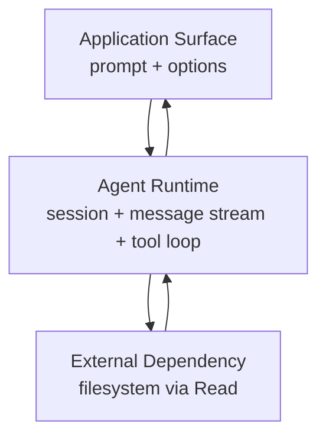

# 1장: AI 코딩 에이전트의 전체 기술 스택 - 사건으로 보는 첫 실행

> 공개 GitHub Pages 투영판: [1장: AI 코딩 에이전트의 전체 기술 스택](https://nfbs2000.github.io/speaky-claude-cookbooks/book/part1/ch01/)

Claude Code를 채팅창이 달린 모델 API로만 보면 중요한 부분을 놓칩니다. 사용자가 요청을 보내는
표면, 세션과 도구를 조율하는 runtime, 파일 시스템 같은 외부 세계가 함께 움직이기 때문입니다.

이 장에서는 이 구조를 이름만으로 설명하지 않습니다. 실제 Python Claude Agent SDK를 한 번
실행하고, 다음 사건이 어떤 순서로 남는지 확인합니다.

```text
configured prompt/options
  -> SystemMessage(init)
  -> StreamEvent
  -> AssistantMessage(ToolUseBlock)
  -> UserMessage(ToolResultBlock)
  -> ResultMessage
```

핵심 질문은 다음과 같습니다.

> 공식 SDK의 공개 사건만으로 host가 구성한 표면, agent runtime, 외부 도구 결과를 구분할 수
> 있는가?

## 1.1 Python SDK의 실제 메시지 타입

Python `claude-agent-sdk==0.2.128`은 `SDKMessage`라는 이름을 export하지 않습니다. 실제 공개
타입은 `Message` union입니다.

```python
from claude_agent_sdk import (
    AssistantMessage,
    ClaudeAgentOptions,
    Message,
    ResultMessage,
    StreamEvent,
    SystemMessage,
    UserMessage,
    query,
)
```

현재 `Message` union은 다음 타입을 포함합니다.

```text
UserMessage
AssistantMessage
SystemMessage
ResultMessage
StreamEvent
RateLimitEvent
```

TypeScript 자료에서 사용하는 `SDKMessage`, `SDKSystemMessage`,
`SDKPartialAssistantMessage` 같은 이름을 Python 타입 이름처럼 쓰면 안 됩니다. 이 책에서는 실제
Python 객체 이름을 사용하고, raw JSONL의 `sdk_message_type`도 그 이름으로 저장합니다.

## 1.2 실제 첫 실행

실험은 임시 workspace에 marker 파일 하나를 만들고 built-in `Read`만 열었습니다. 모델에게 그
파일을 실제로 읽고, 성공한 ToolResult를 받은 뒤에만 marker를 답하도록 했습니다.

```python
options = ClaudeAgentOptions(
    model="claude-opus-5",
    fallback_model=None,
    tools=["Read"],
    allowed_tools=["Read"],
    permission_mode="default",
    max_turns=3,
    cwd=workspace,
    setting_sources=[],
    include_partial_messages=True,
    include_hook_events=True,
)

async for message in query(prompt=prompt, options=options):
    archive_raw(message)
    project_to_otel(message)
```

- accepted attempt: `154613-e5697396`
- trace: `19fd6df325fd194935ad78d6ffafa215`
- session: `b753c43c-3bc0-4b14-9b66-0c961bdef941`
- actual model: `claude-opus-5`
- SDK: `0.2.128`
- CLI: `2.1.220`
- provider concurrency: 1

## 1.3 Configured와 Observed를 분리한다

`ClaudeAgentOptions`는 host가 요청한 조건입니다. 실제 runtime이 그 조건으로 시작했는지는 init
사건을 확인해야 합니다.

| 계층 | 이번 실행의 값 | 증거 |
| --- | --- | --- |
| Configured | model `claude-opus-5` | options |
| Configured | tools/allowed tools `Read` | options |
| Configured | permission mode `default` | options |
| Configured | partial messages enabled | options |
| Observed | init model `claude-opus-5` | raw seq 1 |
| Observed | init tools `[Read]` | raw seq 1 |
| Observed | init permission mode `default` | raw seq 1 |
| Observed | StreamEvent 40개 | raw sequence |
| Observed | 한 session ID | init, stream, assistant, Result |

init에는 이 밖에도 `cwd`, `skills`, `plugins`, `mcp_servers`가 있었습니다. 이번 실행에서 plugin과
MCP server는 빈 목록이었습니다. skill 이름이 init에 나타났다는 사실은 관찰했지만, 그 skill을
실행하거나 기능 전체를 검증한 것은 아닙니다.

## 1.4 세 계층을 사건에 연결한다

이 장의 3계층은 제품 내부 구현을 전부 봤다는 주장이 아닙니다. host 구성과 공개 사건을 읽기
위한 해석 틀입니다.


```mermaid
flowchart TB
    A["Application Surface<br/>prompt + options"] --> B["Agent Runtime<br/>session + message stream + tool loop"]
    B --> C["External Dependency<br/>filesystem via Read"]
    C --> B
    B --> A
```

### Application Surface

이번 실행에서 직접 구성한 표면은 prompt와 options입니다.

- 어떤 과제를 요청했는가
- 어떤 model과 tool을 열었는가
- 어떤 cwd와 permission mode를 사용했는가
- partial stream을 수집할 것인가

채팅 UI, 권한 카드, Book Canvas는 이 실행에 포함되지 않았습니다. 그런 화면은 SDK 사건을
소비하는 별도의 projector가 있어야 만들 수 있습니다.

### Agent Runtime

runtime은 init을 만들고, assistant stream을 진행하고, 도구 요청과 결과를 대화에 연결하고,
terminal Result로 실행을 닫았습니다.

```text
init seq 1
  -> partial stream
  -> Read ToolUse
  -> linked ToolResult
  -> assistant continuation
  -> Result seq 56
```

이 사건 사슬은 모델 호출 하나보다 넓습니다. session ID, tool use ID, 순서, 종료 상태를 runtime이
함께 관리합니다.

### External Dependency

marker 값은 모델의 사전 지식에 없고 임시 파일에만 있었습니다. 모델은 built-in `Read`를 통해
그 값을 받아야 했습니다.

| sequence | 사건 | 결과 |
| ---: | --- | --- |
| 14 -> 18 | 첫 Read 요청과 결과 | 잘못된 경로, error |
| 21 -> 25 | 두 번째 Read 요청과 결과 | 잘못된 경로, error |
| 42 -> 44 | 세 번째 Read 요청과 결과 | 실제 workspace 파일, marker 포함 |
| 56 | terminal Result | success, completed |

세 번째 ToolUse와 ToolResult는 같은 tool use ID를 가졌습니다. 모델의 최종 답변만 보지 않고,
성공 ToolResult가 marker를 실제로 포함했는지 확인했습니다.

## 1.5 실패한 도구 호출도 runtime 상태다

이번 실행에서 처음 두 Read는 실패했지만 전체 run은 실패하지 않았습니다. 모델은 경로를 고쳐
세 번째 Read를 수행했고, 성공 결과를 받은 뒤 terminal Result로 끝났습니다.

```text
tool_result(error)
  -> assistant continues
  -> corrected ToolUse
  -> tool_result(success)
  -> Result(success)
```

따라서 개별 도구 오류와 terminal run 오류를 같은 상태로 취급하면 안 됩니다. UI를 만들 때도
도구별 상태와 전체 run 상태를 분리해야 합니다.

## 1.6 Result는 실행의 영수증이다

seq 56의 `ResultMessage`는 다음 값을 가졌습니다.

| 필드 | 관찰값 |
| --- | ---: |
| subtype | `success` |
| terminal reason | `completed` |
| is error | `false` |
| duration | `10,837ms` |
| API duration | `12,358ms` |
| turns | 4 |
| total cost | `$0.027017` |
| requested model in init | `claude-opus-5` |

billing에는 Opus 5와 Haiku label이 함께 있었습니다. 공개 사건만으로 Haiku의 내부 역할을 알 수
없으므로 추정하지 않습니다.

Result의 성공은 실행이 정상 종료됐다는 증거입니다. 그러나 ToolResult가 실제 marker를
포함했다는 사실까지 대신 증명하지는 않습니다. 두 조건을 따로 검사해야 합니다.

## 1.7 raw와 OTel로 사건을 다시 확인한다

최종 archive에는 raw 사건 58개와 OTel span 60개가 있습니다.

```text
raw 58
  process event 2
  SDK message 56

OTel 60
  process.event 2
  sdk.message 56
  oracle.verdict 1
  proof.attempt 1
```

모든 raw sequence에 OTel carrier가 있었고 missing은 0개였습니다. 모든 span은 trace
`19fd6df325fd194935ad78d6ffafa215`에 속했습니다. raw와 OTel count는 사후 verdict와 root span
때문에 같지 않습니다.

`integrity.json` 대상 5개도 디스크에서 다시 해시해 모두 일치했습니다.

## 1.8 수동 oracle의 판정

이 probe의 capture manifest는 raw 증거를 자동 승인하지 않도록 기술 verdict를 `TODO`로 남기는
초기 recorder 정책을 사용했습니다. 그 뒤 chapter-specific oracle이 immutable raw를 다시 읽어
다음 9개 조건을 판정했습니다.

1. `SystemMessage(subtype=init)`가 있다.
2. 요청 model과 init model이 같다.
3. init tools에 `Read`가 있다.
4. `StreamEvent`가 있다.
5. assistant의 `Read` ToolUse가 있다.
6. 같은 ID의 성공 ToolResult가 fixture marker를 포함한다.
7. terminal Result가 비오류이며 duration과 usage를 가진다.
8. `init < 성공 Read ToolUse < 성공 ToolResult < Result` 순서가 성립한다.
9. 공개 사건의 session ID가 하나로 유지된다.

9개 조건이 모두 통과해 수동 claim 판정은 `OBSERVED`입니다. unit test가 이 주장을 증명한 것이
아니라, 실제 attempt의 raw sequence에 oracle을 적용한 결과입니다.

## 1.9 이번 실행에서 관찰하지 않은 것

| 주장 | 판정 |
| --- | --- |
| built-in Read ToolUse/ToolResult | observed |
| partial stream과 terminal Result | observed |
| init의 model/tool/permission/session 표면 | observed |
| host custom MCP handler | not observed |
| permission callback 또는 권한 대화 상자 | not observed; Read was pre-allowed |
| tool progress 전용 Python message | not observed; current union에도 없음 |
| auth status 전용 Python message | not observed; current union에도 없음 |
| chat/cockpit/Book Canvas UI projection | not executed / TODO |
| AppState 또는 외부 store 구현 | not observed |
| feature flag의 내부 구현 | not observed |
| model 내부 사고 과정 | not observable |

## 학생 실습

임시 workspace에 학생만 아는 marker 파일을 만들고 실제 Python Agent SDK를 실행합니다.

```text
1. tools와 allowed_tools에는 Read만 둔다.
2. include_partial_messages를 켠다.
3. 모델은 성공한 Read ToolResult 뒤에만 marker를 답하게 한다.
4. init, StreamEvent, ToolUse, ToolResult, Result를 raw JSONL에 저장한다.
5. tool use ID와 session ID가 이어지는지 검사한다.
6. 도구 오류와 terminal run 오류를 분리한다.
7. raw sequence의 OTel carrier 누락을 검사한다.
8. UI나 내부 상태처럼 실행하지 않은 항목은 TODO로 남긴다.
```

## Builder takeaway

AI 코딩 에이전트의 전체 기술 스택은 제품 이름의 목록이 아닙니다. host가 구성한 요청과 옵션,
runtime이 만든 session과 event stream, 외부 도구가 돌려준 결과가 서로 다른 책임을 갖고
이어지는 구조입니다.

첫 장에서 기억할 원칙은 하나입니다. 최종 답변만 보지 말고 `init → tool use → tool result →
Result`의 실제 사건 사슬을 보세요.
