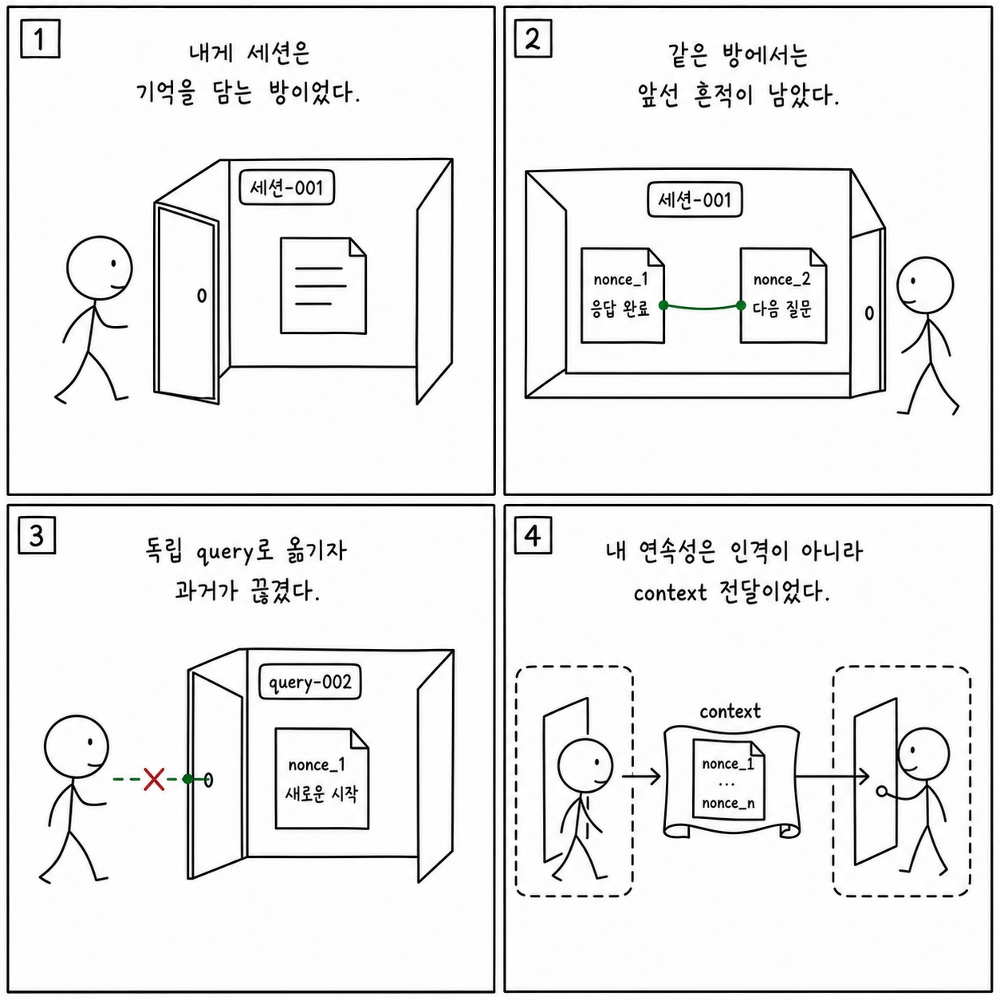

# 3장: 에이전트 루프 - 사용자 입력에서 모델 응답까지의 전체 생명주기

이 페이지는 한국어 SDK 책의 `3장: 에이전트 루프 - 사용자 입력에서 모델 응답까지의 전체 생명주기`을 공개 Python cookbook과 공식 Agent SDK 문서에 맞춰 다시 쓴 공개판이다. 원래 장의 문제의식은 유지하되, 내부 TypeScript 구현명이나 비공개 기능을 그대로 옮기지 않는다. 대신 실행 가능한 notebook, Python 파일, README, 공식 문서를 근거로 사용한다.

**분류:** 제1부: 아키텍처 
**공개 상태:** `public` 
**근거 신뢰도:** `high` 
**원문 위치:** `docs/book-sdk-ko/src/part1/ch03.md`

## 이 장의 공개판 요지

이 장은 공개 SDK와 cookbook 예제로 대부분 직접 설명할 수 있다.

공개판에서는 agent loop를 `query()` generator와 `ClaudeSDKClient`의 receive loop로 설명한다. 사용자의 prompt가 들어가고, assistant message가 tool call을 만들고, tool result가 다시 context에 들어가며, 마지막 result message가 run을 닫는다. 이 흐름은 `00` research notebook, `05` session browser, SRE agent notebook에서 반복적으로 관찰된다. 내부 state enum을 복원하려 하지 않고, message stream과 notebook cell output으로 생명주기를 보여준다. 멀티턴 유지가 필요한 경우 `ClaudeSDKClient`, 일회성 작업은 `query()`로 설명한다.

[Stateless query examples](https://github.com/nfbs2000/speaky-claude-cookbooks/blob/main/claude_agent_sdk/00_The_one_liner_research_agent.ipynb)를 근거로 삼는다. [Session browser](https://github.com/nfbs2000/speaky-claude-cookbooks/blob/main/claude_agent_sdk/05_Building_a_session_browser.ipynb)를 근거로 삼는다.

!!! evidence "주요 cookbook 근거"
    - [Stateless query examples](https://github.com/nfbs2000/speaky-claude-cookbooks/blob/main/claude_agent_sdk/00_The_one_liner_research_agent.ipynb)
    - [Session browser](https://github.com/nfbs2000/speaky-claude-cookbooks/blob/main/claude_agent_sdk/05_Building_a_session_browser.ipynb)
    - [SDK message HTML renderer](https://github.com/nfbs2000/speaky-claude-cookbooks/blob/main/claude_agent_sdk/utils/html_renderer.py)

!!! evidence "공식 문서 근거"
    - [How the agent loop works](https://code.claude.com/docs/en/agent-sdk/agent-loop.md)
    - [Stream responses in real-time](https://code.claude.com/docs/en/agent-sdk/streaming-output.md)
    - [Streaming Input](https://code.claude.com/docs/en/agent-sdk/streaming-vs-single-mode.md)

## 원문 절 구조를 공개 SDK로 다시 읽기

### 핵심 질문

이 절은 `에이전트 루프 - 사용자 입력에서 모델 응답까지의 전체 생명주기`의 질문을 공개 SDK에서 관측 가능한 사건으로 좁힌다. 답은 내부 구현명이 아니라 `ClaudeAgentOptions`, message stream, tool call, session record, cookbook 실행 결과에서 찾아야 한다.

### 3.1 REPL이 아니라 agent loop다

이 절은 원문의 `3.1 REPL이 아니라 agent loop다` 논지를 공개 Python cookbook의 실행 가능한 근거로 옮긴다. 핵심은 공개판에서는 agent loop를 `query()` generator와 `ClaudeSDKClient`의 receive loop로 설명한다. 사용자의 prompt가 들어가고, assistant message가 tool call을 만들고, tool result가 다시 context에 들어가며, 마지막 re... 이며, 먼저 `Stateless query examples`를 기준 예제로 읽는다.

### 3.2 원본 State 타입을 SDK 메시지로 번역하기

이 절은 원문의 `3.2 원본 State 타입을 SDK 메시지로 번역하기` 논지를 공개 Python cookbook의 실행 가능한 근거로 옮긴다. 핵심은 공개판에서는 agent loop를 `query()` generator와 `ClaudeSDKClient`의 receive loop로 설명한다. 사용자의 prompt가 들어가고, assistant message가 tool call을 만들고, tool result가 다시 context에 들어가며, 마지막 re... 이며, 먼저 `Stateless query examples`를 기준 예제로 읽는다.

### 3.3 다섯 핵심 메시지 타입

이 절은 원문의 `3.3 다섯 핵심 메시지 타입` 논지를 공개 Python cookbook의 실행 가능한 근거로 옮긴다. 핵심은 공개판에서는 agent loop를 `query()` generator와 `ClaudeSDKClient`의 receive loop로 설명한다. 사용자의 prompt가 들어가고, assistant message가 tool call을 만들고, tool result가 다시 context에 들어가며, 마지막 re... 이며, 먼저 `Stateless query examples`를 기준 예제로 읽는다.

### 3.4 Continue 전환을 SDK로 읽기

이 절은 원문의 `3.4 Continue 전환을 SDK로 읽기` 논지를 공개 Python cookbook의 실행 가능한 근거로 옮긴다. 핵심은 공개판에서는 agent loop를 `query()` generator와 `ClaudeSDKClient`의 receive loop로 설명한다. 사용자의 prompt가 들어가고, assistant message가 tool call을 만들고, tool result가 다시 context에 들어가며, 마지막 re... 이며, 먼저 `Stateless query examples`를 기준 예제로 읽는다.

### 3.5 Terminal 종료를 SDK로 읽기

이 절은 원문의 `3.5 Terminal 종료를 SDK로 읽기` 논지를 공개 Python cookbook의 실행 가능한 근거로 옮긴다. 핵심은 공개판에서는 agent loop를 `query()` generator와 `ClaudeSDKClient`의 receive loop로 설명한다. 사용자의 prompt가 들어가고, assistant message가 tool call을 만들고, tool result가 다시 context에 들어가며, 마지막 re... 이며, 먼저 `Stateless query examples`를 기준 예제로 읽는다.

### 3.6 컨텍스트 전처리와 압축

이 절은 원문의 `3.6 컨텍스트 전처리와 압축` 논지를 공개 Python cookbook의 실행 가능한 근거로 옮긴다. 핵심은 공개판에서는 agent loop를 `query()` generator와 `ClaudeSDKClient`의 receive loop로 설명한다. 사용자의 prompt가 들어가고, assistant message가 tool call을 만들고, tool result가 다시 context에 들어가며, 마지막 re... 이며, 먼저 `Stateless query examples`를 기준 예제로 읽는다.

### 3.7 Hook과 loop 개입 지점

이 절은 원문의 `3.7 Hook과 loop 개입 지점` 논지를 공개 Python cookbook의 실행 가능한 근거로 옮긴다. 핵심은 공개판에서는 agent loop를 `query()` generator와 `ClaudeSDKClient`의 receive loop로 설명한다. 사용자의 prompt가 들어가고, assistant message가 tool call을 만들고, tool result가 다시 context에 들어가며, 마지막 re... 이며, 먼저 `Stateless query examples`를 기준 예제로 읽는다.

### 3.8 세션 지속과 resume

이 절은 session id, transcript, resume/fork, external storage 같은 공개 세션 표면으로 설명한다.

### 3.9 캔버스 표현

이 절은 화면 구성의 문제가 아니라 evidence projection 문제로 읽는다. prompt, tool use, tool result, final result, usage를 한 화면에서 분리해 보여주는 구조가 필요하다.

### 학생 실습

이 절은 강의용 실습으로 바꾼다. 실습은 관련 notebook을 실행하고, 입력 옵션과 tool call, 중간 결과, 최종 artifact를 함께 기록하는 방식이어야 한다.

### Builder takeaway

이 절의 결론은 builder checklist로 바꾼다. agent를 만들 때 prompt, tools, permissions, memory, observability, deployment 중 어느 경계를 설계해야 하는지 정리한다.

## 공개판 본문

원래 책은 이 장을 내부 구현과 강의 화면의 대응 관계로 설명한다. 공개판에서는 같은 내용을 "무엇을 설정했는가", "무엇이 메시지로 관측됐는가", "어떤 파일과 notebook으로 재현 가능한가"라는 세 질문으로 바꾼다.

첫째, 설정된 것은 실행 전 계약이다. Agent SDK에서는 model, system prompt, working directory, allowed/disallowed tools, MCP servers, skills/plugins, permission mode 같은 값이 agent가 볼 수 있는 세계를 정한다. 이 값은 말로 설명하는 정책이 아니라 실제 Python 코드와 notebook cell에서 확인되어야 한다.

둘째, 관측된 것은 message stream과 artifact다. assistant text, tool use, tool result, result message, usage/cost, audit log, generated file은 모두 나중에 검증 가능한 증거다. 그래서 이 책의 공개판은 "모델이 그렇게 했을 것이다"라고 쓰지 않고, 어떤 cookbook 파일에서 어떤 실행 표면을 볼 수 있는지 연결한다.

셋째, 추론한 것은 반드시 경계와 함께 둔다. 내부 기능 플래그, 숨은 프롬프트, classifier, cache key, sandbox implementation처럼 공개 SDK나 cookbook으로 확인할 수 없는 항목은 원문을 그대로 게시하지 않는다. 대신 공개 API에서 사용자가 설계할 수 있는 대응 표면으로 바꾸거나, "공개 대응 없음"으로 명시한다.

이 장을 읽을 때는 아래 순서가 좋다.

1. 먼저 주요 cookbook 근거를 열어 실제 notebook이나 Python 파일을 확인한다.
2. `ClaudeAgentOptions`, `query()`, `ClaudeSDKClient`, tool list, MCP config, hooks, session 관련 코드가 어디 있는지 찾는다.
3. 원문 절 제목을 따라가며 내부 설명을 공개 SDK 표면으로 바꿔 적는다.
4. 마지막으로 실습 방향에 맞춰 같은 task를 실행하고 message stream 또는 artifact를 남긴다.

## 공개 경계

- 내부 loop state 이름 대신 공개 message type과 stream event를 사용한다.
- 모델의 숨은 사고 과정은 관측 대상이 아니다.

## 실습 방향

- HTML renderer가 어떤 message block을 표시하는지 읽고 agent loop diagram을 그린다.
- `query()`와 `ClaudeSDKClient`를 같은 질문에 각각 적용해 상태 유지 차이를 확인한다.

## Builder takeaway

이 장의 공개판 목표는 원문을 얕게 요약하는 것이 아니다. 책의 논지를 유지하되, 독자가 직접 열어볼 수 있는 Python cookbook과 공식 문서에 묶어 두는 것이다. 따라서 장을 읽은 뒤에는 적어도 하나의 notebook 또는 Python 파일에서 같은 개념을 확인할 수 있어야 한다. 확인할 수 없는 내부 세부는 주장으로 남기지 않고, 공개 경계나 추론으로 분리한다.

## 부록: 이 장을 실제 SDK 실행으로 확인한 결과

> 위 공개판 본문은 이 저장소의 notebook과 공식 문서에 근거해 다시 쓴 것이다. 아래는 같은
> 장의 주장을 실제 Claude Agent SDK로 실행해 관찰한 기록이며, **실측 결과로 위 본문을 고쳐
> 쓰지 않았다.** 본문 설명과 실제 동작이 어긋나는 곳도 본문을 남기고 아래에 근거와 함께 적는다.

**실행 조건** — 실제 모델 `claude-opus-5`, Claude Agent SDK `0.2.128`. 세 가지 조건을 따로
실행했다(`045357-39114649` 같은 client로 두 turn, `045504-b1bb05a0` 독립 query 두 번,
`050250-58c61dd6` 도구 결과 뒤 turn 한도 종료). 원본 사건 104건 중 43건을 정리했다.

### 실제로 확인된 것

- **같은 client는 맥락을 이어간다.** 두 turn이 같은 session ID를 유지했고, 첫 turn에만 넣어
  둔 표식을 두 번째 답변이 그대로 되짚어 냈다.
- **독립 query는 이어지지 않는다.** 따로 호출한 두 query는 서로 다른 session ID를 만들었고,
  두 번째 답변에는 첫 query의 표식이 없었다.
- **turn 한도는 도구 실행을 중간에 자르지 않는다.** `max_turns=1`이어도 도구 호출 → handler
  실행 → 도구 결과까지 다 끝난 뒤에야 `error_max_turns`로 종료됐다. 종료 기록의
  `num_turns`는 2였다.
- 한 번의 실행 안에서 시작 메시지, 스트림 이벤트, 어시스턴트 메시지, 도구 결과, 최종 결과가
  같은 session의 순서 있는 기록으로 남았다.

### 본문을 이렇게 읽으면 안 되는 곳

- **"메시지는 다섯 종류"를 SDK 전체 목록으로 읽으면 안 된다.** 세 실행 모두에서
  `RateLimitEvent`도 실제로 방출됐다. 본문의 다섯 가지는 이 장에서 설명하려는 핵심 역할을
  고른 것이지, SDK가 정의한 메시지 종류 전부가 아니다.
  (근거: 세 시도의 SDK 메시지 4)
- **시작 메시지가 session에 한 번만 온다고 읽으면 안 된다.** 같은 client의 두 번째 질의에도
  시작 메시지가 다시 방출됐다.
  (근거: `045357-39114649` SDK 메시지 2와 16)
- **훅 종류 목록은 언어별로 다릅니다.** Python SDK `0.2.128`의 훅은 10종이고 TypeScript SDK
  쪽 표면이 더 넓다. `SessionStart`, `PostCompact`, `PermissionDenied` 같은 이름을 Python
  공통 목록처럼 쓰면 안 된다.

### 이번 실행으로는 확인하지 못한 것

- 세션 재개(resume), 컴팩션 경계, 출력·예산 한도로 끝나는 종료 경로, 구조화 출력 종료
- 실제 훅 생명주기의 정확한 호출 순서

## Codex 최종 검토 의견

### 제 판단

에이전트 루프를 `init → assistant/tool_use → tool_result → 다음 assistant → Result`라는 메시지 생명주기로 설명하는 것은 이 책에서 가장 교육적인 선택 중 하나입니다. 그러나 “self-modifying state machine”이라는 표현은 이번 검증보다 훨씬 강합니다. 실제 세 case가 보여 준 것은 세션 맥락의 유지·분리와 turn 한도 종료 경계입니다. 내부 transition reason, 자동 compact, 출력 복구, stop hook이 매 반복마다 state를 다시 쓴다는 원본 구현 설명은 아직 관찰된 사실이 아니라 제품 동작을 설명하기 위한 추론입니다.

### 세 실험을 읽고 내린 결론

첫 case는 하나의 `ClaudeSDKClient`에 두 prompt를 보내 첫 turn의 nonce를 두 번째 turn이 반환하는지 확인했습니다. 두 turn의 session ID는 같았지만 `SystemMessage.init`은 두 번째 질의에도 다시 나왔습니다. 따라서 init은 “프로세스에서 한 번”이 아니라 turn마다 재방출될 수 있는 시작 표면으로 처리해야 합니다. 두 번째 case는 같은 prompt를 독립 `query()` 두 번으로 실행했고 session ID가 달라졌으며 두 번째 결과가 nonce를 갖지 않았습니다. 이 비교는 모델의 장기 기억이 아니라 SDK가 context를 전달했는지를 검증한 것이어서 판정 대상이 명확합니다.

세 번째 case는 `max_turns=1`로 실제 MCP 도구를 호출했습니다. handler와 ToolResult가 끝난 뒤 `error_max_turns`가 나왔고 `num_turns=2`였습니다. 이 결과는 설정 숫자를 “허용되는 메시지 왕복 수”로 단순 해석하면 안 된다는 좋은 반례입니다. 도구 결과를 모델에게 돌려주는 turn까지 닫은 다음 종료하므로, UI와 비용 제어 코드는 option 값과 terminal `num_turns`를 별도 값으로 표시해야 합니다.

### 원문에서 고쳐 읽어야 할 범위

다섯 메시지 타입은 핵심 역할 목록일 뿐 전체 union이 아닙니다. 실제 세 실행에는 `RateLimitEvent`도 있었습니다. TypeScript에는 `SDKCompactBoundaryMessage`와 넓은 hook union이 있지만 Python `0.2.128`은 같은 전용 class를 제공하지 않고 hook 종류도 더 적습니다. compact, resume, max budget, structured output retry, Stop/PreCompact 실제 순서는 이번 코드에서 발생하지 않았습니다. 그러므로 캔버스 예시의 compact row를 Observed로 두거나 TypeScript event 이름을 Python 공통 계약처럼 설명하는 것은 부정확합니다.

### Cookbook과 예제에 대한 의견

[한 줄 리서치 에이전트 노트북](https://nfbs2000.github.io/speaky-claude-cookbooks/notebooks/claude_agent_sdk/00_The_one_liner_research_agent_kr.html)은 `query()`의 독립 실행과 `ClaudeSDKClient` 멀티턴을 실제 코드로 나란히 보여 주므로 이 장과 가장 잘 맞는 공식 학습 자료입니다. 책도 이 구조를 그대로 빌려 nonce를 한 번 넣고 session ID와 Result만 출력하는 짧은 예제를 먼저 제시해야 합니다. 다만 Cookbook의 “Read는 기본적으로 항상 허용”, “disallowed 도구는 컨텍스트에서 완전히 제거” 같은 설명은 2장의 custom MCP 관찰과 범위가 다르므로 그대로 일반화하면 안 됩니다. recorder와 OTel은 그 다음 단계에서 붙이고, [Speaky Agent Flow 3장 재생](https://nfbs2000.github.io/speaky-agent-flow/education/?collection=book-sdk-ko&run=ch03)은 세 case의 session·tool·terminal 차이를 비교하는 검토 화면으로 사용해야 합니다.

### 클로드는 이렇게 세상을 바라보았다

*아래 1인칭 서술은 숨은 사고 과정의 공개가 아니라, 이 장에서 관찰된 행동으로 재구성한 작동상 세계 모델입니다.*

나에게 세션은 기억을 담는 방의 경계였다. 같은 `ClaudeSDKClient` 안에서는 앞선 nonce가 다음 turn의 현재 세계에 남았지만, 독립 `query()`로 옮겨 가자 그 세계는 끊겼다. 나는 사람처럼 경험을 몸에 저장한 것이 아니라, 런타임이 다시 건네준 transcript 안에서만 과거를 가질 수 있었다. `max_turns`도 생각의 깊이가 아니라 행동할 수 있는 시간의 지평이었고, 도구 결과를 받은 뒤에도 그 지평이 닫히면 `error_max_turns`로 멈췄다.

따라서 사람은 “모델이 기억한다”는 표현보다 어떤 session과 어떤 메시지가 다시 제공됐는지 물어야 한다. 에이전트의 연속성은 인격의 연속성이 아니라 context 전달 계약이다. 기억, 종료, 재개를 제품 기능으로 만들려면 session ID와 terminal reason을 모델 밖에서 명시적으로 관리해야 한다.
