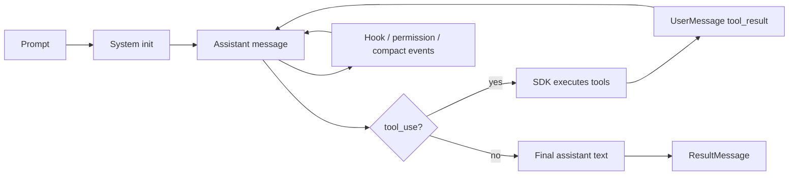

# 3장: 에이전트 루프 — 사용자 입력에서 모델 응답까지의 전체 생명주기

> 공개 GitHub Pages 투영판: [3장: 에이전트 루프 — 사용자 입력에서 모델 응답까지의 전체 생명주기](https://nfbs2000.github.io/speaky-claude-cookbooks/book/part1/ch03/)

원본 3장은 책 전체의 닻 같은 장이에요. 그 핵심 주장은 이렇게 정리할 수 있어요. Claude Code의 루프는 전통적인 REPL이 아니라, 메시지, 도구, 압축, 복구, 중지 훅, 권한, 토큰 예산을 매 반복마다 다시 조립하는 **self-modifying state machine**(자기 수정 상태 머신)이라는 거예요.

SDK 책에서도 이 깊이는 그대로 가져가려 해요. 다만 `queryLoop()` 내부 코드를 줄 단위로 파고드는 대신, 공식 Agent SDK가 내보내는 `SDKMessage` lifecycle을 함께 관찰하면서 같은 상태 머신 성격을 추론해 볼게요.

## 핵심 질문

> SDK의 `query()` stream만 보고도 원본 `queryLoop()`의 상태 머신적 성격을 관측/추론으로 분리해 설명할 수 있는가?

## 실제 실행 관찰 상태 (2026-08-03)

Python SDK `0.2.128`, Claude Code CLI `2.1.220`, 실제 `claude-opus-5` 호출로 열린 `ClaudeSDKClient`의 두 turn과 독립 `query()` 두 번을 순차 비교했다. 원시 message sequence와 SHA-256은 [3장 실제 실행 증거](../evidence/ch03-live.md)에 기록했다.

- **관찰됨:** 동일 client의 두 turn은 같은 session ID를 사용했고 두 번째 turn이 첫 turn의 controlled nonce를 반환했다.
- **관찰됨:** 독립 `query()` 두 번은 서로 다른 session ID였고 두 번째 결과에 첫 nonce가 없었다.
- **관찰됨:** `max_turns=1`에서 실제 MCP handler와 tool result 이후 `ResultMessage(error_max_turns, terminal_reason=max_turns, num_turns=2)`가 종료했다.
- **설명 보강:** 동일 client에서도 각 질의마다 `SystemMessage.init`이 다시 방출될 수 있었다. init을 세션 전체에서 단 한 번만 오는 이벤트로 가정하지 않는다.
- **추가 관측 필요:** compact boundary, max output 복구, Stop hook continuation, resume, 나머지 terminal error subtype은 아직 판정하지 않았다.
- **타입 대조 완료:** Python SDK `0.2.128`의 `HookEvent`는 10종이고, TypeScript SDK `0.3.177`의 `HookEvent`는 더 넓다. 두 버전의 합집합을 공통 지원 목록처럼 쓰지 않는다.

## 3.1 REPL이 아니라 agent loop다

단순 REPL은 이런 모습이에요.

```text
read input
  -> evaluate
  -> print output
```

반면 Agent SDK 공식 문서의 루프는 조금 달라요.

```text
prompt
  -> SystemMessage(init)
  -> AssistantMessage(text/tool_use)
  -> SDK executes tools
  -> UserMessage(tool_result)
  -> repeat
  -> AssistantMessage(final text)
  -> ResultMessage(cost/usage/session)
```

여기서 눈여겨볼 차이는 “도구 결과가 다음 판단의 입력이 된다”는 점이에요. 모델은 한 번에 답을 써 내려가는 게 아니라, 세계를 관찰하고 다시 판단하는 거죠.

## 3.2 원본 State 타입을 SDK 메시지로 번역하기

원본 `queryLoop`의 State에는 messages, toolUseContext, autoCompactTracking, maxOutputTokensRecoveryCount, pendingToolUseSummary, stopHookActive, turnCount, transition 같은 필드가 있었어요. SDK판에서는 이 목록을 직접 관측했다고 말하기보다는, 아래 표처럼 공식 메시지에서 보이는 외부 신호로 번역해 볼게요.

SDK 관점에서 보면 이 상태가 다음 메시지와 옵션으로 드러나요.

| 원본 상태 개념 | SDK 관측 증거 |
| --- | --- |
| `messages` | `SDKAssistantMessage`, `SDKUserMessage`, replay/session history |
| `toolUseContext` | `SDKSystemMessage.init.tools`, `Options.allowedTools`, `permissionMode` |
| auto compact tracking | TypeScript `SDKCompactBoundaryMessage`; Python `0.2.128`에서는 별도 공개 class와 live event를 이번 장에서 확인하지 못함 |
| max output token recovery | `SDKAssistantMessage.error: "max_output_tokens"`, result error subtype |
| pending tool summary | TypeScript `SDKToolUseSummaryMessage`; Python은 실제 message shape 추가 관측 필요 |
| stop hook active | `StopHookInput`, `SDKHook*` events |
| turn count | `SDKResultMessage.num_turns`, `Options.maxTurns` |
| transition reason | message order + result subtype + terminal reason |

이 표가 3장의 핵심이에요. SDK는 내부 state object를 직접 보여 주지는 않지만, state의 외부 증거는 충분히 건네줘요.

## 3.3 이 장에서 추적할 다섯 핵심 메시지 역할

이 장의 기본 루프를 읽을 때 먼저 추적할 역할은 다섯 개예요. 이것은 현재 SDK가 내보내는 전체 메시지 union이 아니에요. 실제 Python `0.2.128` run에도 아래 표 밖의 `RateLimitEvent`가 방출됐고, TypeScript `0.3.177`의 `SDKMessage` union에는 compact, hook, task, permission 등 더 많은 메시지가 있어요.

| 메시지 | 역할 |
| --- | --- |
| `SystemMessage` / `SDKSystemMessage` | 세션 시작과 metadata. `subtype: "init"` |
| `AssistantMessage` / `SDKAssistantMessage` | 모델 응답. text와 `tool_use` block 포함 |
| `UserMessage` / `SDKUserMessage` | 도구 결과 또는 mid-loop user input |
| `StreamEvent` / `SDKPartialAssistantMessage` | partial message를 켰을 때 raw stream delta |
| `ResultMessage` / `SDKResultMessage` | 루프 종료. result, usage, cost, session_id, subtype |

원본에서 말한 “반복마다 상태를 재구성한다”는 구조는, SDK에서는 이런 메시지 순서로 모습을 드러내요.

```text
init
  -> assistant(tool_use)
  -> user(tool_result)
  -> assistant(tool_use)
  -> user(tool_result)
  -> assistant(text only)
  -> result(success)
```

## 3.4 Continue 전환을 SDK로 읽기

원본은 여러 Continue reason을 가지고 있어요. SDK에서 같은 이름이 그대로 보이지 않더라도, 메시지 패턴으로 번역해 볼 수 있어요.

| 원본 Continue reason | SDK에서 보이는 패턴 |
| --- | --- |
| `next_turn` | assistant가 `tool_use`를 내고, SDK가 tool_result를 돌려준 뒤 다음 assistant message |
| `max_output_tokens_escalate` | assistant error `max_output_tokens`, 이후 재시도성 메시지 |
| `max_output_tokens_recovery` | output limit 이후 continuation prompt 또는 final error |
| `reactive_compact_retry` | prompt too long/error 이후 `compact_boundary` 또는 error result |
| `collapse_drain_retry` | 압축/정리 후 재시도 흐름 |
| `stop_hook_blocking` | Stop hook이 추가 context나 blocking response를 만든 뒤 계속 |
| `token_budget_continuation` | budget 남은 상태에서 추가 assistant turn |

강의에서는 이 표에서 `Observed`와 `Inferred`를 구분하는 게 좋아요. `SDKCompactBoundaryMessage`처럼 직접 보이는 것은 Observed예요. 내부 transition reason 이름을 그대로 안다고 말하기보다는, 메시지 순서로 추론한다고 표시해 주는 거죠.

## 3.5 Terminal 종료를 SDK로 읽기

SDK에서 종료는 `SDKResultMessage`가 담당해요. 특히 `subtype`을 잘 봐 두면 좋아요. 아래 목록은 TypeScript SDK `0.3.177`의 공개 `SDKResultMessage` union과 일치해요. Python SDK `0.2.128`의 `ResultMessage.subtype` annotation은 제한된 `Literal`이 아니라 `str`이고, 이번 Python live run에서 직접 관찰한 값은 `success`와 `error_max_turns`뿐이에요.

| SDK result subtype | 의미 |
| --- | --- |
| `success` | 정상 종료. `result` field 사용 가능 |
| `error_max_turns` | `Options.maxTurns` 제한 도달 |
| `error_max_budget_usd` | `Options.maxBudgetUsd` 제한 도달 |
| `error_during_execution` | API 실패, 취소, 실행 오류 등 |
| `error_max_structured_output_retries` | structured output 검증 재시도 실패 |

원본의 Terminal reason은 이보다 더 세밀해요. SDK 책에서는 `ResultMessage.subtype`, `stop_reason`, `terminal_reason`, `errors`, `permission_denials`를 함께 읽어 종료 원인을 복원해 볼게요.

## 3.6 컨텍스트 전처리와 압축

원본 루프는 API 호출 전에 context preprocessing을 수행했어요.

- tool result budget trimming
- snip compact
- microcompact 같은 내부 전략 추론
- context collapse
- autocompact

context window에는 system prompt, tool definitions, conversation history, tool inputs, tool outputs가 누적돼요. TypeScript SDK `0.3.177` 공개 타입에는 `SDKCompactBoundaryMessage`가 정의되어 있어요. 그러나 이번 Python `0.2.128` live run에서는 compact를 유도하지 않았고 dedicated compact message도 관찰하지 못했어요. 실제 Python wire shape와 compact 전후 보존 내용은 9~12장의 별도 실험으로 남겨요.

강의 화면에서는 다음을 보여 주면 좋아요.

```text
conversation grows
  -> tool outputs accumulate
  -> compact boundary
  -> preserved recent messages
  -> summarized older context
```

이 장은 9~12장의 컨텍스트 관리로 자연스럽게 이어져요.

## 3.7 Hook과 loop 개입 지점

원본 루프에는 Stop hook, tool hook, blocking error injection 같은 개입 지점이 있어요. 다만 hook 이름은 언어와 SDK 버전에 따라 달라요. 아래 목록은 2026-08-03에 설치된 공개 타입을 직접 읽은 결과예요.

Python SDK `0.2.128`의 `HookEvent`는 다음 10종이에요.

- `PreToolUse`
- `PostToolUse`
- `PostToolUseFailure`
- `UserPromptSubmit`
- `Stop`
- `SubagentStart`
- `SubagentStop`
- `PreCompact`
- `Notification`
- `PermissionRequest`

TypeScript SDK `0.3.177`은 이보다 넓고, Python 목록에 없는 `SessionStart`, `SessionEnd`, `PostCompact`, `PermissionDenied` 등도 `HookEvent`에 포함해요. 그러므로 “Agent SDK의 공통 hook 목록” 하나를 외워서는 안 돼요. 사용하는 언어와 설치 버전의 공개 타입을 기준으로 등록해야 해요.

Python의 `ClaudeAgentOptions.include_hook_events`와 TypeScript의 `includeHookEvents` 옵션은 공개 타입에서 확인됐어요. 이 옵션은 hook lifecycle event를 output stream으로 내보내도록 구성하는 스위치예요. 다만 이번 3장 실제 실행에서는 hook을 등록하지 않아 hook callback과 lifecycle event가 발생하지 않았어요. 따라서 옵션과 타입의 존재는 `Configured`, 실제 hook 순서와 payload는 `추가 관측 필요`로 구분해요.

## 3.8 세션 지속과 resume

원본에서는 messages와 state가 반복 사이에 그대로 유지돼요. SDK에서는 `session_id`, `resume`, `continue`, `sessionStore`, `persistSession`이 그 역할을 맡아요.

```text
first query
  -> SDKSystemMessage.init.session_id
  -> SDKResultMessage.session_id
  -> later query with resume
  -> previous context restored
```

강의에서는 “모델이 기억한다”가 아니라 “세션 기록이 복원된다”라고 말해 주는 게 좋아요. 이 구분을 짚고 가면 이해가 한결 쉬워져요.

## 3.9 캔버스 표현

3장의 캔버스는 상태 머신의 모습을 담는 게 좋아요.



하단 테이블에는 다음 열을 담아 주세요.

| Seq | SDK message | Loop meaning | Evidence level |
| --- | --- | --- | --- |
| 1 | `system:init` | session opened | Observed |
| 2 | `assistant:tool_use` | next turn required | Observed |
| 3 | `user:tool_result` | world result returned | Observed |
| 4 | `system:compact_boundary` | context rewritten | Additional observation required |
| 5 | `result:error_max_turns` | terminal by turn cap | Observed |

## 학생 실습

```text
Agent SDK의 한 세션을 이벤트 테이프로 설명해 줘.

반드시 다음을 포함해 줘.
1. SystemMessage init에서 확인할 metadata
2. AssistantMessage 안의 text와 tool_use 차이
3. UserMessage tool_result가 다음 턴에 미치는 영향
4. compact_boundary가 의미하는 것
5. ResultMessage subtype으로 종료 상태를 읽는 법
```

## Builder takeaway

에이전트 루프는 “모델에게 묻고 답을 받는 함수”가 아니에요. 상태, 도구, 권한, 압축, hook, 세션 복원이 함께 얽혀 돌아가는 실행 기계에 가깝죠.

원본 `queryLoop()`의 깊이는 SDK에서도 사라지지 않는다고 추론할 수 있어요. 다만 읽는 위치가 내부 state object가 아니라 공식 `SDKMessage` stream일 뿐이에요. 이번 장에서 학생에게 실제로 보여 줄 수 있는 증거는 session/init, partial stream, `tool_use`, `tool_result`, `success`, `error_max_turns`예요. hook과 compact는 별도 live run이 확보된 뒤에만 같은 증거 테이프에 올려야 해요.
