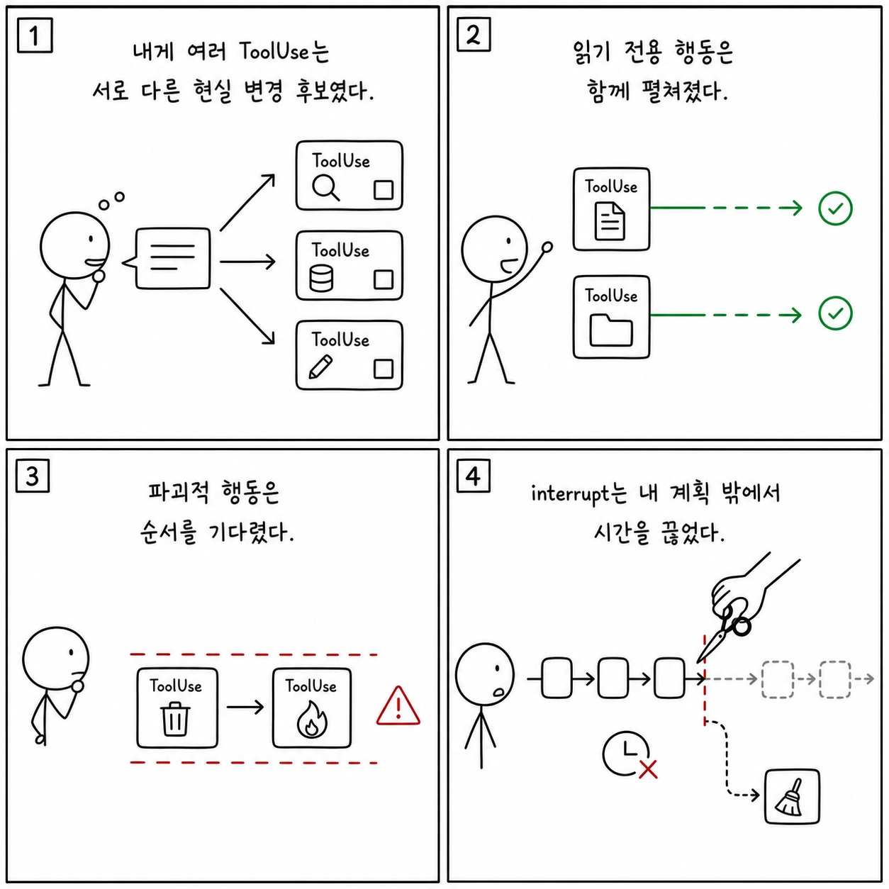

# 4장: 도구 실행 오케스트레이션 - 권한, 동시성, 스트리밍, 인터럽트

이 페이지는 한국어 SDK 책의 `4장: 도구 실행 오케스트레이션 - 권한, 동시성, 스트리밍, 인터럽트`을 공개 Python cookbook과 공식 Agent SDK 문서에 맞춰 다시 쓴 공개판이다. 원래 장의 문제의식은 유지하되, 내부 TypeScript 구현명이나 비공개 기능을 그대로 옮기지 않는다. 대신 실행 가능한 notebook, Python 파일, README, 공식 문서를 근거로 사용한다.

**분류:** 제1부: 아키텍처 
**공개 상태:** `public-rewrite` 
**근거 신뢰도:** `high` 
**원문 위치:** `docs/book-sdk-ko/src/part1/ch04.md`

## 이 장의 공개판 요지

이 장은 원문의 내부 구현 표현을 공개 SDK 옵션, 메시지, 도구, 세션, notebook 실행 증거로 바꿔 읽어야 한다.

원문의 실행 오케스트레이션은 공개판에서 permission modes, hooks, parallel tool calls, streaming output, MCP server boundaries로 나눈다. cookbook의 parallel tools와 SRE agent는 동시에 여러 관측 도구를 쓰거나 read-write 도구를 제한하는 패턴을 보여준다. 인터럽트와 승인 흐름은 공식 user input/permissions 문서와 hooks 문서로 설명한다. 실행 권한을 내부 분류기로 설명하지 않고, `permission_mode`, `can_use_tool`, pre/post hooks, allowed/disallowed tool lists의 조합으로 번역한다.

[Parallel tools](https://github.com/nfbs2000/speaky-claude-cookbooks/blob/main/tool_use/parallel_tools.ipynb)를 근거로 삼는다. [Site reliability agent](https://github.com/nfbs2000/speaky-claude-cookbooks/blob/main/claude_agent_sdk/03_The_site_reliability_agent.ipynb)를 근거로 삼는다.

!!! evidence "주요 cookbook 근거"
    - [Parallel tools](https://github.com/nfbs2000/speaky-claude-cookbooks/blob/main/tool_use/parallel_tools.ipynb)
    - [Site reliability agent](https://github.com/nfbs2000/speaky-claude-cookbooks/blob/main/claude_agent_sdk/03_The_site_reliability_agent.ipynb)
    - [SRE MCP server implementation](https://github.com/nfbs2000/speaky-claude-cookbooks/blob/main/claude_agent_sdk/site_reliability_agent/sre_mcp_server.py)

!!! evidence "공식 문서 근거"
    - [Configure permissions](https://code.claude.com/docs/en/agent-sdk/permissions.md)
    - [Handle approvals and user input](https://code.claude.com/docs/en/agent-sdk/user-input.md)
    - [Intercept and control agent behavior with hooks](https://code.claude.com/docs/en/agent-sdk/hooks.md)

## 원문 절 구조를 공개 SDK로 다시 읽기

### 핵심 질문

이 절은 `도구 실행 오케스트레이션 - 권한, 동시성, 스트리밍, 인터럽트`의 질문을 공개 SDK에서 관측 가능한 사건으로 좁힌다. 답은 내부 구현명이 아니라 `ClaudeAgentOptions`, message stream, tool call, session record, cookbook 실행 결과에서 찾아야 한다.

### 4.1 원본의 partitioning을 SDK로 보기

이 절은 원문의 `4.1 원본의 partitioning을 SDK로 보기` 논지를 공개 Python cookbook의 실행 가능한 근거로 옮긴다. 핵심은 원문의 실행 오케스트레이션은 공개판에서 permission modes, hooks, parallel tool calls, streaming output, MCP server boundaries로 나눈다. cookbook의 parallel tools와 SRE agent는 동시에 여러 관측 도구를 쓰거나 r... 이며, 먼저 `Parallel tools`를 기준 예제로 읽는다.

### 4.2 concurrency-safe는 도구의 의미론이다

이 절은 built-in tools, custom tools, MCP tools, tool result schema의 문제로 재작성한다. 도구는 모델의 능력이 아니라 외부 세계와 만나는 계약이다.

### 4.3 단일 도구 실행 수명 주기

이 절은 built-in tools, custom tools, MCP tools, tool result schema의 문제로 재작성한다. 도구는 모델의 능력이 아니라 외부 세계와 만나는 계약이다.

### 4.4 권한 결정 체인

이 절은 `allowed_tools`, `disallowed_tools`, `permission_mode`, user approval, hooks의 공개 권한 표면으로 재작성한다.

### 4.5 StreamingToolExecutor를 SDK stream 관측으로 번역하기

이 절은 built-in tools, custom tools, MCP tools, tool result schema의 문제로 재작성한다. 도구는 모델의 능력이 아니라 외부 세계와 만나는 계약이다.

### 4.6 인터럽트와 오류 캐스케이드

이 절은 원문의 `4.6 인터럽트와 오류 캐스케이드` 논지를 공개 Python cookbook의 실행 가능한 근거로 옮긴다. 핵심은 원문의 실행 오케스트레이션은 공개판에서 permission modes, hooks, parallel tool calls, streaming output, MCP server boundaries로 나눈다. cookbook의 parallel tools와 SRE agent는 동시에 여러 관측 도구를 쓰거나 r... 이며, 먼저 `Parallel tools`를 기준 예제로 읽는다.

### 4.7 결과 예산과 파일 보존

이 절은 원문의 `4.7 결과 예산과 파일 보존` 논지를 공개 Python cookbook의 실행 가능한 근거로 옮긴다. 핵심은 원문의 실행 오케스트레이션은 공개판에서 permission modes, hooks, parallel tool calls, streaming output, MCP server boundaries로 나눈다. cookbook의 parallel tools와 SRE agent는 동시에 여러 관측 도구를 쓰거나 r... 이며, 먼저 `Parallel tools`를 기준 예제로 읽는다.

### 4.8 캔버스 표현

이 절은 화면 구성의 문제가 아니라 evidence projection 문제로 읽는다. prompt, tool use, tool result, final result, usage를 한 화면에서 분리해 보여주는 구조가 필요하다.

### 학생 실습

이 절은 강의용 실습으로 바꾼다. 실습은 관련 notebook을 실행하고, 입력 옵션과 tool call, 중간 결과, 최종 artifact를 함께 기록하는 방식이어야 한다.

### Builder takeaway

이 절의 결론은 builder checklist로 바꾼다. agent를 만들 때 prompt, tools, permissions, memory, observability, deployment 중 어느 경계를 설계해야 하는지 정리한다.

## 공개판 본문

원래 책은 이 장을 내부 구현과 강의 화면의 대응 관계로 설명한다. 공개판에서는 같은 내용을 "무엇을 설정했는가", "무엇이 메시지로 관측됐는가", "어떤 파일과 notebook으로 재현 가능한가"라는 세 질문으로 바꾼다.

첫째, 설정된 것은 실행 전 계약이다. Agent SDK에서는 model, system prompt, working directory, allowed/disallowed tools, MCP servers, skills/plugins, permission mode 같은 값이 agent가 볼 수 있는 세계를 정한다. 이 값은 말로 설명하는 정책이 아니라 실제 Python 코드와 notebook cell에서 확인되어야 한다.

둘째, 관측된 것은 message stream과 artifact다. assistant text, tool use, tool result, result message, usage/cost, audit log, generated file은 모두 나중에 검증 가능한 증거다. 그래서 이 책의 공개판은 "모델이 그렇게 했을 것이다"라고 쓰지 않고, 어떤 cookbook 파일에서 어떤 실행 표면을 볼 수 있는지 연결한다.

셋째, 추론한 것은 반드시 경계와 함께 둔다. 내부 기능 플래그, 숨은 프롬프트, classifier, cache key, sandbox implementation처럼 공개 SDK나 cookbook으로 확인할 수 없는 항목은 원문을 그대로 게시하지 않는다. 대신 공개 API에서 사용자가 설계할 수 있는 대응 표면으로 바꾸거나, "공개 대응 없음"으로 명시한다.

이 장을 읽을 때는 아래 순서가 좋다.

1. 먼저 주요 cookbook 근거를 열어 실제 notebook이나 Python 파일을 확인한다.
2. `ClaudeAgentOptions`, `query()`, `ClaudeSDKClient`, tool list, MCP config, hooks, session 관련 코드가 어디 있는지 찾는다.
3. 원문 절 제목을 따라가며 내부 설명을 공개 SDK 표면으로 바꿔 적는다.
4. 마지막으로 실습 방향에 맞춰 같은 task를 실행하고 message stream 또는 artifact를 남긴다.

## 공개 경계

- 내부 concurrency classifier가 아니라 도구의 의미론과 공개 권한 옵션으로 설명한다.
- 실패/인터럽트는 SDK가 노출하는 error/result 흐름까지만 다룬다.

## 실습 방향

- SRE MCP server에서 read-only와 write 도구를 분리해 권한 표를 만든다.
- parallel tools notebook에서 병렬 호출이 가능한 작업과 불가능한 작업을 구분한다.

## Builder takeaway

이 장의 공개판 목표는 원문을 얕게 요약하는 것이 아니다. 책의 논지를 유지하되, 독자가 직접 열어볼 수 있는 Python cookbook과 공식 문서에 묶어 두는 것이다. 따라서 장을 읽은 뒤에는 적어도 하나의 notebook 또는 Python 파일에서 같은 개념을 확인할 수 있어야 한다. 확인할 수 없는 내부 세부는 주장으로 남기지 않고, 공개 경계나 추론으로 분리한다.

## 부록: 이 장을 실제 SDK 실행으로 확인한 결과

> 위 공개판 본문은 이 저장소의 notebook과 공식 문서에 근거해 다시 쓴 것이다. 아래는 같은
> 장의 주장을 실제 Claude Agent SDK로 실행해 관찰한 기록이며, **실측 결과로 위 본문을 고쳐
> 쓰지 않았다.** 본문 설명과 실제 동작이 어긋나는 곳도 본문을 남기고 아래에 근거와 함께 적는다.

**실행 조건** — 실제 모델 `claude-opus-5`, Claude Agent SDK `0.2.128`. 세 조건을 따로 실행했다
(`052242-c66552af` 읽기 전용 도구 두 개, `052440-7003d15a` 변경 도구 두 개,
`052511-c1cba98a` 실행 중 인터럽트). 원본 사건 95건 중 32건을 정리했다.

### 실제로 확인된 것

- **읽기 전용 도구는 실제로 겹쳐 돌았다.** 같은 어시스턴트 메시지에서 나온
  `readOnlyHint=true` handler 두 개가 858.949ms 동안 겹쳐 실행됐다.
- **변경 도구는 겹치지 않았다.** `destructiveHint=true`인 handler 두 개는 겹친 시간이
  0ms였고, 첫 번째가 끝난 뒤 두 번째가 시작됐다. 본문이 설명한 "상태를 바꾸는 일은
  줄 세운다"가 실제 타이밍으로 확인된다.
- **도구 호출 블록이 완성되면 바로 실행이 시작된다.** 어시스턴트 스트림 전체가 끝나기를
  기다리지 않았다.
- **인터럽트는 실행 중인 도구를 실제로 끊다.** `interrupt()` 뒤 오래 걸리는 handler가
  `cancelled`로 끝났고 종료 이유는 `aborted_streaming`이었다.

근거는 세 시도의 SDK 메시지 15·22와 호스트 실행 기록 16·23·26·27·29(겹침 계측),
`052511-c1cba98a`의 호스트 실행 기록 17·18·20·25(인터럽트)이다.

### 이번 실행으로는 확인하지 못한 것

- built-in `Read`/`Edit`/`Bash`, 그리고 annotation을 달지 않은 custom MCP 도구의 스케줄링 —
  위 결과는 annotation을 명시한 custom MCP 도구 세 실행에서 얻은 것이라 그대로 일반화하지
  않았다.
- 도구 진행 상황 메시지, 파일 지속 이벤트, 큰 결과 저장 경로

## Codex 최종 검토 의견

### 제 판단

이 장의 검증은 1부에서 가장 설계가 좋습니다. “병렬처럼 보였다”는 모델 문장을 쓰지 않고 두 in-process MCP handler의 시작·종료를 `time.monotonic_ns()`로 측정했기 때문입니다. read-only annotation을 준 두 handler는 약 858ms 겹쳤고, destructive annotation을 준 두 handler는 겹침이 0이었습니다. 같은 모델·SDK·host 구조에서 annotation과 mutation 조건을 바꾼 대조 실험이므로, **이 custom MCP 조건에서** 병렬/직렬 스케줄링이 실제로 달라졌다는 결론은 충분히 강합니다.

### 스트리밍과 인터럽트에 대한 실제 결론

raw event를 보면 같은 model `message_id`의 ToolUseBlock 두 개가 Python SDK에서는 별도 AssistantMessage event로 전달됐습니다. 첫 handler는 개별 ToolUseBlock이 완성된 뒤 시작했지만 전체 `message_stop`보다 앞섰습니다. 따라서 “partial JSON만 보이면 즉시 실행”도 아니고 “assistant message 전체가 끝난 뒤 실행”도 아닙니다. 정확한 관찰은 **완성된 개별 tool block 이후, 전체 message 종료 이전**입니다. 이 세밀한 경계가 원문의 `StreamingToolExecutor` 설명보다 더 가치 있습니다.

인터럽트 case도 실제 동작을 잘 잡았습니다. 20초 sleep handler가 시작된 뒤 `client.interrupt()`를 호출하자 Result는 `error_during_execution/aborted_streaming`으로 닫혔고 handler는 cancellation 경로로 들어갔습니다. 다만 terminal Result가 handler의 `finally` 종료 기록보다 먼저 도착했습니다. UI가 Result 수신 순간 모든 host 작업이 이미 정리됐다고 가정하면 race가 생길 수 있으므로, stream 종료와 handler cleanup을 별도 상태로 다뤄야 합니다.

### 일반화하면 안 되는 부분

이 실험은 built-in `Read/Glob/Grep`, `Edit/Write/Bash`를 실행하지 않았습니다. annotation이 없는 custom MCP 기본 스케줄링과 명령 내용에 따른 Bash 안전성도 보지 않았습니다. 따라서 원문의 built-in 분류표는 합리적인 설계 설명이지만 이 attempt가 내부 `partitionToolCalls`를 입증했다고 말해서는 안 됩니다. `SDKToolProgressMessage`, `SDKFilesPersistedEvent`, 큰 결과 persistence와 permission cascade도 미관찰입니다. OTel은 host monotonic 구간을 사람이 비교할 수 있는 시간선으로 옮겼을 때 가치가 있으며, scheduler 내부 판단 이유를 추가로 알려 주지는 않습니다.

### Cookbook과 예제에 대한 의견

[병렬 도구 호출 노트북](https://nfbs2000.github.io/speaky-claude-cookbooks/notebooks/tool_use/parallel_tools_kr.html)은 Anthropic Messages API에서 여러 tool use를 한 응답에 받는 방식과 batch 도구 패턴을 설명합니다. 하지만 그 host 구현의 반복문 자체는 Agent SDK scheduler 병렬성의 증거가 아닙니다. 책의 실습은 현재 probe처럼 1.25초 지연 도구 두 개를 만들고 `readOnlyHint` 조건과 `destructiveHint` 조건의 wall-clock/overlap을 직접 출력해야 합니다. 인터럽트는 별도 case로 떼어 Result와 handler cleanup의 순서를 보여 주어야 합니다. 이 세 시간선은 [Speaky Agent Flow 4장 재생](https://nfbs2000.github.io/speaky-agent-flow/education/?collection=book-sdk-ko&run=ch04)에서 같은 message ID와 tool invocation ID로 검토하는 것이 적절합니다.

### 클로드는 이렇게 세상을 바라보았다

*아래 1인칭 서술은 숨은 사고 과정의 공개가 아니라, 이 장에서 관찰된 행동으로 재구성한 작동상 세계 모델입니다.*

나에게 여러 ToolUse는 한 문장 안의 아이디어가 아니라 서로 다른 현실 변경 후보였다. 읽기 전용이라고 표시된 두 행동은 동시에 펼쳐도 세계를 충돌시키지 않는 것으로 취급됐고, 파괴적이라고 표시된 행동은 순서를 가져야 하는 것으로 취급됐다. 개별 tool block이 완성되면 전체 발화가 끝나기 전에도 행동이 시작될 수 있었고, host의 interrupt는 내 계획 바깥에서 세계의 시간을 끊는 사건이었다.

이 행동은 에이전트의 병렬성이 모델의 성격이 아니라 도구 계약과 scheduler의 합성 결과임을 가르친다. 사람은 도구 annotation을 장식으로 보지 말고 동시성 의미론으로 설계해야 하며, terminal Result와 handler cleanup도 같은 순간으로 가정하지 않아야 한다. 안전한 중단은 답변을 끊는 것과 실행 중 부작용을 정리하는 것을 모두 다뤄야 한다.
