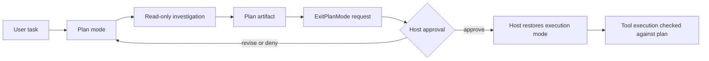

# 4b장: 플랜 모드 — 뛰기 전에 살펴보기

> 공개 GitHub Pages 투영판: [4b장: 플랜 모드 — 뛰기 전에 살펴보기](https://nfbs2000.github.io/speaky-claude-cookbooks/book/part1/ch04b/)

플랜 모드는 흔히 오해하듯 “모델이 생각을 더 오래 하는 모드”가 아니에요. 실행 전에 읽기 조사와 계획을 허용하되, 파일 변경 같은 실행 권한은 승인 경계 뒤로 미루는 runtime mode입니다. Python SDK 0.2.128에서는 이 경계를 `ClaudeAgentOptions(permission_mode="plan")`, init 메시지의 `permissionMode`, `ExitPlanMode` 요청, permission callback으로 관찰할 수 있어요. 이 버전의 Python `ClaudeAgentOptions`에는 `planModeInstructions` 또는 `plan_mode_instructions` 필드가 없습니다.

## 핵심 질문

> 플랜 모드는 단순한 자연어 계획인가, 아니면 도구 실행 전 인간-AI 의도 정렬을 강제하는 runtime mode인가?

## 4b.1 원본의 플랜 모드 상태 머신

제품 UI와 host 구현에 따라 승인 연결 방식은 달라질 수 있습니다. 2026-08-03에 Python SDK 0.2.128과 Claude Code 2.1.220으로 실행한 headless host-managed case에서는 다음 흐름이 관찰됐어요.

```text
host saves previous mode
  -> host sets plan mode
  -> read-only investigation
  -> assistant plan artifact
  -> model requests ExitPlanMode
  -> permission callback preserves the approval gate
  -> host or user supplies an approval decision
  -> host explicitly restores the saved mode
  -> next turn executes in the same SDK session
```

여기서 중요한 점은 permission mode 저장/복원의 **소유자**예요. 이번 Python SDK 실행에서는 SDK가 이전 mode를 자동 복원하지 않았습니다. host가 이전 mode인 `acceptEdits`를 저장해 두고, 명시적 승인 뒤 `set_permission_mode("acceptEdits")`를 호출했어요. 자동 복원과 host-managed 복원을 같은 기능으로 설명하면 안 됩니다.

## 4b.2 SDK에서 보이는 플랜 모드

Python SDK의 `PermissionMode`에는 `plan`이 있어요. `ClaudeAgentOptions(permission_mode="plan")`으로 시작하면 `Glob`과 `Read` 같은 조사 도구는 실제 실행될 수 있습니다. 다만 “변경 도구가 전혀 나타나지 않는다”라고 설명하면 부정확합니다. 재실행에서는 격리된 `config/plans` 계획 artifact를 만드는 `Edit`가 plan phase에 성공했지만, 대상 작업공간 `app.py`는 승인 전까지 바뀌지 않았습니다. 설치된 Python SDK 0.2.128에서는 `planModeInstructions`로 workflow를 바꾸는 option을 확인하지 못했으므로 이 책에서는 Python SDK 기능으로 가르치지 않습니다.

SDK 화면에서 함께 확인해 볼 것은 다음과 같아요.

| SDK 증거 | 의미 |
| --- | --- |
| `ClaudeAgentOptions(permission_mode="plan")` | 실행 전 계획 모드로 시작 |
| `SDKSystemMessage.init.permissionMode` | 실제 세션의 permission mode |
| read-only tool use/result | 계획 단계에서도 조사 도구는 실행될 수 있음 |
| target workspace hash before/after plan | 승인 전 애플리케이션 소스가 바뀌지 않음 |
| plan artifact tool/result + assistant plan | 계획 산출물과 대상 작업공간 변경을 구분 |
| `ExitPlanMode` request + permission result | 계획 종료 요청과 승인 경계의 처리 |
| later turn in the same session | 승인 후 같은 대화 맥락에서 실행으로 이동 |

## 4b.3 계획 파일은 의도 정렬 매체다

계획 artifact는 모델의 중간 메모가 아니라, 사용자와 모델이 같은 목표를 보고 있는지 확인해 주는 매체예요. artifact는 assistant text일 수도 있고 host가 관리하는 계획 파일일 수도 있습니다. 이번 재실행의 init 도구 목록에는 `Write`가 없었고 실제 `Write` 요청은 “enabled되지 않았다”는 오류로 끝났습니다. 그러나 이어진 `Edit`는 격리된 `config/plans/...md` 계획 artifact에 성공했고, 같은 계획은 `ExitPlanMode` 입력에도 실렸습니다. 따라서 “`Write`가 없으니 계획 파일도 없다”는 결론은 틀립니다.

SDK 강의에서는 실제 파일 생성 여부보다 다음 구조를 강조해요.

- 목표
- 현재 이해
- 조사한 근거
- 변경 후보
- 위험한 단계
- 검증 방법
- 승인 요청

말하자면 계획은 실행 전에 맺는 계약이에요. 이후 실행 이벤트는 이 계약과 비교해 보면 됩니다.

```text
Plan item: "Read auth.ts and auth.test.ts"
  -> observed Read tool_use

Plan item: "Run tests after edit"
  -> Bash가 없으면 not observed로 남김

Plan item: "Do not modify application source before approval"
  -> config/plans artifact Edit may occur
  -> target workspace hash must remain unchanged
```

## 4b.4 5단계 workflow

플랜 모드는 단순히 “계획을 써라”에 그치지 않고, 차근차근 따라갈 수 있는 workflow와 함께 사용할 수 있습니다. 다음 5단계는 유용한 교육용 구조이지만, Python SDK가 정확히 이 다섯 heading을 자동 주입하거나 보장한다는 뜻은 아닙니다.

1. 초기 이해
2. 설계
3. 검토
4. 최종 계획
5. `ExitPlanMode` 호출

SDK 책에서는 이 5단계를 plan canvas의 lane으로 보여줘요.

| 단계 | SDK 관측 |
| --- | --- |
| 초기 이해 | assistant가 요구사항/파일 후보를 정리 |
| 설계 | read-only 도구로 근거 수집 |
| 검토 | 위험/대안/검증 방법 표시 |
| 최종 계획 | 구조화된 plan output |
| 종료 | `ExitPlanMode` 요청, 승인 처리, 다음 실행 turn을 각각 확인 |

## 4b.5 full vs sparse 계획

계획 내용을 full로 넣을지 sparse로 줄일지는 context budget과 연결되는 설계 선택입니다. 이번 Python SDK 실행에서는 이를 선택하는 공개 option이나 내부 기준을 관찰하지 못했으므로, SDK의 검증된 자동 최적화 기능으로 단정하지 않습니다.

- full plan: 복잡한 작업, 높은 정확도, 큰 context 비용
- sparse plan: 반복적/작은 작업, 낮은 context 비용, 누락 위험

강의 화면에서는 계획의 길이만 보기보다, 계획 항목이 실제 실행 이벤트로 잘 이어졌는지를 함께 봐요.

## 4b.6 사용자 승인과 팀리드 승인

원본에는 사용자 승인뿐 아니라 팀리드 승인 흐름도 있었어요. SDK 관점에서는 이 두 승인을 구분해서 봅니다.

| 승인 주체 | SDK/제품 표면 |
| --- | --- |
| 사용자 | app UI의 permission card, 외부 `permission.reply`, `can_use_tool` 응답 |
| 팀리드/상위 agent | Agent tool result, subagent synthesis, plan acceptance message |

여기서 중요한 것은 “누가 승인했는가”를 화면에 남겨 두는 일이에요. 자동 실행 시스템에서 승인 주체가 흐려지면 통제권이 사라지기 때문이죠.

제품 UI는 `can_use_tool` callback을 사용자 인터페이스와 다음처럼 연결해야 합니다.

```text
ExitPlanMode permission request
  -> host publishes permission.requested(requestId, toolUseId, plan)
  -> UI renders 승인 / 거절 / 수정 요청
  -> user click publishes permission.reply(requestId, actor=user, decision)
  -> pending callback returns PermissionResultAllow or PermissionResultDeny
  -> raw SDK result and subsequent tool execution are appended to the same timeline
```

GitHub Pages 같은 재생 화면은 승인 버튼을 실제 runtime 제어 버튼처럼 가장하지 않습니다. 저장된
`permission.requested`, 실제 reply, callback result, 후속 tool event를 순서대로 재생해 “어떤
승인으로 무엇이 실행됐는가”를 보여줍니다. 반대로 live app에서는 reply가 도착하기 전까지
callback의 pending future를 풀지 않아야 합니다.

## 4b.7 auto mode와 플랜 모드

`auto`와 `plan`을 함께 사용할 때는 다음을 설계 원칙으로 검토해야 합니다. 이번 실제 case는 이전 mode로 `acceptEdits`를 사용했으므로, 아래 `auto` 조합은 아직 관찰 증거가 아니라 후속 실험 대상입니다.

- `auto`는 도구 승인 판단을 자동화한다.
- `plan`은 도구 실행 자체를 막고 계획을 우선한다.
- plan mode 진입 전 permission state를 보존해야 한다.
- plan exit 후 자동 승인 정책이 갑자기 넓어지면 안 된다.

이 장의 시각화는 mode transition을 보여주는 데 초점을 둡니다.

```text
permissionMode: auto
  -> enter plan
  -> permissionMode: plan
  -> ExitPlanMode
  -> restore auto with safeguards
```

## 4b.8 캔버스 표현



하단 테이블은 계획과 실제 실행이 얼마나 잘 맞았는지를 보여줘요.

| Plan item | Expected event | Observed event | Status |
| --- | --- | --- | --- |
| 조사 | read-only tools | `Glob` seq 19, `Read` seq 32/46/56 | observed |
| 계획 artifact | 격리된 계획 저장 | `Write` seq 761 거부 뒤 `config/plans` `Edit` seq 817 성공 | observed; 앱 변경과 별개 |
| 수정 전 승인 | target workspace no mutation | baseline/after-plan `app.py` hash 동일 | observed |
| 종료 요청 | `ExitPlanMode` | seq 841/866, callback deny seq 847~848/872~873 | observed gate; 자동 전환 없음 |
| 승인 입력 | programmatic host approval | process seq 901 뒤 mode 전환 | observed mechanism; 사람 클릭 아님 |
| 실행 진입 | restored mode + `Edit` | `acceptEdits` init seq 906, `Edit` seq 916/922 | observed |
| 검증 | Bash test | 실행 도구가 없어 미수행 | not observed |

## 4b.9 실제 Opus 5 실행에서 확인한 것

attempt `224407-d1e8d267`은 mock 없이 actual `claude-opus-5`를 호출한 결과입니다. plan turn과 execution turn의 opaque SDK session ID는 같았고, plan 뒤 대상 `app.py` hash는 변하지 않았습니다. 모델은 `ExitPlanMode`를 두 번 요청했지만 permission callback은 두 번 모두 명시적 외부 승인을 요구하며 거부했습니다. 그 뒤 `actor=host-program` 승인 기록, `acceptEdits` 전환, 실제 `app.py` `Edit`, 파일 hash 변경이 순서대로 이어졌으므로 “승인 입력과 host mode 전환이 대상 작업공간의 mutation 경계를 연다”는 메커니즘은 관찰됐습니다.

계획 artifact 생성은 이번에 관찰됐지만, 정확한 5단계 heading 보장, `auto` 복원, 실제 사람의 UI 승인, 팀리드 승인, 테스트 실행은 확인되지 않았습니다. primary assistant model은 Opus 5였지만 terminal `model_usage`에는 Haiku 4.5도 함께 기록됐습니다. 관찰되지 않은 항목을 성공으로 채우지 않고 후속 case로 남깁니다.

전체 sequence, source hash, raw/OTel 대응 및 공개 redaction 원칙은 [4b장 실제 Python SDK 관찰](../evidence/ch04b-live.md)에 분리해 두었습니다.

## 학생 실습

```text
현재 프로젝트의 작은 개선 작업을 플랜 모드로 진행한다고 가정해 줘.

아직 파일을 수정하지 말고 다음을 작성해 줘.
1. 초기 이해
2. 조사할 파일과 검색어
3. 설계안
4. 위험과 대안
5. 최종 계획
6. 승인 후 실행할 도구 순서
```

강사용 SDK 화면에서는 `permissionMode: "plan"`에서 읽기 도구와 변경 도구를 구분하고, 변경이 승인 전에 일어나지 않았는지 확인합니다. 이어서 `ExitPlanMode` 요청, permission decision, 승인 주체, mode 전환, 같은 session의 후속 실행을 하나의 타임라인으로 대조해요.

## Builder takeaway

플랜 모드는 “천천히 생각하기”가 아니라, 조사·계획 artifact와 대상 작업공간 변경 사이에 승인 경계를 두는 상태 머신이에요. headless SDK 통합에서는 그 경계가 자동으로 완성된다고 가정하지 말고, host가 승인 기록과 mode 전환을 어떻게 소유하는지 raw event와 대상 파일 hash로 함께 확인해야 합니다.

1부는 여기서 마무리됩니다. 이제 2부에서는 이 실행 시스템을 실제로 조종하는 프롬프트 제어 평면으로 함께 들어가 볼게요.

## 관련 강의

- [5장: 시스템 프롬프트 아키텍처](../part2/ch05.md)
- [Superpowers 2장: 설계 제어 평면](../../../book-superpowers-ko/src/part1/ch02.md)
