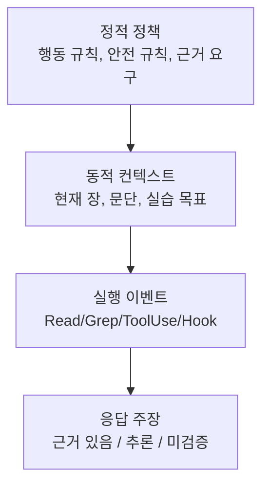

# 5장: 시스템 프롬프트 아키텍처

> 공개 GitHub Pages 투영판: [5장: 시스템 프롬프트 아키텍처](https://nfbs2000.github.io/speaky-claude-cookbooks/book/part2/ch05/)
>
> 실제 실행 증거: [custom, preset+append, exclude dynamic 세 case](../evidence/ch05-live.md)

1부에서는 실행 루프와 도구 실행을 함께 살펴봤어요. 이제 질문은 조금 더 안쪽으로 들어가 봅니다.

같은 루프인데 왜 어떤 때는 바로 파일을 읽고, 어떤 때는 계획만 세우고, 어떤 때는 사용자 승인을 기다리고, 어떤 때는 MCP/스킬/프로젝트 메모리를 먼저 읽을까요? 그 답이 바로 시스템 프롬프트입니다. 다만 이 강의에서 다루는 시스템 프롬프트는 “숨겨진 마법 문장”이 아니라 **SDK에서 설정하고, 이벤트로 검증하는 제어 평면**이라고 생각하면 편해요.

원본 Claude Code 관점에서 5장의 핵심은 `systemPromptSection`, `DANGEROUS_uncachedSystemPromptSection`, `SYSTEM_PROMPT_DYNAMIC_BOUNDARY`, `splitSysPromptPrefix`, `buildEffectiveSystemPrompt`였습니다. SDK판에서는 그 내부 파일을 그대로 강의하지는 않아요. 대신 같은 설계를 TypeScript의 `Options.systemPrompt`/`settingSources`와 Python의 `ClaudeAgentOptions.system_prompt`/`setting_sources`, 그리고 `SDKSystemMessage.init`, `SDKMessage` 스트림으로 관찰합니다. 두 SDK의 표기와 지원 입력 형태는 같지 않습니다.

## 5.1 시스템 프롬프트에 아키텍처가 필요한 이유

단순한 에이전트라면 시스템 프롬프트를 하나의 문자열로 넣어도 괜찮습니다.

```typescript
systemPrompt: "You are a helpful coding assistant."
```

그런데 실제 코딩 에이전트는 그렇게 단순하지만은 않아요. 프롬프트에는 최소한 다음 성격의 정보가 섞여 들어갑니다.

| 계층 | 예 | 변경 빈도 | SDK에서 다루는 표면 |
| --- | --- | --- | --- |
| 정체성/행동 규칙 | “코딩 에이전트처럼 행동하라”, “검증하지 않은 성공을 주장하지 마라” | 낮음 | `systemPrompt` preset 또는 custom static block |
| 도구 정책 | Read/Grep/Edit/Bash 사용 규칙 | 중간 | `tools`, `allowedTools`, `disallowedTools`, `canUseTool` |
| 프로젝트 지침 | CLAUDE.md, 프로젝트 설정 | 프로젝트별 | `settingSources`, `cwd`, `SDKSystemMessage.init` |
| 스킬/플러그인 | 동적으로 로드된 작업 능력 | 세션별 | `skills`, `plugins`, `SDKSystemMessage.init.skills/plugins` |
| MCP 서버 | 외부 도구/서버 설명 | 세션 중 변할 수 있음 | `mcpServers`, `SDKSystemMessage.init.mcp_servers` |
| 사용자 질문 | 이번 턴의 목적 | 매 턴 | `query({ prompt })` |

원본 구현이 섹션 레지스트리와 캐시 경계를 둔 이유는 바로 이 변경 빈도 차이를 관리하기 위해서예요. SDK 강의에서는 같은 사실을 이렇게 정리해 볼 수 있습니다.

> 프롬프트는 하나의 문장이 아니라, 정적 제어 규칙과 세션별 동적 컨텍스트가 합성된 실행 조건이다.

이 장의 배열과 `SYSTEM_PROMPT_DYNAMIC_BOUNDARY` 예제는 TypeScript Agent SDK 0.3.177
기준입니다. Python Agent SDK 0.2.128의 `system_prompt`는 string 또는 preset/file 구조를
받지만 TypeScript식 `string[]`와 공개 boundary 상수를 제공하지 않습니다. Python에서는
`exclude_dynamic_sections`처럼 snake_case 이름을 사용해요.

## 5.2 원본의 `systemPromptSection`을 SDK로 번역하기

원본의 `systemPromptSection(name, compute)`는 “이 섹션은 이름이 있고, 계산되고, 재사용될 수 있다”는 구조였습니다. SDK에는 같은 이름의 public API가 직접 노출되지는 않아요. 대신 소비자가 다음 표면으로 같은 구조를 만들어 갑니다.

```typescript
import {
  query,
  SYSTEM_PROMPT_DYNAMIC_BOUNDARY,
  type SDKMessage,
} from "@anthropic-ai/claude-agent-sdk";

const staticPolicy = [
  "답하기 전에 근거 문서를 먼저 확인한다.",
  "근거와 추론을 분리해서 보고한다.",
  "검증하지 않은 성공을 성공이라고 말하지 않는다.",
].join("\n");

const sessionContext = [
  `courseChapter=${chapterId}`,
  `targetFile=${chapterFile}`,
  `allowedEvidence=SDK messages, tool_use, tool_result`,
].join("\n");

const stream = query({
  prompt,
  options: {
    cwd,
    systemPrompt: [
      staticPolicy,
      SYSTEM_PROMPT_DYNAMIC_BOUNDARY,
      sessionContext,
    ],
    settingSources: ["project"],
    skills: ["book-evidence"],
    tools: { type: "preset", preset: "claude_code" },
    includeHookEvents: true,
    includePartialMessages: true,
  },
});
```

이 예제에서 눈여겨볼 핵심은 `SYSTEM_PROMPT_DYNAMIC_BOUNDARY`예요. SDK 타입은 `systemPrompt`를 `string[]`로 받을 수 있고, 그 배열 안에 boundary를 독립 원소로 넣으면 정적 prefix와 세션 suffix를 구분할 수 있다고 설명합니다. 이 장의 강의 포인트는 “프롬프트를 잘 쓰자”가 아니라 “프롬프트를 캐시 가능한 정적 부분과 세션별 동적 부분으로 설계하자”에 있어요.

## 5.3 `DANGEROUS_uncachedSystemPromptSection`의 의미

원본에서 `DANGEROUS_uncachedSystemPromptSection`은 매번 다시 계산해야 하는 섹션이었어요. 대표적인 이유는 MCP 서버 지침처럼 세션 중 연결 상태가 바뀔 수 있는 내용이기 때문입니다.

SDK에서는 그 함수가 직접 보이지는 않아요. 하지만 같은 위험은 그대로 남아 있습니다.

| 원본 개념 | SDK에서 대응되는 위험 | 관찰/검증 방법 |
| --- | --- | --- |
| 메모이즈 가능한 정적 섹션 | 모든 세션에 같은 `systemPrompt` prefix 사용 | prompt assembly log 또는 실행 config |
| 휘발성 섹션 | 매 턴 바뀌는 MCP/스킬/현재 파일 상태를 static prompt에 섞음 | 같은 prompt인데 cache/latency/행동이 흔들림 |
| DANGEROUS 이유 기입 | 왜 매번 주입해야 하는지 문서화 | runner config, chapter metadata에 `dynamicReason` 저장 |

강의용 책 프로젝트에서는 “동적 내용을 어디에 넣었는가”를 꼭 기록해 두는 게 좋아요. 예를 들어 책 캔버스의 한 노드는 이렇게 표현해 볼 수 있습니다.

```json
{
  "kind": "prompt_section",
  "name": "chapter_runtime_context",
  "stability": "dynamic",
  "reason": "현재 보고 있는 장, 선택한 문단, 실습 프롬프트가 매 실행마다 달라진다",
  "observable": ["SDKSystemMessage.init.cwd", "user prompt", "tool_use inputs"]
}
```

이렇게 기록해 두면 “프롬프트가 왜 바뀌었는지”를 나중에 다시 재현할 수 있어요.

## 5.4 `Options.systemPrompt`의 `SYSTEM_PROMPT_DYNAMIC_BOUNDARY`

`SYSTEM_PROMPT_DYNAMIC_BOUNDARY`는 TypeScript Agent SDK 0.3.177의 `Options.systemPrompt` 배열에서 정적 영역과 동적 영역을 나누는 공개 입력 마커예요. Python SDK 0.2.128의 공개 입력은 같은 형태가 아닙니다. 그래서 TypeScript 실행에서 관측할 것은 내부 분리 함수가 아니라 Configured `systemPrompt` 배열, Observed `SDKSystemMessage.init`, 그리고 이후 `tool_use`/`tool_result` 행동 변화입니다.

```text
정적 영역
  - 기본 정체성
  - 행동 규칙
  - 도구 사용 원칙
  - 출력 스타일 원칙

SYSTEM_PROMPT_DYNAMIC_BOUNDARY

동적 영역
  - 현재 cwd
  - 프로젝트 지침
  - 메모리/CLAUDE.md
  - MCP/스킬 상태
  - 현재 장/실습 문맥
```

SDK판 책에서는 이 구조를 두 가지 의미로 사용해요.

첫째, 실행 비용과 캐시의 문제입니다. 정적 영역에 세션별 변수가 들어가면 같은 강좌 실습을 여러 번 돌려도 prefix가 계속 달라져요. 그러면 캐시 적중률이 떨어지고, 같은 프롬프트 실험의 비교 가능성도 흔들립니다.

둘째, 강의 시각화의 문제예요. 사용자가 프롬프트를 넣었을 때 캔버스가 “모델이 그냥 답했다”만 보여주면 곤란합니다. 최소한 아래 네 층을 분리해서 보여주는 게 좋아요.



## 5.5 `systemPrompt` prefix를 SDK 관점으로 읽기

원본의 `splitSysPromptPrefix`는 시스템 프롬프트 배열을 API 요청 블록으로 나누고, 각 블록에 캐시 범위를 붙였다는 역사적 설명이에요. SDK 소비자는 내부 `cache_control` 블록을 직접 만지지 않아요. 대신 Configured `Options.systemPrompt` 입력 형태를 결정하고, Observed `SDKResultMessage.usage`와 실행 행동을 통해 캐시/동적 분리의 효과를 추론합니다.

| 설계 선택 | SDK 입력 | 기대 효과 |
| --- | --- | --- |
| 완전 custom prompt | `systemPrompt: "..."` | 단순하지만 캐시/동적 분리가 어렵다 |
| custom block prompt | `systemPrompt: [static, boundary, dynamic]` | 정적/동적 분리가 명확하다 |
| 기본 Claude Code prompt 사용 | `systemPrompt: { type: "preset", preset: "claude_code" }` | 제품 기본 하니스에 올라탄다 |
| 기본 prompt에 강의 규칙 추가 | `systemPrompt: { type: "preset", preset: "claude_code", append }` | 원래 도구/안전 지침을 유지하면서 강의 목표를 덧붙인다 |
| 다중 사용자 캐시 최적화 요청 | TS `excludeDynamicSections: true`, Python `exclude_dynamic_sections=True` | 이동 동작은 공개 option 계약이며, 실제 조립 결과가 raw event에 보이는지는 별도 문제 |

책 실습에서는 대체로 `preset + append`가 무난해요. 학생에게 Claude Code의 기본 도구/권한/안전 하니스를 유지한 채, 강의용 근거 추적 규칙만 더해 줄 수 있기 때문입니다. 반대로 TypeScript 기반 강사용 시각화 실험에서는 `string[] + boundary`를 사용할 수 있어요. Python에서 같은 배열 API를 그대로 복사하면 안 됩니다.

## 5.6 `buildEffectiveSystemPrompt`: 우선순위는 반드시 설명해야 한다

원본 구현의 우선순위 체인은 대략 다음과 같았어요.

```text
override
  > coordinator
  > agent
  > custom
  > default
  + append
```

SDK판에서도 같은 충돌이 생길 수 있어요.

| 입력 | 의미 | 충돌 위험 |
| --- | --- | --- |
| `agent` + `agents` | main thread에 특정 agent prompt 적용 | 기본 prompt와 역할 충돌 |
| `systemPrompt` custom | 전체 시스템 prompt 대체 | Claude Code 기본 안전/도구 지침 약화 |
| `systemPrompt.preset.append` | 기본 prompt 뒤에 추가 | 비교적 안전하지만 뒤쪽 지침이라 약할 수 있음 |
| `settings`, `managedSettings`, `settingSources` | 파일/정책 계층에서 지침 로드 | 사용자가 모르는 지침이 섞일 수 있음 |
| `skills`, `plugins` | 동적 능력/명령 로드 | 어떤 스킬이 행동을 바꿨는지 추적 필요 |

그래서 강의 화면은 최소한 `SDKSystemMessage.init`에서 다음 항목을 기록해 두는 게 좋아요.

- `cwd`
- `model`
- `permissionMode`
- `tools`
- `mcp_servers`
- `skills`
- `plugins`
- `agents`
- `slash_commands`
- `output_style`

이 값들이 “모델의 완전한 마음”을 보여주는 건 아니에요. 하지만 이번 세션이 어떤 하니스 위에서 실행됐는지 알려주는 합법적이고 공개적인 관측값입니다.

## 5.7 직접 보이는 것과 추론해야 하는 것

이 장에서 가장 중요한 강의 규칙은 evidence label이에요.

| 분류 | 예 | 책/캔버스 표시 |
| --- | --- | --- |
| Configured | `Options.systemPrompt`, `skills`, `plugins`, `mcpServers`, `permissionMode` | “실행 전 설정” |
| Observed | `SDKSystemMessage.init`, `tool_use`, `tool_result`, hook events | “실제 이벤트” |
| Inferred | 특정 지침이 특정 행동을 유도했다는 해석 | “추론” |
| Not observable | 내부 비공개 prompt 전문, 모델의 chain-of-thought | “표시하지 않음” |

예를 들어 “모델이 근거를 먼저 읽으라는 지침을 따랐다”는 주장은 이렇게 나눠 볼 수 있어요.

```text
Configured: append prompt에 "관련 문서를 먼저 읽어라"가 있었다.
Observed: assistant가 답변 전에 Grep/Read를 호출했다.
Observed: 응답에 문서명과 핵심 단어가 포함됐다.
Inferred: 해당 지침이 문서 탐색 행동을 강화했다.
Not observable: 모델 내부 사고 과정 전문.
```

이 구분이 없으면 강좌가 “SDK로 관찰한 것”과 “강사가 해석한 것”을 자칫 섞어 버리게 돼요.

## 5.8 책 캔버스 요구사항

5장 캔버스는 기존의 팀/스웜 그림만 보여주면 조금 아쉬워요. 프롬프트 조립 구조까지 보여주는 게 좋습니다.

```text
Prompt Assembly
  Static Policy
    - 행동 규칙
    - 근거 요구
    - 안전 규칙
  Dynamic Context
    - 현재 장
    - 선택 문단
    - 실습 질문
  Runtime Surface
    - tools
    - skills
    - plugins
    - mcp servers
  Evidence Tape
    - system:init
    - tool_use
    - tool_result
    - assistant text
```

아래 표는 이 장에서 꼭 보여야 하는 최소 테이블이에요.

| 프롬프트 문장/섹션 | 안정성 | SDK 근거 | 이후 행동 |
| --- | --- | --- | --- |
| “문서를 먼저 읽어라” | static | configured prompt block | Read/Grep 발생 여부 |
| 현재 장 파일 경로 | dynamic | user prompt 또는 dynamic block | 해당 파일 Read 여부 |
| 스킬 활성화 | dynamic | `SDKSystemMessage.init.skills` | Skill/Read/ToolUse 변화 |
| MCP 서버 | dynamic | `SDKSystemMessage.init.mcp_servers` | MCP tool 호출 여부 |

## 5.9 실제 Opus 5 실행으로 확인한 경계

2026-08-03에 Python SDK 0.2.128과 Claude Code 2.1.220으로 세 case를 순차 실행했습니다.
세 세션의 init과 assistant primary model은 실제 `claude-opus-5`였으며 model mock은 사용하지
않았어요. 다만 두 preset case의 최종 `ResultMessage.model_usage`에는 보조
`claude-haiku-4-5-20251001` 사용도 함께 기록됐습니다. 따라서 이 표의 모델 표기는 primary
assistant model을 뜻하며, provider 사용 전체가 Opus 하나뿐이었다는 뜻은 아닙니다.

| case / attempt | Configured | Observed | 판정 |
| --- | --- | --- | --- |
| custom / `102115-1592cc3c` | custom string, Read | 첫 Read 실패 15~17, 복구 Read 35~37, 답변 56 | custom 실행과 행동은 관찰, 유일 인과는 추론 |
| preset+append / `102206-ff8fd397` | preset, append, Read | Read 20, result 22, 답변 37 | preset+append 실행과 행동 관찰 |
| exclude dynamic / `102245-348d28d3` | `exclude_dynamic_sections=True` | Read 17, result 19, 답변 37 | option은 configured, 내부 prompt 이동은 비관찰 |

custom case의 첫 경로 오류도 증거입니다. 모델은 `/workspace/evidence.md`를 먼저 읽다가
실패했고, tool result가 알려 준 실제 cwd로 경로를 고쳐 marker를 찾았습니다. 반면 두 preset
case는 첫 Read부터 실제 cwd를 사용했어요. 이 차이는 흥미롭지만 각 case 한 번뿐이므로 preset의
일반적 우월성으로 단정하지 않습니다.

세 Result에는 cache token과 비용도 들어 있지만 session과 marker가 서로 다릅니다. 이 숫자만
비교해 `exclude_dynamic_sections`의 cache 개선 효과를 증명하지 않습니다. 반복·고정 입력을
사용하는 cache 전용 장에서 다시 관찰해야 해요.

세 probe는 `setting_sources=[]`였지만 `skills` 옵션을 따로 지정하지 않았고, 세 init 모두
16개 skill 이름을 노출했습니다. Python SDK 0.2.128의 공개 계약도 `skills=None`은 SDK가
스킬을 자동 설정하지 않는다는 뜻일 뿐 CLI 기본값까지 끄는 값은 아니라고 명시합니다. 모든
skill을 목록에서 제외하려면 `skills=[]`를 별도로 전달해야 합니다. 즉 filesystem settings
격리와 skill 비활성화는 같은 스위치가 아닙니다.

## 5.10 학생 실습

```text
현재 장의 핵심을 설명해 줘.

규칙:
1. 답하기 전에 관련 장 파일을 먼저 확인해라.
2. 네가 사용한 핵심 단어를 먼저 적어라.
3. 근거가 있는 내용과 추론한 내용을 분리해라.
4. 내부 시스템 프롬프트를 복원하려고 하지 말고, SDK에서 보이는 이벤트만 근거로 삼아라.
```

강사용 SDK 화면에서는 다음을 함께 확인해 봅니다.

- `system:init`에 어떤 tools/skills/plugins가 있었는가
- Read/Grep가 assistant claim보다 앞섰는가
- 응답이 “근거/추론”을 분리했는가
- 프롬프트 계층 중 어느 문장이 어떤 행동과 연결됐는가

## Builder takeaway

시스템 프롬프트 아키텍처의 핵심은 “긴 지침을 잘 쓰는 것”이 아니에요. 정적 정책, 동적 컨텍스트, 도구 정책, 프로젝트 지침을 분리하고, 실행 뒤에는 그 효과를 SDK 이벤트로 검증하는 것입니다.

다음 장에서는 이 프롬프트 계층 안에 들어가는 실제 행동 조종 패턴을 함께 살펴봅니다.

## 관련 강의

- [8c장: 정적 시스템 프롬프트](./ch08c.md)
- [8d장: 동적 프롬프트 계층](./ch08d.md)
- [8f장: 권한 분류기 프롬프트](./ch08f.md)
- [부록 J: 비공식 시스템 프롬프트 자료를 읽는 법](../appendix/appendix-j.md)
- [부록 M: Claude 시스템 프롬프트 버전 진화 지도](../appendix/appendix-m.md)
