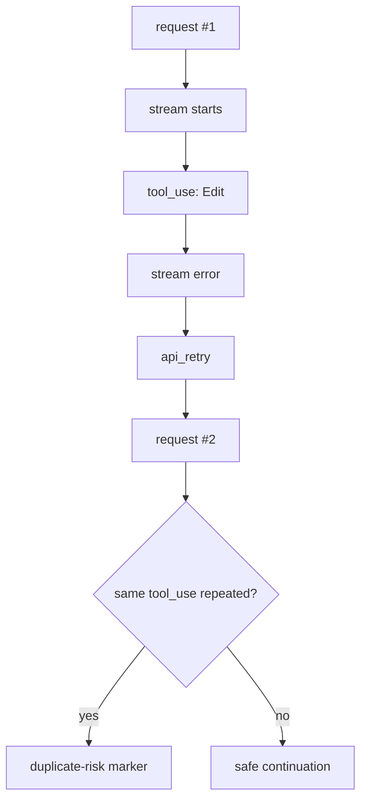

# 6b장: API 통신 계층 — 재시도, 스트리밍, 성능 저하 대응

> 공개 GitHub Pages 투영판: [6b장: API 통신 계층 — 재시도, 스트리밍, 성능 저하 대응](https://nfbs2000.github.io/speaky-claude-cookbooks/book/part2/ch06b/)
>
> 실제 실행 증거: [partial stream, interrupt, max turns, checkpoint, session store, API retry](../evidence/ch06b-live.md)

사용자는 에이전트를 하나의 대화 상대로 봅니다. 그런데 제품을 만드는 입장에서 보면, 이건 단순한 대화가 아니라 요청 전송, 스트리밍, 부분 응답, 도구 호출, 도구 결과, 재시도, 오류, fallback, 최종 result가 차례로 이어지는 통신 파이프랍니다.

원본 Claude Code 관점에서 이 장은 `withRetry`, streaming watchdog, Fast Mode cache-aware retry, persistent retry, API observability, Files API를 다뤘습니다. SDK판에서는 같은 관점을 공식 `SDKMessage` stream으로 번역해서 살펴봅니다. 단, 아래 이름을 모든 언어에 공통이라고 읽으면 안 됩니다. TypeScript `@anthropic-ai/claude-agent-sdk==0.3.177`에는 `SDKAPIRetryMessage`, `SDKPartialAssistantMessage.ttft_ms`, `abortController`, `debug`, `debugFile`이 있고, 이 장을 실제 실행한 Python `claude-agent-sdk==0.2.128`에는 `StreamEvent`, `ClaudeSDKClient.interrupt()`, `fallback_model`, `stderr`, `session_store`, `enable_file_checkpointing`, `rewind_files()`가 있습니다.

## 6b.1 스트리밍은 UX가 아니라 증거 파이프다

스트리밍은 “글자가 빨리 보이는 기능”이라기보다는, 강의 화면에서 관찰 가능한 실행 경로를 다시 복원해 주는 증거 파이프에 가깝습니다. 공개 stream으로 내부 chain-of-thought를 복원할 수 있다는 뜻은 아닙니다.

```text
Prompt submit
  -> stream_event(partial)
  -> assistant(tool_use)
  -> user(tool_result)
  -> stream_event(partial)
  -> result(success/error)
```

TypeScript SDK에서 `includePartialMessages: true`를 켜면 `SDKPartialAssistantMessage`가 나옵니다. 타입상 이 메시지는 다음 정보를 담고 있어요. Python 0.2.128에서는 `include_partial_messages=True`로 `StreamEvent`를 받습니다.

| 필드 | 의미 |
| --- | --- |
| `type: "stream_event"` | 부분 스트리밍 이벤트 |
| `event` | raw stream event |
| `parent_tool_use_id` | subagent/nested 흐름 연결 |
| `ttft_ms` | 첫 토큰까지 시간. 이 필드는 이 장의 TypeScript 버전 표면이며 Python 0.2.128에는 없음 |
| `uuid`, `session_id` | 세션 추적 키 |

책 캔버스에서 `ttft_ms`는 꽤 중요한 값입니다. 사용자가 “느리다”고 느낄 때, 병목이 모델의 첫 토큰인지, 도구 실행인지, 아니면 UI 반영인지를 나눠서 볼 수 있게 도와주기 때문이에요. Python에서는 host가 capture 시작과 첫 SDK message 도착 시각을 재서 별도 필드로 보완할 수 있지만, 그 값은 provider가 보고한 TTFT가 아닙니다.

## 6b.2 재시도는 중복 실행 위험을 만든다

원본 구현에서 재시도는 단순한 `try again`이 아니었습니다. 429/529, 네트워크 오류, 인증 오류, context overflow, streaming 중단 등이 저마다 다른 정책을 가지고 있었죠. TypeScript SDK에서는 그 일부를 `SDKAPIRetryMessage`로 관측할 수 있습니다. 이후 Python 0.2.128 실제 실행에서도 generic `SystemMessage(subtype="api_retry")`를 관찰했습니다. 아래 TypeScript type 이름과 Python의 generic message shape는 구분해야 합니다.

```typescript
type SDKAPIRetryMessage = {
  type: "system";
  subtype: "api_retry";
  attempt: number;
  max_retries: number;
  retry_delay_ms: number;
  error_status: number | null;
  error: SDKAssistantMessageError;
  uuid: UUID;
  session_id: string;
};
```

이 이벤트가 중요한 이유는, “같은 의도”가 여러 번 시도되었음을 숨기지 않기 때문입니다. 다만 `api_retry` 하나만 보고 도구 부작용도 반복됐다고 결론 내리면 안 됩니다. 이번 실제 529 실행에서는 세 retry 뒤 도구가 한 번 실행됐고 성공했습니다. 아래 그림은 stream 중단 이후 host가 요청을 재구성하는 시스템에서 따로 점검해야 할 **개념적 중복 위험**이지, 이번 실행의 실제 사건 순서가 아닙니다.

| 중복 대상 | 위험 |
| --- | --- |
| 텍스트 생성 | 대체로 낮음 |
| Read/Grep | 낮음 |
| Edit/FileWrite | 중간: 같은 변경 중복 가능 |
| Bash test | 낮음~중간 |
| Bash deploy/rm/git push | 높음 |
| MCP 외부 호출 | 높음 |

그래서 강의용 이벤트 그래프에서는 retry를 숨기지 않는 것이 좋습니다.



## 6b.3 SDK에서 제어할 수 있는 통신 옵션

SDK 소비자가 직접 제어할 수 있는 주요 옵션을 함께 살펴봅시다.

| 역할 | TypeScript | Python 0.2.128 | 강의에서 보여줄 의미 |
| --- | --- | --- | --- |
| partial event 노출 | `includePartialMessages` | `include_partial_messages` | 응답이 언제 시작됐는가 |
| hook event 노출 | `includeHookEvents` | `include_hook_events` | 권한/가로채기/후처리 가시화 |
| 대체 모델 | `fallbackModel` | `fallback_model` | 품질 변화와 availability tradeoff |
| 실행 취소 | `abortController` | `ClaudeSDKClient.interrupt()` | 사용자/host 중단과 타임아웃 |
| 턴 제한 | `maxTurns` | `max_turns` | runaway 방지 |
| 비용 제한 | `maxBudgetUsd` | `max_budget_usd` | 강의/실습 안전장치 |
| 내부 디버그 로그 | `debug`, `debugFile`, `stderr` | `stderr` | SDK 이벤트로 안 보이는 통신 오류 보강 |
| transcript 외부 저장 | `sessionStore` | `session_store` | 장기 실험 재현 |

원본의 Fast Mode cache-aware retry나 persistent retry를 SDK 소비자가 전부 직접 재현할 필요는 없습니다. 다만 강의 화면에서는 최소한 retry/fallback/partial/result 정도는 구분해 두는 게 좋아요. 이 구분이 없으면 “모델이 이상하게 답했다”와 “통신 파이프가 중간에 끊겼다”를 가려내기 어렵기 때문입니다.

## 6b.4 실패 분류: 답변 실패와 파이프 실패는 다르다

`SDKResultMessage`에는 성공과 오류가 모두 함께 들어옵니다. 오류 subtype은 인증, 실행 중 오류, max budget, invalid request 같은 실행 실패를 나타내는데요, 이것은 모델의 추론 품질과는 따로 떼어 보는 것이 좋습니다.

| 실패 종류 | 예 | 대응 |
| --- | --- | --- |
| 파이프 실패 | api retry, stream 중단, auth error | 통신 계층/환경 수정 |
| 권한 실패 | permission denied | 사용자 승인/정책 수정 |
| 도구 실패 | Bash exit non-zero, Read path missing | 에이전트 복구 행동 평가 |
| 추론 실패 | 문서를 읽었지만 결론이 틀림 | 프롬프트/모델/근거 연결 개선 |
| 제품 투영 실패 | result는 왔지만 UI에 안 보임 | renderer/store projection 수정 |

책에서 추론 흐름을 보여주려면 이 실패 종류들을 나눠서 다루는 것이 좋습니다. 모든 실패를 “LLM이 틀렸다”로 뭉뚱그리면 강좌가 정확하지 않게 되니까요.

## 6b.5 watchdog 관점을 SDK 화면으로 옮기기

원본은 streaming idle timeout과 stall detection을 구분해서 다뤘습니다.

| 원본 개념 | 의미 | SDK/제품 투영 |
| --- | --- | --- |
| TTFB/TTFT | 첫 이벤트 또는 첫 토큰까지 시간 | TypeScript `ttft_ms`; Python에서는 host timestamp를 별도 측정 |
| Stall | 이벤트 간 간격이 비정상적으로 큼 | partial event gap |
| Idle timeout | 일정 시간 이벤트 없음 | timeout marker 또는 abort |
| Non-stream fallback | streaming 실패 후 non-stream 재시도 | retry/fallback marker |

SDK 이벤트만으로는 내부 watchdog 전체를 다 보기 어려울 수 있습니다. 이럴 때 제품은 자체 timestamp를 붙여 주면 됩니다.

```json
{
  "event": "stream_gap",
  "session_id": "...",
  "gap_ms": 42137,
  "previous": "stream_event",
  "next": "assistant.tool_use",
  "classification": "stall-inferred"
}
```

여기서 `classification`이 `inferred`라는 점을 표시해 두면 좋습니다. 내부 watchdog 이벤트가 직접 온 것이 아니라, SDK event timestamp 차이를 통해 추론한 값이기 때문이에요. 큰 gap 하나만으로 네트워크 stall, 모델 계산, 도구 대기 중 무엇이 원인이었는지도 확정할 수 없습니다.

## 6b.6 Files API와 파일 증거

원본의 Files API는 세션 파일 첨부, 원격 seed bundle, 변경 파일 persistence 같은 역할을 했다고 볼 수 있습니다. SDK 책에서는 이 내부 역할을 직접 관측했다고 말하기보다는, 공식 `SDKMessage`와 파일 관련 이벤트에서 보이는 artifact 신호로 번역해서 다룹니다. 그리고 무엇보다 파일이 증거 그래프의 결과물이 된다는 점이 중요해요.

| 파일 이벤트 | 강의 의미 |
| --- | --- |
| attachment download | 사용자가 어떤 자료를 세션에 제공했는가 |
| file edit/write | 모델이 어떤 산출물을 만들었는가 |
| file persisted | 세션 이후에도 어떤 결과가 남았는가 |
| checkpoint/rewind | 어느 사용자 메시지 기준으로 되돌릴 수 있는가 |

TypeScript SDK에는 `enableFileCheckpointing`과 `Query.rewindFiles()`가 있고, Python 0.2.128에는 `enable_file_checkpointing`과 `ClaudeSDKClient.rewind_files(user_message_uuid)`가 있습니다. 강의에서는 “AI가 파일을 만들었다”에서 한 걸음 더 나아가, “어느 prompt, 어느 evidence, 어느 tool_use 뒤에 이 파일이 생겼는가”를 보여 주면 좋습니다. 단, checkpoint/rewind 한 사례가 attachment download나 원격 Files API 전체를 증명하는 것은 아닙니다.

## 6b.7 실제 Opus 5 실행에서 관찰한 것

2026-08-03에 Python `claude-agent-sdk==0.2.128`, Claude Code `2.1.220`, 요청 모델 `claude-opus-5`로 다섯 case를 순차 실행했습니다. init과 assistant의 primary model은 Opus 5였지만 `ResultMessage.model_usage`에는 Haiku 4.5 보조 사용도 기록됐습니다. mock event나 fixture verdict를 런타임 증거로 사용하지 않았습니다. fixture 파일은 모델이 실제 Read/Edit할 통제 자극으로만 사용했고, 판정은 raw SDK JSONL, host process event, OTel, 파일 hash를 직접 대조했습니다.

| case | 실제 관찰 | 판정 경계 |
| --- | --- | --- |
| partial stream | attempt `103238-e1ac26b5`, StreamEvent 58개, Read tool result, 성공 Result | host 첫 이벤트 지연은 관찰했지만 provider TTFT는 아님 |
| interrupt | attempt `103316-15c0b725`, 장기 MCP handler 시작 뒤 `interrupt()`, `aborted_streaming` | Python interrupt 증거이며 TypeScript AbortController 증거는 아님 |
| max turns | attempt `103340-dfe3c027`, 도구 성공 결과 직후 `error_max_turns` | 도구 실패가 아니라 런타임 종료 경계 |
| checkpoint | attempt `103401-427be665`, Edit 뒤 hash 변경, 실제 UserMessage UUID로 rewind 뒤 원래 hash 복원 | checkpoint/rewind는 관찰, Files API 전체는 미검증 |
| session store | attempt `103439-e3093bb2`, Result와 같은 session ID로 21개 항목 저장 | append/flush/count는 관찰, 비공개 transcript 본문 동일성은 미검증 |

최초 다섯 case에서는 `api_retry`와 fallback이 관찰되지 않았습니다. 그러나 12장 token-budget 실험이 소유한 실제 attempt `113303-a2d4890a`에서 provider 529 overloaded가 자연 발생했고 Python raw SDK stream에 generic `SystemMessage(subtype="api_retry")`가 세 번 나타났습니다. attempt 1/2/3의 `retry_delay_ms`는 520/1169/2440, `max_retries=10`, `error_status=529`, `error="overloaded"`였고 이후 같은 session의 run이 성공했습니다. OTel trace ID는 `fc90c18181caadc8ba3ea9faea841e15`입니다. 이 보조 증거는 6b장 실행으로 복제하지 않고 12장 원본 attempt를 그대로 인용합니다.

따라서 Python의 `api_retry`는 이제 `Observed`입니다. 다만 이 한 사건으로 429, network error, retry exhaustion, mutation 중복, fallback까지 증명한 것은 아닙니다. fallback은 여전히 `Not observed / TODO`입니다.

## 6b.8 캔버스 요구사항

6b장 캔버스는 request/stream timeline입니다.

```text
Prompt
  -> Request
  -> Partial stream
  -> Tool use
  -> Tool result
  -> Retry/Fallback
  -> Final result
  -> UI projection
```

각 노드는 다음 필드를 갖추는 것이 좋습니다.

| 필드 | 이유 |
| --- | --- |
| `session_id` | 세션 연결 |
| `uuid` | 메시지 연결 |
| `timestamp` | 지연/순서 분석 |
| `parent_tool_use_id` | subagent/nested flow 연결 |
| `retry_attempt` | 중복 실행 분석 |
| `error_status` | API 실패 분류 |
| `tool_use_id` | tool_result 연결 |

## 6b.9 학생 실습

```text
긴 답변을 만들기 전에 먼저 3단계 계획을 보여 줘.
각 단계마다 필요한 문서를 확인하고 답변해 줘.
답변 마지막에는 어느 단계에서 시간이 오래 걸렸는지, 그리고 그 이유가 모델/도구/권한/네트워크 중 어디에 가까운지 추정해 줘.
```

강사용 SDK 화면에서는 다음을 함께 확인해 봅니다.

- 첫 partial event까지 시간이 얼마였는가
- 문서 Read/Grep가 어느 단계에 발생했는가
- tool_result gap이 긴 구간은 어디인가
- retry가 있었는가
- 최종 result가 어떤 request 흐름에 속하는가

## Builder takeaway

API 통신 계층은 눈에 잘 띄지 않는 배관이지만, 에이전트 제품에서는 관찰 가능한 실행 경로의 신뢰성을 좌우하는 중요한 부분입니다. 이벤트가 누락되거나 중복되면 시각화도, 평가도 함께 흔들리게 되죠.

다음 장에서는 같은 하니스라도 모델별 행동 차이를 어떻게 실험하고 비교할 수 있는지 함께 살펴보겠습니다.
