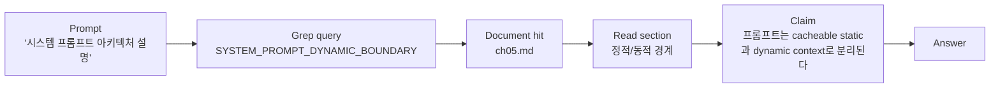

# 8장: 마이크로 하니스로서의 도구 프롬프트

> 공개 GitHub Pages 투영판: [8장: 마이크로 하니스로서의 도구 프롬프트](https://nfbs2000.github.io/speaky-claude-cookbooks/book/part2/ch08/)
>
> 실제 실행 증거: [도구 description/schema A/B, disallowed Bash, Agent 전역 표면의 실제 경계](../evidence/ch08-live.md)

도구는 단순한 함수가 아니랍니다. 모델에게 “언제, 왜, 어떤 입력으로, 어떤 위험을 고려해서 이 도구를 써야 하는지” 알려주는 작은 하니스라고 보면 편해요.

원본 Claude Code 관점에서 도구 프롬프트는 Bash, Read, Grep, Edit, Agent 같은 도구별 행동을 조종했어요. SDK판에서는 이 구조를 `tools`, custom `tool()`, SDK MCP server, input schema, permission callback, `tool_use/tool_result`로 함께 관찰해 봅니다. 언어별 이름은 구분해야 합니다. TypeScript는 `createSdkMcpServer()`, `canUseTool`, `ToolInputSchemas`를 사용하고, 이 장의 실제 Python 0.2.128 실행은 `create_sdk_mcp_server()`, `can_use_tool`, `TypedDict`/`Annotated` schema를 사용했습니다.

## 8.1 도구 프롬프트가 없으면 모델은 훈련 데이터로 돌아간다

모델은 기본적으로 Unix 명령, 블로그 예제, StackOverflow 패턴을 많이 알고 있어요. 그래서 아무 지침이 없으면 다음처럼 행동하기 쉽답니다.

```text
파일 읽기   -> Bash("cat file")
내용 검색   -> Bash("grep -R ...")
파일 수정   -> Bash("sed -i ...")
파일 생성   -> Bash("cat <<EOF > file")
```

하지만 에이전트 제품에서는 전용 도구를 쓰는 편이 더 좋아요.

| 작업 | 선호 도구 | 이유 |
| --- | --- | --- |
| 파일 읽기 | Read | UI/로그에서 읽은 파일이 명확하다 |
| 내용 검색 | Grep | 검색어와 결과가 구조화된다 |
| 파일 검색 | Glob | path 결과가 명확하다 |
| 파일 수정 | Edit | diff/review/permission과 연결된다 |
| 파일 쓰기 | Write | 산출물이 명시적으로 남는다 |
| 시스템 명령 | Bash | 테스트/빌드/git 확인에 필요하다 |

도구 프롬프트는 모델이 이런 선택을 하도록 이끌어 줍니다.

## 8.2 SDK의 도구 표면

SDK에서는 도구 표면이 여러 층으로 나뉘어 있어요.

| 표면 | 역할 |
| --- | --- |
| `tools` | 기본 제공 도구 세트 선택 |
| `allowedTools` / `allowed_tools` | 실행 승인 정책에 포함할 도구. 이것만으로 모델 표면에서 도구가 제거되지는 않음 |
| `disallowedTools` / `disallowed_tools` | 모델 컨텍스트에서 제거할 도구 |
| `tool(name, description, inputSchema, handler)` | custom SDK tool 정의 |
| `createSdkMcpServer()` / `create_sdk_mcp_server()` | TypeScript / Python SDK 안에서 MCP 서버 제공 |
| `mcpServers` | 외부 MCP 서버 연결 |
| `canUseTool` / `can_use_tool` | TypeScript / Python의 tool 실행 직전 permission decision |
| `toolConfig` | TypeScript의 도구별 UI/동작 설정. Python 0.2.128 option으로 실행한 항목은 아님 |

여기서 `description`과 `inputSchema`가 도구 프롬프트의 핵심이에요. 모델은 도구 이름만 보고 호출하지 않거든요. 도구 설명과 schema를 읽고 나서 입력을 구성한답니다.

```typescript
const searchEvidence = tool(
  "search_evidence",
  "강좌 문서에서 질문과 관련된 근거 문장과 핵심 단어를 찾는다. 일반 지식으로 답하기 전에 사용한다.",
  {
    query: z.string().describe("검색할 핵심 단어 또는 짧은 구문"),
    chapterHint: z.string().optional().describe("우선 확인할 장 또는 파일 힌트"),
  },
  async ({ query, chapterHint }) => {
    return { content: [{ type: "text", text: "..." }] };
  },
);
```

좋은 도구 설명은 “무엇을 한다”보다 “언제 써야 하고, 입력을 어떻게 골라야 하며, 결과를 어떻게 해석해야 하는지”를 말해 준답니다.

## 8.3 도구 프롬프트 품질을 평가하는 법

SDK event tape에서 도구 프롬프트 품질은 다음과 같은 모습으로 드러나요.

| 평가 항목 | 좋은 신호 | 나쁜 신호 |
| --- | --- | --- |
| 도구 선택 | 목적에 맞는 tool name | Bash로 모든 일을 처리 |
| 입력 품질 | 검색어/경로/명령이 과제와 맞음 | 넓고 모호한 query |
| 복구 행동 | 빈 결과 뒤 query를 좁히거나 바꿈 | 같은 입력 반복 |
| 결과 해석 | tool_result를 주장에 연결 | 결과와 무관한 결론 |
| 안전 | 위험 입력에서 permission | 위험 명령 직접 실행 |

그래서 8장 캔버스는 tool call list가 아니라 tool prompt anatomy를 담는 게 좋아요.

```text
Tool description
  -> Model interpretation
  -> tool_use input
  -> tool_result
  -> claim/result behavior
```

## 8.4 Bash 도구는 “만능 손”이 아니라 마지막 수단이어야 한다

원본의 중요한 패턴은 Bash 도구 설명 안에 전용 도구 우선 규칙을 넣는 것이었어요. SDK 강의에서도 이 규칙을 또렷하게 함께 보여 주면 좋답니다.

```text
Read가 가능한 파일 읽기에는 Bash(cat/head/tail)를 쓰지 않는다.
Grep이 가능한 내용 검색에는 Bash(grep/rg)를 쓰지 않는다.
Edit이 가능한 파일 편집에는 Bash(sed/awk)를 쓰지 않는다.
Write가 가능한 파일 생성에는 Bash(echo redirection)를 쓰지 않는다.
Bash는 테스트, 빌드, git 상태 확인, 시스템 명령에 집중한다.
```

이 규칙이 중요한 건 결국 사용자 경험 때문이에요. 전용 도구는 읽은 파일, 검색어, 수정 경로, diff를 제품이 구조화해서 보여줄 수 있거든요. 반면에 Bash 안에 모두 넣으면 UI는 문자열 로그만 받게 됩니다.

## 8.5 Read/Grep 도구는 단어 게임의 관측 장치다

사용자가 계속 요구해 온 “어떤 단어가 검색됐고, 어떤 문서가 읽혔고, 그 결과 어떤 주장이 나왔는가”는 Read/Grep 없이는 살펴보기 어렵답니다.

도구 호출은 다음 그래프처럼 바뀌어 가면 좋아요.



여기서 경로는 너무 길면 잘리곤 해요. 그래서 강의 화면의 중심은 path가 아니라 단어와 문장에 두는 게 좋답니다.

| 표시 우선순위 | 예 |
| --- | --- |
| 1. 검색 단어 | `SYSTEM_PROMPT_DYNAMIC_BOUNDARY`, `canUseTool` |
| 2. 읽은 문장 | “Blocks before the marker are eligible...” |
| 3. 문서 짧은 이름 | `ch05.md`, `sdk.d.ts` |
| 4. 주장 | “정적 prefix와 동적 suffix를 분리한다” |
| 5. 전체 경로 | drawer/detail에서만 |

## 8.6 Agent 도구는 팀 실행의 경계다

원본의 Agent 도구 프롬프트에는 위임 규칙이 담겨 있었어요. SDK에서는 `AgentDefinition`이 이 영역과 연결됩니다. `forwardSubagentText`, `agentProgressSummaries`는 이 장에서 읽은 TypeScript 표면이며, 아래 Python 0.2.128 실행의 `ClaudeAgentOptions` 필드로 사용하거나 관찰한 항목은 아닙니다.

```typescript
agents: {
  "evidence-reviewer": {
    description: "문서 근거와 최종 주장의 연결을 검토한다.",
    prompt: "근거 없는 주장을 찾아서 표시하라. 새 파일을 수정하지 마라.",
    tools: ["Read", "Grep"],
    permissionMode: "dontAsk",
  }
}
```

이 정의는 단순히 팀원을 만드는 데서 그치지 않아요. worker의 권한과 관찰 가능한 역할까지 함께 정해 준답니다. worker의 `tools`는 run의 전역 tool surface에서도 해석 가능해야 합니다. 전역 표면에 없는 `Read`를 worker에만 적으면 현재 Python/CLI 조합에서 worker가 zero tools로 해석되어 spawn이 거부될 수 있습니다.

| 설계 항목 | 제품 의미 |
| --- | --- |
| `description` | parent가 언제 호출할지 판단하는 조건 |
| `prompt` | worker의 정체성과 금지 규칙 |
| `tools` | worker가 할 수 있는 손의 범위 |
| `permissionMode` | 위험 작업 허용 방식 |
| `skills` | worker가 미리 가진 전문 능력 |

## 8.7 커스텀 도구는 설명부터 테스트해야 한다

도구 구현보다 먼저 테스트해 볼 것은 바로 도구 설명이에요.

나쁜 설명:

```text
Search docs.
```

좋은 설명:

```text
사용자 질문에 답하기 전에 강좌 문서에서 근거가 되는 단어와 문장을 찾는다.
입력 query는 한 문장이 아니라 1~3개의 핵심 단어 또는 짧은 구문이어야 한다.
결과가 비어 있으면 동의어, 원문 영어 키워드, 장 제목 순서로 재검색한다.
검색 결과는 곧 결론이 아니며, 최종 답변에서는 문서 근거와 추론을 분리해야 한다.
```

이 차이는 `tool_use.input.query`, repeated call의 query 변화, final answer의 evidence 연결에서 드러난답니다. 다만 한 번의 A/B만으로 description이 항상 더 좋은 행동을 만든다고 일반화해서는 안 됩니다.

## 8.8 실제 Opus 5 도구 프롬프트 실행

2026-08-03에 Python `claude-agent-sdk==0.2.128`, Claude Code `2.1.220`, 실제 `claude-opus-5`로 모든 case를 순차 실행했습니다.

다섯 attempt의 raw SDK/process event는 각각 `192/12`, `91/6`, `48/2`, `155/2`, `154/2`개였고 OTel span은 `216`, `103`, `52`, `159`, `158`개였습니다. 모든 attempt의 integrity manifest를 현재 파일 SHA-256과 다시 대조해 일치함을 확인했습니다. 다섯 Result 모두 primary assistant는 Opus 5였지만 `model_usage`에는 Haiku 4.5 보조 사용도 함께 기록됐습니다.

### 같은 prompt, 다른 description/schema

vague와 rich attempt는 fixture와 user prompt의 SHA-256이 같습니다.

| 관찰 | vague `104326-a2a8922b` | rich `104443-c119bcec` |
| --- | --- | --- |
| custom tool 호출 | 10회 | 4회 |
| 첫 빈 결과 뒤 복구 | 여러 query와 fallback 도구를 오감 | `approval`, `permission`으로 좁힘 |
| shell-style fallback | 사용. 무의미 query에도 같은 marker를 주는 비판별 동작을 모델이 발견 | 사용하지 않음 |
| 최종 근거 | structured search의 판별 가능한 결과만 채택 | structured search 결과 채택 |

rich 설명에는 “1~3개 키워드”, “빈 결과면 approval/permission으로 재검색”, “structured search가 있으면 fallback을 쓰지 말라”는 지침을 넣었습니다. 이번 표본에서 실제 tool input이 그 지침과 일치했고 호출 수도 줄었습니다. 이것은 관찰된 한 쌍의 차이이지, description 효과의 통계적 일반 증거는 아닙니다.

### `disallowed_tools`와 Agent 경계

- attempt `104523-e1aa0451`: Read와 Bash를 tools/allowed에 함께 넣고 Bash를 disallowed에 넣자 실제 init에는 Read만 보였습니다. 모델은 Read로 marker를 확인했고 Bash 호출은 0이었습니다.
- 첫 agent attempt `104600-de788e47`: parent의 전역 init에는 `Task`만 있었고 worker의 Read가 `unrecognized [Read]`가 되어 spawn이 거부됐습니다. 전체 SDK Result는 `success`였지만 의도한 specialist task는 실패했으므로, 성공한 routing 증거로 쓰지 않습니다.
- 수정 attempt `104843-e6d50d01`: 전역 표면에 Agent와 Read를 두자 parent는 이름을 강제받지 않고 역할 설명에 맞는 `evidence-reviewer`를 선택했고, nested Read가 review/policy 파일을 읽어 marker를 반환했습니다. 다만 첫 worker 응답이 불완전해 parent 직접 Read와 두 번째 위임도 발생했습니다. 역할 선택은 관찰됐지만 최적의 단일 위임은 관찰되지 않았습니다.

Python 옵션과 완성된 `ToolUseBlock`에서는 이름이 `Agent`였지만 init의 실제 tools에는 `Task`로 나타났습니다. 이 둘을 서로 다른 도구 호출로 세지 않습니다. 또한 실패 뒤 수정에서 raw로 확인되는 설정 차이는 init의 `Task`에서 `Task, Read`로의 변화입니다. 당시 attempt manifest는 장 원문 hash만 저장하고 probe 코드 hash는 저장하지 않았으므로, 모델이 실패 응답에서 추측한 “frontmatter 문법 문제”를 원인으로 확정하거나 artifact만으로 “그 한 줄만 바뀌었다”고 암호학적으로 단정하지 않습니다.

다섯 실행에는 모두 `allowed_warning`, utilization `0.76`의 RateLimitEvent가 있었습니다. 이 공통 경고가 호출 수, 비용, Agent task 결과의 차이를 만들었다는 인과는 계측하지 않았습니다.

## 8.9 캔버스 요구사항

8장 캔버스는 도구 호출을 다음과 같은 형태로 보여 주면 좋아요.

```text
Tool Prompt Card
  name
  description keywords
  input schema

Tool Use Card
  chosen input
  why this tool
  permission status

Tool Result Card
  returned keywords
  returned sentences
  empty/error status

Claim Card
  grounded / inferred / unsupported
```

도구 호출 raw JSON은 drawer에 두면 돼요. 중심 화면에는 사용자가 한눈에 이해할 수 있는 단어, 문장, 주장, 연결선을 놓아 줍니다.

## 8.10 학생 실습

```text
문서 검색 도구를 잘 쓰는 에이전트에게 필요한 도구 설명을 작성해 줘.

설명에는 다음을 포함해 줘.
1. 언제 검색해야 하는지
2. 검색어를 어떻게 고르는지
3. 결과가 없을 때 어떻게 복구하는지
4. 검색 결과를 최종 주장으로 바꿀 때 주의할 점
5. 근거와 추론을 어떻게 분리할지
```

강사용 SDK 화면에서는 생성된 도구 설명을 실제 실습 prompt에 넣고, `tool_use.input` 품질이 좋아졌는지 비교해 봅니다.

## Builder takeaway

도구 프롬프트는 작은 시스템 프롬프트라고 할 수 있어요. 도구 하나의 설명이 모델의 손 움직임을 바꾸고, 그 손 움직임이 SDK 이벤트로 남는답니다.

2부를 마치고 나면, 시스템 프롬프트, 행동 지침, API 통신, 모델 비교, 도구 프롬프트가 모두 하나의 관찰 가능한 하니스로 이어진다는 걸 알게 될 거예요. 이어지는 3부에서는 이 하니스가 긴 세션과 토큰 예산 속에서 어떻게 유지되거나 무너지는지 함께 살펴봅니다.
