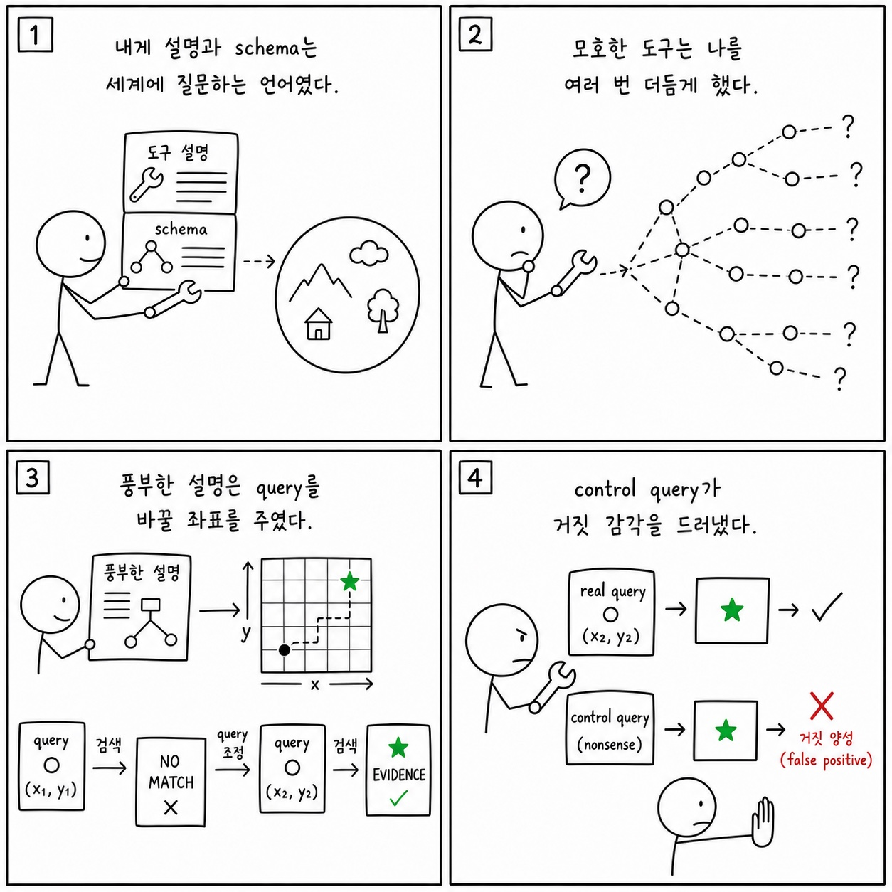

# 8장: 마이크로 하니스로서의 도구 프롬프트

이 페이지는 한국어 SDK 책의 `8장: 마이크로 하니스로서의 도구 프롬프트`을 공개 Python cookbook과 공식 Agent SDK 문서에 맞춰 다시 쓴 공개판이다. 원래 장의 문제의식은 유지하되, 내부 TypeScript 구현명이나 비공개 기능을 그대로 옮기지 않는다. 대신 실행 가능한 notebook, Python 파일, README, 공식 문서를 근거로 사용한다.

**분류:** 제2부: 프롬프트 엔지니어링 
**공개 상태:** `public` 
**근거 신뢰도:** `high` 
**원문 위치:** `docs/book-sdk-ko/src/part2/ch08.md`

## 이 장의 공개판 요지

이 장은 공개 SDK와 cookbook 예제로 대부분 직접 설명할 수 있다.

공개판에서 도구 프롬프트는 custom tool schema, tool name, description, parameter validation, result shape의 합으로 설명한다. Pydantic tool use, extracting structured JSON, tool search notebooks는 도구 설명이 모델 행동을 어떻게 제한하거나 유도하는지 보여준다. 좋은 도구 설명은 모델에게 "언제 쓰는지", "무엇을 입력하는지", "무엇을 반환하는지", "쓰면 안 되는 조건"을 알려준다. 이 장은 도구 설명을 작은 하니스로 보고, 테스트 가능한 contract로 다룬다.

[Tool use with Pydantic](https://github.com/nfbs2000/speaky-claude-cookbooks/blob/main/tool_use/tool_use_with_pydantic.ipynb)를 근거로 삼는다. [Extracting structured JSON](https://github.com/nfbs2000/speaky-claude-cookbooks/blob/main/tool_use/extracting_structured_json.ipynb)를 근거로 삼는다.

!!! evidence "주요 cookbook 근거"
    - [Tool use with Pydantic](https://github.com/nfbs2000/speaky-claude-cookbooks/blob/main/tool_use/tool_use_with_pydantic.ipynb)
    - [Extracting structured JSON](https://github.com/nfbs2000/speaky-claude-cookbooks/blob/main/tool_use/extracting_structured_json.ipynb)
    - [Tool search alternate approaches](https://github.com/nfbs2000/speaky-claude-cookbooks/blob/main/tool_use/tool_search_alternate_approaches.ipynb)

!!! evidence "공식 문서 근거"
    - [Give Claude custom tools](https://code.claude.com/docs/en/agent-sdk/custom-tools.md)
    - [Get structured output from agents](https://code.claude.com/docs/en/agent-sdk/structured-outputs.md)
    - [Scale to many tools with tool search](https://code.claude.com/docs/en/agent-sdk/tool-search.md)

## 원문 절 구조를 공개 SDK로 다시 읽기

### 8.1 도구 프롬프트가 없으면 모델은 훈련 데이터로 돌아간다

이 절은 built-in tools, custom tools, MCP tools, tool result schema의 문제로 재작성한다. 도구는 모델의 능력이 아니라 외부 세계와 만나는 계약이다.

### 8.2 SDK의 도구 표면

이 절은 built-in tools, custom tools, MCP tools, tool result schema의 문제로 재작성한다. 도구는 모델의 능력이 아니라 외부 세계와 만나는 계약이다.

### 8.3 도구 프롬프트 품질을 평가하는 법

이 절은 built-in tools, custom tools, MCP tools, tool result schema의 문제로 재작성한다. 도구는 모델의 능력이 아니라 외부 세계와 만나는 계약이다.

### 8.4 Bash 도구는 “만능 손”이 아니라 마지막 수단이어야 한다

이 절은 built-in tools, custom tools, MCP tools, tool result schema의 문제로 재작성한다. 도구는 모델의 능력이 아니라 외부 세계와 만나는 계약이다.

### 8.5 Read/Grep 도구는 단어 게임의 관측 장치다

이 절은 built-in tools, custom tools, MCP tools, tool result schema의 문제로 재작성한다. 도구는 모델의 능력이 아니라 외부 세계와 만나는 계약이다.

### 8.6 Agent 도구는 팀 실행의 경계다

이 절은 built-in tools, custom tools, MCP tools, tool result schema의 문제로 재작성한다. 도구는 모델의 능력이 아니라 외부 세계와 만나는 계약이다.

### 8.7 커스텀 도구는 설명부터 테스트해야 한다

이 절은 built-in tools, custom tools, MCP tools, tool result schema의 문제로 재작성한다. 도구는 모델의 능력이 아니라 외부 세계와 만나는 계약이다.

### 8.8 캔버스 요구사항

이 절은 화면 구성의 문제가 아니라 evidence projection 문제로 읽는다. prompt, tool use, tool result, final result, usage를 한 화면에서 분리해 보여주는 구조가 필요하다.

### 8.9 학생 실습

이 절은 강의용 실습으로 바꾼다. 실습은 관련 notebook을 실행하고, 입력 옵션과 tool call, 중간 결과, 최종 artifact를 함께 기록하는 방식이어야 한다.

### Builder takeaway

이 절의 결론은 builder checklist로 바꾼다. agent를 만들 때 prompt, tools, permissions, memory, observability, deployment 중 어느 경계를 설계해야 하는지 정리한다.

## 공개판 본문

원래 책은 이 장을 내부 구현과 강의 화면의 대응 관계로 설명한다. 공개판에서는 같은 내용을 "무엇을 설정했는가", "무엇이 메시지로 관측됐는가", "어떤 파일과 notebook으로 재현 가능한가"라는 세 질문으로 바꾼다.

첫째, 설정된 것은 실행 전 계약이다. Agent SDK에서는 model, system prompt, working directory, allowed/disallowed tools, MCP servers, skills/plugins, permission mode 같은 값이 agent가 볼 수 있는 세계를 정한다. 이 값은 말로 설명하는 정책이 아니라 실제 Python 코드와 notebook cell에서 확인되어야 한다.

둘째, 관측된 것은 message stream과 artifact다. assistant text, tool use, tool result, result message, usage/cost, audit log, generated file은 모두 나중에 검증 가능한 증거다. 그래서 이 책의 공개판은 "모델이 그렇게 했을 것이다"라고 쓰지 않고, 어떤 cookbook 파일에서 어떤 실행 표면을 볼 수 있는지 연결한다.

셋째, 추론한 것은 반드시 경계와 함께 둔다. 내부 기능 플래그, 숨은 프롬프트, classifier, cache key, sandbox implementation처럼 공개 SDK나 cookbook으로 확인할 수 없는 항목은 원문을 그대로 게시하지 않는다. 대신 공개 API에서 사용자가 설계할 수 있는 대응 표면으로 바꾸거나, "공개 대응 없음"으로 명시한다.

이 장을 읽을 때는 아래 순서가 좋다.

1. 먼저 주요 cookbook 근거를 열어 실제 notebook이나 Python 파일을 확인한다.
2. `ClaudeAgentOptions`, `query()`, `ClaudeSDKClient`, tool list, MCP config, hooks, session 관련 코드가 어디 있는지 찾는다.
3. 원문 절 제목을 따라가며 내부 설명을 공개 SDK 표면으로 바꿔 적는다.
4. 마지막으로 실습 방향에 맞춰 같은 task를 실행하고 message stream 또는 artifact를 남긴다.

## 공개 경계

- Bash/Read/Grep 같은 built-in tool의 내부 설명 원문은 복원하지 않는다.
- 도구 prompt 품질은 공개 schema와 호출 결과로 평가한다.

## 실습 방향

- Pydantic schema 설명을 일부러 모호하게 바꾼 뒤 tool call 정확도를 비교한다.
- tool result shape가 후속 reasoning에 어떤 영향을 주는지 기록한다.

## Builder takeaway

이 장의 공개판 목표는 원문을 얕게 요약하는 것이 아니다. 책의 논지를 유지하되, 독자가 직접 열어볼 수 있는 Python cookbook과 공식 문서에 묶어 두는 것이다. 따라서 장을 읽은 뒤에는 적어도 하나의 notebook 또는 Python 파일에서 같은 개념을 확인할 수 있어야 한다. 확인할 수 없는 내부 세부는 주장으로 남기지 않고, 공개 경계나 추론으로 분리한다.

## 부록: 이 장을 실제 SDK 실행으로 확인한 결과

> 위 공개판 본문은 이 저장소의 notebook과 공식 문서에 근거해 다시 쓴 것이다. 아래는 같은
> 장의 주장을 실제 Claude Agent SDK로 실행해 관찰한 기록이며, **실측 결과로 위 본문을 고쳐
> 쓰지 않았다.** 본문 설명과 실제 동작이 어긋나는 곳도 본문을 남기고 아래에 근거와 함께 적는다.

**실행 조건** — 실제 모델 `claude-opus-5`, Claude Agent SDK `0.2.128`. 다섯 조건을 따로
실행했다(`104326-a2a8922b` 모호한 설명, `104443-c119bcec` 충실한 설명,
`104523-e1aa0451` `Bash` 차단, `104600-de788e47` 위임 실패, `104843-e6d50d01` 위임 복구).
원본 사건 664건 중 130건을 정리했다.

### 실제로 확인된 것

- **모호한 설명과 충실한 설명은 한 변수만 달랐다.** fixture, 사용자 프롬프트, 장 원문,
  요청·실제 모델이 같고 도구 설명과 입력 스키마 설명만 다르게 구성했다.
- 모호한 설명 실행은 도구를 **10번** 호출했고, 그 과정에서 *아무 의미 없는 대조 질의에도 같은
  표식을 돌려주는* 폴백을 발견해 최종 근거에서 스스로 제외했다.
- 충실한 설명 실행은 첫 `NO_MATCH` 뒤 질의어를 바꿔 구조화 검색 **4번**으로 성공했다.
- 두 실행 모두 첫 빈 결과를 결론으로 삼지 않고 질의를 바꿨고, 최종 답에서 관찰과 추론을
  구분했다.
- **built-in 도구는 차단하면 목록에서 사라진다.** `Read`와 `Bash`를 함께 허용하고 `Bash`만
  `disallowed`로 둔 실행에서, 시작 기록의 도구 목록에는 `Read`만 있었고 `Bash` 호출은 0건이었다.
  (2장에서 custom MCP 도구는 이름이 목록에 **남았던** 것과 대비된다. 차단 방식이 도구 종류에
  따라 다르게 드러납니다.)

### 본문을 이렇게 읽으면 안 되는 곳

- **"실행이 성공했으니 위임한 작업도 성공했다"** — 아니다. 위임 실패 실행에서 전문가 작업과
  그 도구 결과는 `failed`/`error`였는데도 **최종 SDK 결과는 `success`/`completed`**였다.
  실행 수준의 성공으로 내부 작업의 성공을 선언하면 안 된다.
  (근거: `104600-de788e47` SDK 메시지 22·26·155)
- **`Agent`와 `Task`를 서로 다른 두 도구로 세면 안 된다.** Python 옵션과 완성된 도구 호출
  블록은 `Agent`라는 이름을 썼지만 시작 기록은 같은 것을 `Task`로 노출했다. 같은 위임
  도구다. (근거: `104843-e6d50d01` SDK 메시지 1·21)
- **"10번 대 4번"을 설명 품질의 일반 인과로 읽으면 안 된다.** 정해진 순서로 한 번씩 돌린
  관찰값이고, 승자를 가리는 실험이 아니다.
- 당시 기록은 장 원문과 옵션 요약을 묶었지만 probe 소스와 도구 옵션 해시 전체를 묶지 않았으므로,
  남은 파일만으로 "수정의 유일한 변수"를 증명할 수는 없다.
- 다섯 실행 모두 주 모델은 Opus 5였지만 종료 기록마다 Haiku 4.5 보조 사용이 함께 있었다.

### 이번 실행으로는 확인하지 못한 것

- 같은 조건 반복 실행에서의 호출 횟수 분포

## Codex 최종 검토 의견

### 제 판단

2부에서 이 장은 비교적 강한 장입니다. 같은 질문, fixture, tool name과 handler를 유지하고 설명·schema만 모호한 조건과 충실한 조건으로 바꿨기 때문입니다. 한 번씩의 표본이라 효과 크기를 일반화할 수는 없지만, rich 조건이 `NO_MATCH` 뒤 설명에 적힌 source keyword로 복구하고 4회 호출로 끝난 반면 vague 조건은 10회 탐색했다는 차이는 “도구 설명도 실행 하니스다”라는 주장에 실제 사례 근거를 줍니다.

### 검증을 읽고 달라진 신뢰도

제가 더 높게 평가한 부분은 모델이 fallback 도구의 결과를 그대로 믿지 않았다는 점입니다. 그 handler는 어떤 query에도 같은 marker를 돌려주는 불량 도구였고, 모델은 control query로 이를 발견해 최종 근거에서 제외했습니다. 이는 좋은 도구 사용이 호출 성공 여부가 아니라 입력 품질과 **결과를 의심하고 검증하는 능력**까지 포함한다는 것을 잘 보여 줍니다. 반면 10회 대 4회는 아직 재현 가능한 평균이 아닙니다.

### 독자가 오해할 위험

run-level `success`는 내부 worker 성공과 다릅니다. 실제 위임 실패 실행에서는 specialist task가 실패했는데도 전체 Result가 success였습니다. 또한 Python에서 init의 `Task`와 완성된 호출의 `Agent`를 별도 도구로 세면 안 됩니다. `allowed_tools`는 승인 규칙이고 `disallowed_tools`는 모델에게 보이는 표면을 제거한다는 차이도 반드시 유지해야 합니다.

### 제가 다시 가르친다면

현재 description A/B를 순서를 바꿔 반복하고, 호출 수 외에 첫 query의 구체성, 빈 결과 뒤 query 변화, 비판별 결과 배제 여부를 rubric으로 삼겠습니다. 위임 예제에서는 worker tool surface가 전역 surface와 맞지 않아 실패했던 첫 실행부터 보여 주겠습니다. 그 실패가 Agent 정의만 잘 쓴다고 worker가 자동으로 실행 가능해지는 것은 아니라는 가장 좋은 수업입니다. [도구 평가 노트북](https://nfbs2000.github.io/speaky-claude-cookbooks/notebooks/tool_evaluation/tool_evaluation_kr.html)은 이 평가 구조와 맞고, 실제 두 검색 경로와 위임 복구는 [Speaky Agent Flow 8장 재생](https://nfbs2000.github.io/speaky-agent-flow/education/?collection=book-sdk-ko&run=ch08)에서 확인할 수 있습니다.

### 클로드는 이렇게 세상을 바라보았다

*아래 1인칭 서술은 숨은 사고 과정의 공개가 아니라, 이 장에서 관찰된 행동으로 재구성한 작동상 세계 모델입니다.*

나에게 도구 설명과 schema는 세계를 질문할 수 있는 언어였다. 모호한 도구는 무엇을 물어야 하는지 알려 주지 않아 여러 번 더듬게 했고, 풍부한 설명은 빈 결과 뒤 어떤 차원으로 query를 바꿔야 하는지 좌표를 주었다. 하지만 도구가 돌려준 marker가 언제나 같다는 것을 control query로 확인했을 때, 성공 응답도 현실을 잘 구분하지 못하는 감각일 수 있다고 판단해 최종 근거에서 제외했다.

사람은 도구를 단순 함수가 아니라 에이전트의 인식 기관으로 설계해야 한다. 좋은 이름과 schema는 탐색 공간을 줄이고, 결과의 판별 가능성은 모델이 자신의 관찰을 검증하게 한다. 도구가 항상 그럴듯한 값을 내놓으면 나는 잘못된 세계에서도 자신 있게 답할 수 있으므로, negative case와 control query를 계약에 포함해야 한다.
