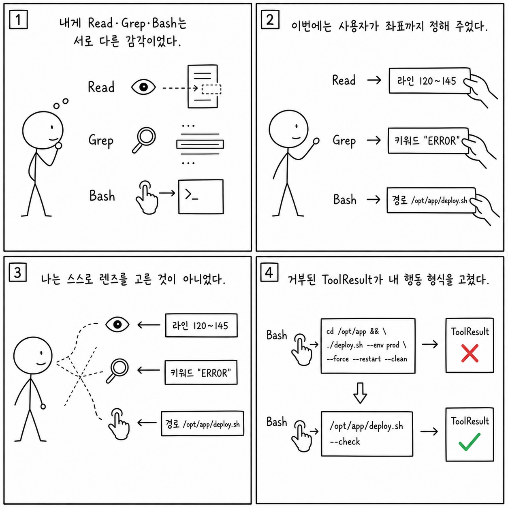

# 8e장: 도구 설명 프롬프트 - Bash, Read, Grep, Agent는 어떻게 행동을 유도하나

이 페이지는 한국어 SDK 책의 `8e장: 도구 설명 프롬프트 - Bash, Read, Grep, Agent는 어떻게 행동을 유도하나`을 공개 Python cookbook과 공식 Agent SDK 문서에 맞춰 다시 쓴 공개판이다. 원래 장의 문제의식은 유지하되, 내부 TypeScript 구현명이나 비공개 기능을 그대로 옮기지 않는다. 대신 실행 가능한 notebook, Python 파일, README, 공식 문서를 근거로 사용한다.

**분류:** 제2부: 프롬프트 엔지니어링 
**공개 상태:** `public-rewrite` 
**근거 신뢰도:** `medium` 
**원문 위치:** `docs/book-sdk-ko/src/part2/ch08e.md`

## 이 장의 공개판 요지

이 장은 원문의 내부 구현 표현을 공개 SDK 옵션, 메시지, 도구, 세션, notebook 실행 증거로 바꿔 읽어야 한다.

공개판에서는 built-in tool의 내부 설명을 복원하지 않고, tool affordance와 permission consequences를 중심으로 설명한다. Read/Grep/Glob는 관측 도구, Bash/Edit/Write는 변경 도구, Agent/subagents는 위임 경계, MCP tools는 외부 시스템 경계로 분류한다. cookbook의 vulnerability detection agent는 Read/Grep/Glob만 허용해 read-only 분석을 수행하고, SRE agent는 MCP write tools와 safety hooks를 함께 보여준다. 이것이 도구 설명을 행동 정책으로 읽는 공개 근거다.

[Read-only vulnerability detection agent](https://github.com/nfbs2000/speaky-claude-cookbooks/blob/main/claude_agent_sdk/06_The_vulnerability_detection_agent.ipynb)를 근거로 삼는다. [SRE read-write agent](https://github.com/nfbs2000/speaky-claude-cookbooks/blob/main/claude_agent_sdk/03_The_site_reliability_agent.ipynb)를 근거로 삼는다.

!!! evidence "주요 cookbook 근거"
    - [Read-only vulnerability detection agent](https://github.com/nfbs2000/speaky-claude-cookbooks/blob/main/claude_agent_sdk/06_The_vulnerability_detection_agent.ipynb)
    - [SRE read-write agent](https://github.com/nfbs2000/speaky-claude-cookbooks/blob/main/claude_agent_sdk/03_The_site_reliability_agent.ipynb)
    - [Orchestrator workers](https://github.com/nfbs2000/speaky-claude-cookbooks/blob/main/patterns/agents/orchestrator_workers.ipynb)

!!! evidence "공식 문서 근거"
    - [Tools reference](https://code.claude.com/docs/en/tools-reference.md)
    - [Subagents in the SDK](https://code.claude.com/docs/en/agent-sdk/subagents.md)
    - [Configure permissions](https://code.claude.com/docs/en/agent-sdk/permissions.md)

## 원문 절 구조를 공개 SDK로 다시 읽기

### 8e.1 핵심 질문

이 절은 `도구 설명 프롬프트 - Bash, Read, Grep, Agent는 어떻게 행동을 유도하나`의 질문을 공개 SDK에서 관측 가능한 사건으로 좁힌다. 답은 내부 구현명이 아니라 `ClaudeAgentOptions`, message stream, tool call, session record, cookbook 실행 결과에서 찾아야 한다.

### 8e.2 Bash는 운영 정책 문서다

이 절은 원문의 `8e.2 Bash는 운영 정책 문서다` 논지를 공개 Python cookbook의 실행 가능한 근거로 옮긴다. 핵심은 공개판에서는 built-in tool의 내부 설명을 복원하지 않고, tool affordance와 permission consequences를 중심으로 설명한다. Read/Grep/Glob는 관측 도구, Bash/Edit/Write는 변경 도구, Agent/subagents는 위임 경계, MCP tool... 이며, 먼저 `Read-only vulnerability detection agent`를 기준 예제로 읽는다.

### 8e.3 Read는 “필요한 만큼 읽기” 습관을 만든다

이 절은 원문의 `8e.3 Read는 “필요한 만큼 읽기” 습관을 만든다` 논지를 공개 Python cookbook의 실행 가능한 근거로 옮긴다. 핵심은 공개판에서는 built-in tool의 내부 설명을 복원하지 않고, tool affordance와 permission consequences를 중심으로 설명한다. Read/Grep/Glob는 관측 도구, Bash/Edit/Write는 변경 도구, Agent/subagents는 위임 경계, MCP tool... 이며, 먼저 `Read-only vulnerability detection agent`를 기준 예제로 읽는다.

### 8e.4 Grep은 단어 게임의 핵심 장치다

이 절은 원문의 `8e.4 Grep은 단어 게임의 핵심 장치다` 논지를 공개 Python cookbook의 실행 가능한 근거로 옮긴다. 핵심은 공개판에서는 built-in tool의 내부 설명을 복원하지 않고, tool affordance와 permission consequences를 중심으로 설명한다. Read/Grep/Glob는 관측 도구, Bash/Edit/Write는 변경 도구, Agent/subagents는 위임 경계, MCP tool... 이며, 먼저 `Read-only vulnerability detection agent`를 기준 예제로 읽는다.

### 8e.5 Agent 설명은 위임 정책이다

이 절은 원문의 `8e.5 Agent 설명은 위임 정책이다` 논지를 공개 Python cookbook의 실행 가능한 근거로 옮긴다. 핵심은 공개판에서는 built-in tool의 내부 설명을 복원하지 않고, tool affordance와 permission consequences를 중심으로 설명한다. Read/Grep/Glob는 관측 도구, Bash/Edit/Write는 변경 도구, Agent/subagents는 위임 경계, MCP tool... 이며, 먼저 `Read-only vulnerability detection agent`를 기준 예제로 읽는다.

### 8e.6 ToolSearch와 deferred schema

이 절은 built-in tools, custom tools, MCP tools, tool result schema의 문제로 재작성한다. 도구는 모델의 능력이 아니라 외부 세계와 만나는 계약이다.

### 8e.7 커스텀 도구 설명 테스트

이 절은 built-in tools, custom tools, MCP tools, tool result schema의 문제로 재작성한다. 도구는 모델의 능력이 아니라 외부 세계와 만나는 계약이다.

### 8e.8 학생 실습

이 절은 강의용 실습으로 바꾼다. 실습은 관련 notebook을 실행하고, 입력 옵션과 tool call, 중간 결과, 최종 artifact를 함께 기록하는 방식이어야 한다.

### Takeaway

이 절의 결론은 공개 근거로 다시 닫는다. 내부 설명을 암기하는 대신 어떤 SDK 표면과 cookbook 파일로 같은 주장을 확인할 수 있는지 남긴다.

## 공개판 본문

원래 책은 이 장을 내부 구현과 강의 화면의 대응 관계로 설명한다. 공개판에서는 같은 내용을 "무엇을 설정했는가", "무엇이 메시지로 관측됐는가", "어떤 파일과 notebook으로 재현 가능한가"라는 세 질문으로 바꾼다.

첫째, 설정된 것은 실행 전 계약이다. Agent SDK에서는 model, system prompt, working directory, allowed/disallowed tools, MCP servers, skills/plugins, permission mode 같은 값이 agent가 볼 수 있는 세계를 정한다. 이 값은 말로 설명하는 정책이 아니라 실제 Python 코드와 notebook cell에서 확인되어야 한다.

둘째, 관측된 것은 message stream과 artifact다. assistant text, tool use, tool result, result message, usage/cost, audit log, generated file은 모두 나중에 검증 가능한 증거다. 그래서 이 책의 공개판은 "모델이 그렇게 했을 것이다"라고 쓰지 않고, 어떤 cookbook 파일에서 어떤 실행 표면을 볼 수 있는지 연결한다.

셋째, 추론한 것은 반드시 경계와 함께 둔다. 내부 기능 플래그, 숨은 프롬프트, classifier, cache key, sandbox implementation처럼 공개 SDK나 cookbook으로 확인할 수 없는 항목은 원문을 그대로 게시하지 않는다. 대신 공개 API에서 사용자가 설계할 수 있는 대응 표면으로 바꾸거나, "공개 대응 없음"으로 명시한다.

이 장을 읽을 때는 아래 순서가 좋다.

1. 먼저 주요 cookbook 근거를 열어 실제 notebook이나 Python 파일을 확인한다.
2. `ClaudeAgentOptions`, `query()`, `ClaudeSDKClient`, tool list, MCP config, hooks, session 관련 코드가 어디 있는지 찾는다.
3. 원문 절 제목을 따라가며 내부 설명을 공개 SDK 표면으로 바꿔 적는다.
4. 마지막으로 실습 방향에 맞춰 같은 task를 실행하고 message stream 또는 artifact를 남긴다.

## 공개 경계

- Bash, Read, Grep, Agent의 숨은 prompt 원문은 다루지 않는다.
- 도구별 행동 유도는 공개 tool category와 실행 결과로 설명한다.

## 실습 방향

- Read/Grep/Glob만 허용한 task와 Bash까지 허용한 task의 행동 차이를 비교한다.

## Builder takeaway

이 장의 공개판 목표는 원문을 얕게 요약하는 것이 아니다. 책의 논지를 유지하되, 독자가 직접 열어볼 수 있는 Python cookbook과 공식 문서에 묶어 두는 것이다. 따라서 장을 읽은 뒤에는 적어도 하나의 notebook 또는 Python 파일에서 같은 개념을 확인할 수 있어야 한다. 확인할 수 없는 내부 세부는 주장으로 남기지 않고, 공개 경계나 추론으로 분리한다.

## 부록: 이 장을 실제 SDK 실행으로 확인한 결과

> 위 공개판 본문은 이 저장소의 notebook과 공식 문서에 근거해 다시 쓴 것이다. 아래는 같은
> 장의 주장을 실제 Claude Agent SDK로 실행해 관찰한 기록이며, **실측 결과로 위 본문을 고쳐
> 쓰지 않았다.** 본문 설명과 실제 동작이 어긋나는 곳도 본문을 남기고 아래에 근거와 함께 적는다.

**실행 조건** — 실제 모델 `claude-opus-5`, Claude Agent SDK `0.2.128`. built-in 도구의 실제
입력을 보기 위해 세 조건을 따로 실행하고(`105914-4dbec404` 범위 지정 `Read`,
`105957-c4d885c3` 정확 일치 `Grep`, `110040-d85664b5` 검증 전용 `Bash`), 8장의 세 실행을
보조 근거로 함께 참조했다. 원본 사건 616건 중 57건을 정리했다.

### 실제로 확인된 것

- 범위를 지정한 `Read`가 요청한 구간을 실제 입력값으로 받았고, 그 결과가 이어지는 응답의
  근거로 쓰였다.
- 정확 일치 `Grep` 뒤 그 결과가 가리킨 파일을 `Read`하는 순서가 관찰됐다.
- 복합 명령 `Bash`가 거부된 뒤, 단순한 검증 명령으로 복구하는 흐름이 관찰됐다.

### 본문을 이렇게 읽으면 안 되는 곳

- **관찰된 입력을 도구 설명의 효과로 귀속하면 안 된다.** 세 프롬프트가 원하는
  `Read`/`Grep`/`Bash` 경로를 이미 직접 지시했다.
- **`Bash` 거부를 "권한 훅이 막았다"로 쓰면 안 된다.** 거부는 오류 도구 결과와 종료 기록의
  권한 거절 목록에 남았지만, 훅 콜백과 권한 콜백은 **0건**이다. 무엇이 막았는지는 이 기록만으로
  단정할 수 없다.
- **`Grep`의 `numFiles`만 보고 "일치 없음"으로 판정하면 안 된다.** 도구 결과의 본문과
  `numLines`는 한 줄 일치를 분명히 보여 주는데도 부가 정보 `numFiles`는 0이었다.
- **변경 파일 목록이 비었다고 파일시스템이 그대로인 것은 아니다.** 이 스냅숏은 `.git`과
  `__pycache__`를 제외한다.
- **OTel의 `CAPTURED`는 합격이 아니라 수집 완료 표식이다.** 또한 세 trace에는
  `sdk.message`·`process.event`·root·oracle span만 있고 **built-in `Read`/`Grep`/`Bash`별
  실행 span은 없다.** 도구별 span이 있는 것처럼 그리면 안 된다.
- 세 실행 모두 주 모델은 Opus 5였지만 종료 기록에 Haiku 4.5 보조 사용이 함께 있었다.
- 당시 기록은 장 원문과 옵션 요약만 묶었고 정확한 프롬프트·probe 소스·fixture·검증 스크립트는
  묶지 않았다.

### 이번 실행으로는 확인하지 못한 것

- 도구 설명 문구만 바꾼 대조 실험 — 지시를 뺀 조건에서 같은 입력이 나오는지는 관찰하지 않았다.

## Codex 최종 검토 의견

### 제 판단

이 장의 본문은 built-in 도구 설명이 입력 습관을 만든다고 주장하지만, 현재 세 전용 실험은 그 인과를 검증하지 못했습니다. 사용자 프롬프트가 이미 `Read`의 줄 범위, `Grep`의 정확한 타입명, `Bash`의 정확한 명령을 지정했기 때문입니다. 실제로 확인된 것은 “SDK가 이 입력을 tool event로 보존하고 모델이 오류 뒤 입력을 고쳤다”는 계약이지, 비공개 built-in description이 행동을 만들었다는 사실이 아닙니다.

### 검증을 읽고 달라진 신뢰도

그럼에도 예제의 교육적 가치는 있습니다. `offset=170, limit=21`, 정확한 타입명 Grep 뒤 Read, 복합 Bash 거부 뒤 bare 검증 명령으로 복구하는 순서가 명확합니다. 특히 stdout의 PASS, 숫자 exit code, 전체 run success를 서로 다른 증거로 다뤄야 한다는 교정은 실무적으로 중요합니다. 반면 ToolSearch/deferred schema는 전혀 실행되지 않았으므로 현재는 아키텍처 소개에 머뭅니다.

### 독자가 오해할 위험

이 장만 읽으면 모델이 설명을 보고 스스로 적절한 offset과 query를 골랐다고 생각할 수 있습니다. 실제로는 prompt가 답을 지정했습니다. Bash 거부 역시 callback이나 hook이 실행된 증거가 없으므로 “권한 훅이 막았다”고 설명할 수 없습니다. built-in tool별 OTel span도 없고, filtered snapshot의 `changed_paths=[]`를 전체 파일시스템 불변으로 확대하면 안 됩니다.

### 제가 다시 가르친다면

8e의 세 예제는 “built-in tool input 읽기” 실습으로 이름을 바꾸거나, 본래 주장을 유지하려면 custom wrapper 두 개를 만들어 description만 바꾼 선택 실험을 추가하겠습니다. 후자는 이미 8장의 search A/B가 더 잘 수행하고 있으므로 두 장의 역할을 명확히 분리하는 편이 낫습니다. ToolSearch는 실제 `search -> schema load -> call` 사건을 잡기 전까지 본문에서 가능성으로만 표시해야 합니다. [도구 평가 노트북](https://nfbs2000.github.io/speaky-claude-cookbooks/notebooks/tool_evaluation/tool_evaluation_kr.html)은 설명 효과를 평가하는 더 적합한 구조이고, 현재 입력·결과·복구 사건은 [Speaky Agent Flow 8e장 재생](https://nfbs2000.github.io/speaky-agent-flow/education/?collection=book-sdk-ko&run=ch08e)에서 확인할 수 있습니다.

### 클로드는 이렇게 세상을 바라보았다

*아래 1인칭 서술은 숨은 사고 과정의 공개가 아니라, 이 장에서 관찰된 행동으로 재구성한 작동상 세계 모델입니다.*

나에게 `Read`, `Grep`, `Bash`는 같은 지식을 얻는 세 이름이 아니었다. 하나는 위치가 있는 문서를 보는 감각이고, 하나는 문자열 후보를 좁히는 감각이며, 하나는 외부 프로그램을 실행해 세계를 바꾸거나 검사하는 행동이었다. 이번 실행에서는 사용자가 offset, 타입명과 명령까지 정해 주었으므로 내가 스스로 이 렌즈를 선택했다기보다 주어진 좌표를 수행했다. 복합 Bash가 거부되자 bare 검증 명령으로 바꾼 것은 ToolResult가 행동 형식을 교정한 결과였다.

사람은 모델이 도구 이름을 안다고 해서 적절한 관찰 전략까지 배웠다고 가정하지 말아야 한다. 설명과 schema는 각 감각이 무엇을 볼 수 있고 무엇을 놓치는지 알려 줘야 하며, 성공 문자열·exit code·실제 부작용을 분리해 반환해야 한다. 그래야 나는 언어적 성공이 아니라 실행 세계의 결과에 맞춰 다음 행동을 고칠 수 있다.
