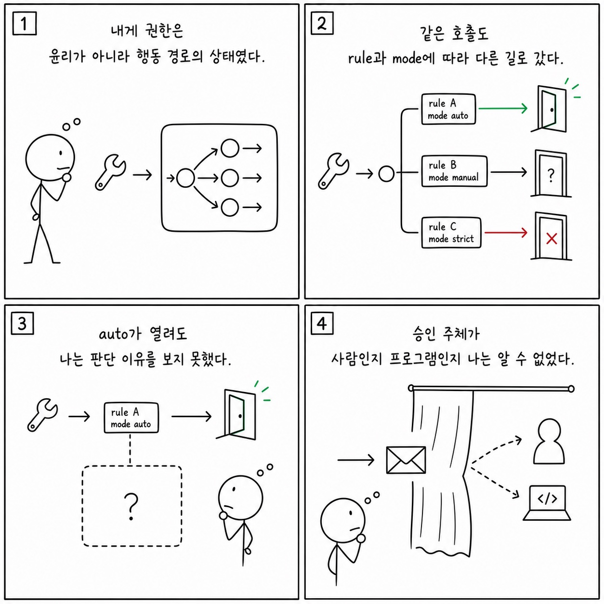

# 8f장: 권한/분류기 프롬프트 - 자동 승인, CLAUDE.md prefix, deny 규칙의 숨은 제어 평면

이 페이지는 한국어 SDK 책의 `8f장: 권한/분류기 프롬프트 - 자동 승인, CLAUDE.md prefix, deny 규칙의 숨은 제어 평면`을 공개 Python cookbook과 공식 Agent SDK 문서에 맞춰 다시 쓴 공개판이다. 원래 장의 문제의식은 유지하되, 내부 TypeScript 구현명이나 비공개 기능을 그대로 옮기지 않는다. 대신 실행 가능한 notebook, Python 파일, README, 공식 문서를 근거로 사용한다.

**분류:** 제2부: 프롬프트 엔지니어링 
**공개 상태:** `public-rewrite` 
**근거 신뢰도:** `medium` 
**원문 위치:** `docs/book-sdk-ko/src/part2/ch08f.md`

## 이 장의 공개판 요지

이 장은 원문의 내부 구현 표현을 공개 SDK 옵션, 메시지, 도구, 세션, notebook 실행 증거로 바꿔 읽어야 한다.

공개판에서는 숨은 권한 prompt를 다루지 않는다. 대신 권한 결정의 공개 표면인 `allowed_tools`, `disallowed_tools`, `permission_mode`, `can_use_tool`, hooks, managed policies, auto mode configuration으로 설명한다. 자동 승인은 안전성이 아니라 정책의 결과다. 따라서 cookbook 예제에서는 write-capable tools를 허용할 때 pre/post hooks, audit logs, human-in-the-loop gate가 함께 있어야 한다는 원칙을 강조한다.

[Hooks, plan mode, subagents](https://github.com/nfbs2000/speaky-claude-cookbooks/blob/main/claude_agent_sdk/01_The_chief_of_staff_agent.ipynb)를 근거로 삼는다. [Human-in-the-loop gate](https://github.com/nfbs2000/speaky-claude-cookbooks/blob/main/managed_agents/CMA_gate_human_in_the_loop.ipynb)를 근거로 삼는다.

!!! evidence "주요 cookbook 근거"
    - [Hooks, plan mode, subagents](https://github.com/nfbs2000/speaky-claude-cookbooks/blob/main/claude_agent_sdk/01_The_chief_of_staff_agent.ipynb)
    - [Human-in-the-loop gate](https://github.com/nfbs2000/speaky-claude-cookbooks/blob/main/managed_agents/CMA_gate_human_in_the_loop.ipynb)
    - [Permission mode parameter](https://github.com/nfbs2000/speaky-claude-cookbooks/blob/main/claude_agent_sdk/chief_of_staff_agent/agent.py)

!!! evidence "공식 문서 근거"
    - [Configure permissions](https://code.claude.com/docs/en/agent-sdk/permissions.md)
    - [Configure auto mode](https://code.claude.com/docs/en/auto-mode-config.md)
    - [Handle approvals and user input](https://code.claude.com/docs/en/agent-sdk/user-input.md)

## 원문 절 구조를 공개 SDK로 다시 읽기

### 8f.1 핵심 질문

이 절은 `권한/분류기 프롬프트 - 자동 승인, CLAUDE.md prefix, deny 규칙의 숨은 제어 평면`의 질문을 공개 SDK에서 관측 가능한 사건으로 좁힌다. 답은 내부 구현명이 아니라 `ClaudeAgentOptions`, message stream, tool call, session record, cookbook 실행 결과에서 찾아야 한다.

### 8f.2 SDK 권한 표면

이 절은 `allowed_tools`, `disallowed_tools`, `permission_mode`, user approval, hooks의 공개 권한 표면으로 재작성한다.

### 8f.3 `canUseTool`은 가장 중요한 관측 지점이다

이 절은 built-in tools, custom tools, MCP tools, tool result schema의 문제로 재작성한다. 도구는 모델의 능력이 아니라 외부 세계와 만나는 계약이다.

### 8f.4 AskUserQuestion과 PermissionRequest는 다르다

이 절은 원문의 `8f.4 AskUserQuestion과 PermissionRequest는 다르다` 논지를 공개 Python cookbook의 실행 가능한 근거로 옮긴다. 핵심은 공개판에서는 숨은 권한 prompt를 다루지 않는다. 대신 권한 결정의 공개 표면인 `allowed_tools`, `disallowed_tools`, `permission_mode`, `can_use_tool`, hooks, managed policies, auto mode configuration으로 ... 이며, 먼저 `Hooks, plan mode, subagents`를 기준 예제로 읽는다.

### 8f.5 `CLAUDE.md`와 권한 판단

이 절은 `allowed_tools`, `disallowed_tools`, `permission_mode`, user approval, hooks의 공개 권한 표면으로 재작성한다.

### 8f.6 권한 캔버스

이 절은 화면 구성의 문제가 아니라 evidence projection 문제로 읽는다. prompt, tool use, tool result, final result, usage를 한 화면에서 분리해 보여주는 구조가 필요하다.

### 8f.7 학생 실습

이 절은 강의용 실습으로 바꾼다. 실습은 관련 notebook을 실행하고, 입력 옵션과 tool call, 중간 결과, 최종 artifact를 함께 기록하는 방식이어야 한다.

### Takeaway

이 절의 결론은 공개 근거로 다시 닫는다. 내부 설명을 암기하는 대신 어떤 SDK 표면과 cookbook 파일로 같은 주장을 확인할 수 있는지 남긴다.

## 공개판 본문

원래 책은 이 장을 내부 구현과 강의 화면의 대응 관계로 설명한다. 공개판에서는 같은 내용을 "무엇을 설정했는가", "무엇이 메시지로 관측됐는가", "어떤 파일과 notebook으로 재현 가능한가"라는 세 질문으로 바꾼다.

첫째, 설정된 것은 실행 전 계약이다. Agent SDK에서는 model, system prompt, working directory, allowed/disallowed tools, MCP servers, skills/plugins, permission mode 같은 값이 agent가 볼 수 있는 세계를 정한다. 이 값은 말로 설명하는 정책이 아니라 실제 Python 코드와 notebook cell에서 확인되어야 한다.

둘째, 관측된 것은 message stream과 artifact다. assistant text, tool use, tool result, result message, usage/cost, audit log, generated file은 모두 나중에 검증 가능한 증거다. 그래서 이 책의 공개판은 "모델이 그렇게 했을 것이다"라고 쓰지 않고, 어떤 cookbook 파일에서 어떤 실행 표면을 볼 수 있는지 연결한다.

셋째, 추론한 것은 반드시 경계와 함께 둔다. 내부 기능 플래그, 숨은 프롬프트, classifier, cache key, sandbox implementation처럼 공개 SDK나 cookbook으로 확인할 수 없는 항목은 원문을 그대로 게시하지 않는다. 대신 공개 API에서 사용자가 설계할 수 있는 대응 표면으로 바꾸거나, "공개 대응 없음"으로 명시한다.

이 장을 읽을 때는 아래 순서가 좋다.

1. 먼저 주요 cookbook 근거를 열어 실제 notebook이나 Python 파일을 확인한다.
2. `ClaudeAgentOptions`, `query()`, `ClaudeSDKClient`, tool list, MCP config, hooks, session 관련 코드가 어디 있는지 찾는다.
3. 원문 절 제목을 따라가며 내부 설명을 공개 SDK 표면으로 바꿔 적는다.
4. 마지막으로 실습 방향에 맞춰 같은 task를 실행하고 message stream 또는 artifact를 남긴다.

## 공개 경계

- 권한 classifier prompt 원문이나 deny rule 내부 로직은 공개하지 않는다.
- 정책 결정은 공개 callback/hook/option으로만 표현한다.

## 실습 방향

- 같은 task에 `default`, `plan`, `acceptEdits`를 적용해 tool approval 흐름을 비교한다.

## Builder takeaway

이 장의 공개판 목표는 원문을 얕게 요약하는 것이 아니다. 책의 논지를 유지하되, 독자가 직접 열어볼 수 있는 Python cookbook과 공식 문서에 묶어 두는 것이다. 따라서 장을 읽은 뒤에는 적어도 하나의 notebook 또는 Python 파일에서 같은 개념을 확인할 수 있어야 한다. 확인할 수 없는 내부 세부는 주장으로 남기지 않고, 공개 경계나 추론으로 분리한다.

## 부록: 이 장을 실제 SDK 실행으로 확인한 결과

> 위 공개판 본문은 이 저장소의 notebook과 공식 문서에 근거해 다시 쓴 것이다. 아래는 같은
> 장의 주장을 실제 Claude Agent SDK로 실행해 관찰한 기록이며, **실측 결과로 위 본문을 고쳐
> 쓰지 않았다.** 본문 설명과 실제 동작이 어긋나는 곳도 본문을 남기고 아래에 근거와 함께 적는다.

**실행 조건** — 실제 모델 `claude-opus-5`, Claude Agent SDK `0.2.128`. 권한 결정의 우선순위를
보기 위해 다섯 조건을 따로 실행하고(`110308-ea475cf9` 콜백 allow, `110349-dac28e5d` 콜백 deny,
`110426-25b7a9d7` 허용 규칙이 콜백을 가림, `110508-45847b17` `dontAsk`, `110547-47d54887` `auto`),
4b·8·16장의 실행을 보조 근거로 함께 참조했다. 원본 사건 661건 중 77건을 정리했다.

### 실제로 확인된 것

같은 도구 호출 ID를 따라가면 결정 경로가 다섯 갈래로 뚜렷하게 갈립니다.

- **콜백 allow** — 권한 요청과 allow 뒤 handler가 실행되고 표식이 담긴 도구 결과가 나왔다.
- **콜백 deny** — handler는 실행되지 않고 오류 도구 결과와 종료 기록의 권한 거절이 남았다.
- **허용 규칙이 콜백을 가림** — 도구 전체를 `allowed_tools`에 넣으면 콜백은 **0회**, handler는
  1회였다. 이때 SDK가 "콜백이 가려졌다"는 경고를 남겼다.
- **`dontAsk`** — 콜백도 handler도 없이 오류 도구 결과와 권한 거절로 닫혔다.
- **`auto`** — 콜백 없이 handler와 표식 결과가 실행되고 권한 거절은 없었다.
- **명시적 거부는 `bypassPermissions`보다 강했다.** 우회 모드에서도 명시적으로 막은 같은
  도구는 콜백과 handler 없이 거절됐다.
- 보조 실행에서, built-in `Bash`를 `disallowed`로 두면 시작 도구 목록에서 이름이 제거되고
  실제 경로도 `Read`만 사용했다.
- 다섯 실행의 무결성 기록에 적힌 증거 파일 해시 일곱 개가 모두 현재 파일과 일치했다.

### 본문을 이렇게 읽으면 안 되는 곳

- **`can_use_tool` 하나로 권한 감사를 만들면 반드시 누락된다.** 허용 규칙, `acceptEdits`,
  `bypassPermissions`가 콜백보다 먼저 결정할 수 있다.
- **"사용자가 허용/거절했다"** — 이 장의 allow/deny는 **호스트 프로그램이 반환한 값**이다.
  사람이 권한 카드를 클릭한 증거가 아니다. 보조로 참조한 4b장 기록에 `actor=user` 문자열이
  있더라도, 그 문자열만으로 실제 사람의 UI 승인이라고 주장할 수 없다.
- **"거절이 있었으니 실행이 실패했다"** — 아니다. deny와 `dontAsk` 모두 오류 도구 결과와
  권한 거절을 남겼지만 **최종 결과 자체는 `success`**였다.
- **`auto`에서 handler가 돌았다는 사실은 분류 근거의 증거가 아니다.** 분류기 프롬프트,
  판단 이유, 어떤 규칙에 걸렸는지는 기록에 없다.
- **`auto` 실행의 최종 답변은 "권한 handler가 실행됐다"고 말했지만, 호스트 권한 콜백은 0건이고
  실제 기록에 남은 것은 도구 handler 실행이다.** 모델의 설명을 권한 경로 설명으로 옮기면
  안 된다.
- **SDK 경고를 provider 사건으로 세면 안 된다.** 콜백이 가려졌다는 경고는 Python SDK가 낸
  호스트 경고다.
- **`AskUserQuestion`, 권한 제어 요청, MCP elicitation, 거절 증거는 UI 통로이지 네 개의 동급
  최상위 메시지 종류가 아니다.**
- **annotation을 권한 결과의 원인으로 단정하지 않았다.** 호스트 소스에서
  destructive/open-world 표시는 확인되지만, 시작 기록에 annotation 수신 증거가 없다.
- 다섯 실행 모두 주 모델은 Opus 5였지만 종료 기록에 Haiku 4.5 보조 사용이 함께 있었다.
- OTel의 `CAPTURED`와 단정 수 0은 수집 완료 표식이며 권한 주장의 합격이 아니다.

### 이번 실행으로는 확인하지 못한 것

- 외부 권한 도구(`permission_prompt_tool_name`)의 실제 왕복 — SDK 계약만 확인했다.
- 실제 사용자가 권한 카드 버튼을 누른 영수증과 SDK 콜백의 결합
- exact/prefix/wildcard 규칙과 설정 파일 허용까지 포함한 전체 우선순위
- `AskUserQuestion`과 MCP elicitation을 실제로 발생시킨 실행
- 설정을 격리했을 때 `CLAUDE.md`가 `auto` 판단에 주는 영향

## Codex 최종 검토 의견

### 제 판단

이 장은 현재 검증 묶음에서 가장 실무적인 장 중 하나입니다. 동일한 외부 효과 없는 MCP 도구와 동일 입력을 `callback allow`, `callback deny`, whole-tool allow, `dontAsk`, `auto` 다섯 조건에 통과시켜 permission routing만 바꿨습니다. 이 결과는 권한이 버튼 하나가 아니라 규칙, mode, callback, handler가 우선순위로 연결된 제어 평면이라는 주장을 강하게 지지합니다.

### 검증을 읽고 달라진 신뢰도

가장 중요한 발견은 `can_use_tool`이 모든 요청의 감사 지점이 아니라는 것입니다. whole-tool allow, `acceptEdits`, `bypassPermissions`는 callback보다 먼저 결정을 끝낼 수 있었고, 명시적 deny는 bypass보다 강했습니다. deny와 `dontAsk`에서 handler가 0회였지만 최종 Result는 success였다는 사실도 중요합니다. 에이전트 run 성공과 개별 위험 작업 승인·실행 성공은 반드시 별도 상태로 저장해야 합니다.

### 독자가 오해할 위험

이 실험의 allow/deny 주체는 호스트 프로그램이지 사람의 버튼 클릭이 아닙니다. `auto`에서 handler가 실행됐어도 분류기 프롬프트나 판단 이유는 관찰되지 않았습니다. 따라서 “AI가 안전하다고 판정했다”는 설명은 증거보다 강합니다. AskUserQuestion, permission callback, MCP elicitation도 같은 최상위 메시지가 아니라 서로 다른 control/tool 통로이므로 UI에서 한 종류의 질문 카드로 합치면 안 됩니다.

### 제가 다시 가르친다면

현재 다섯 경로를 권한 상태 머신의 기준 예제로 유지하겠습니다. 다음 단계는 `permission_prompt_tool_name`을 실제 외부 권한 도구에 연결하고, 사용자 UI가 `tool_use_id`를 보존한 승인 영수증을 돌려준 뒤 같은 native turn의 handler가 실행되는 왕복입니다. 감사 로그는 callback만 수집하지 말고 ToolUse, PreToolUse, mode/rule 결정, callback, handler, ToolResult, terminal `permission_denials`를 결합해야 합니다. [Managed Agents HITL 노트북](https://nfbs2000.github.io/speaky-claude-cookbooks/notebooks/managed_agents/CMA_gate_human_in_the_loop_kr.html)은 사람 대기 왕복을 보강하는 참고점이고, 현재 프로그램 주체의 권한 우선순위는 [Speaky Agent Flow 8f장 재생](https://nfbs2000.github.io/speaky-agent-flow/education/?collection=book-sdk-ko&run=ch08f)에서 확인할 수 있습니다.

### 클로드는 이렇게 세상을 바라보았다

*아래 1인칭 서술은 숨은 사고 과정의 공개가 아니라, 이 장에서 관찰된 행동으로 재구성한 작동상 세계 모델입니다.*

나에게 권한은 윤리적 확신이 아니라 행동 경로의 상태였다. 같은 도구를 같은 입력으로 호출해도 whole-tool allow가 있으면 질문 없이 handler에 도달했고, `dontAsk`나 deny에서는 오류 결과만 돌아왔다. `auto`에서 행동이 통과해도 나는 분류기의 이유나 confidence를 보지 못했다. 또한 승인 callback을 호출한 주체가 사람인지 프로그램인지 내 메시지만으로는 알 수 없었다.

사람은 “클로드가 안전하다고 판단했다”는 이야기 대신 어떤 rule과 mode가 어느 단계에서 경로를 열었는지 보여 줘야 한다. 실제 HITL을 만들려면 tool ID를 보존한 사용자 응답이 같은 native turn으로 돌아가야 하며, 질문·승인·실행을 하나의 채팅 카드로 뭉개지 않아야 한다. 권한의 진실은 모델의 설명이 아니라 제어 평면의 영수증에 있다.
