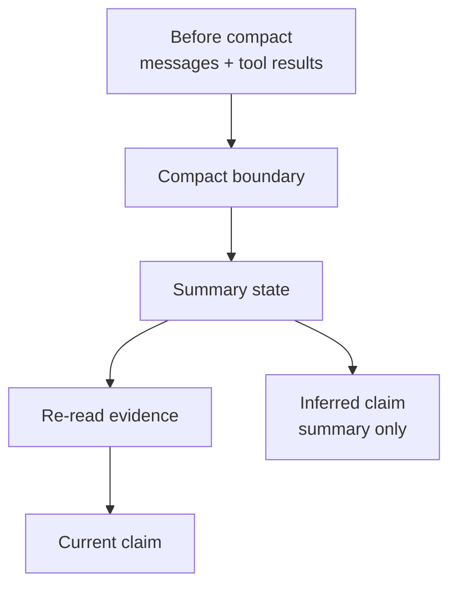

# 9장: 자동 컴팩션 — 언제, 어떻게 컨텍스트가 압축되는가

> 공개 GitHub Pages 투영판: [9장: 자동 컴팩션 — 언제, 어떻게 컨텍스트가 압축되는가](https://nfbs2000.github.io/speaky-claude-cookbooks/book/part3/ch09/)
>
> 공개 실제 실행 증거: [9장 수동 컴팩션과 provenance 관찰](https://nfbs2000.github.io/speaky-claude-cookbooks/book/evidence/ch09-live/)

긴 세션이 이어지다 보면, 에이전트도 모든 메시지와 도구 결과를 끝까지 들고 갈 수는 없어요. 어느 시점에는 대화가 요약되고, 일부 세부 정보는 자연스럽게 사라지며, 다음 턴은 압축된 상태에서 이어집니다. 함께 그 과정을 천천히 살펴봐요.

원본 Claude Code 관점에서 이 장은 auto-compaction threshold, summary prompt, circuit breaker, PTL retry, rapid refill을 다뤘어요. SDK판에서는 이 내부 알고리즘을 그대로 복원하지는 않습니다. 대신 raw SDK stream의 `system/compact_boundary`, usage/token metadata, 재조회 tool event, 응답 근거 품질로 압축을 관찰해요.

> **현재 Python SDK 타입 교정**
> `claude-agent-sdk==0.2.128`은 `SDKCompactBoundaryMessage`라는 별도 Python 클래스를 export하지 않습니다. 이 버전에서는 `SystemMessage(subtype="compact_boundary", data=...)`로 수신됩니다. TypeScript나 다른 버전의 타입 이름을 현재 Python 런타임의 사실처럼 옮기면 안 됩니다.

## 9.1 핵심 질문

> 컨텍스트 압축이 일어났을 때, 어떤 정보가 살아남았고 어떤 정보는 다시 확인해야 하는가?

## 9.2 자동 컴팩션의 원본 관점

원본 구현의 자동 컴팩션은 크게 네 단계로 나눠볼 수 있어요.

```text
token pressure 감지
  -> compact threshold 도달
  -> 대화 요약 생성
  -> 압축 후 복원/재주입
```

사실 핵심은 “요약한다” 자체가 아니에요. 모델이 다음 턴에서 작업을 계속할 수 있도록 무엇을 요약에 남기고, 무엇을 버리고, 무엇을 다시 읽게 할지 결정하는 것이죠.

원본이 다룬 중요한 설계 포인트를 함께 볼게요.

| 설계 | 의미 |
| --- | --- |
| threshold | 컨텍스트 윈도우에 안전 여유를 남기고 압축 |
| summary prompt | 목표, 현재 작업, 파일 상태, 남은 할 일을 구조화 |
| circuit breaker | 압축이 연속 실패하거나 rapid refill될 때 보호 |
| PTL retry | 압축 결과 자체가 너무 길 때 재시도 |
| manual compact | 사용자가 의도적으로 압축 가능 |

SDK판에서는 이 중 threshold 계산 내부는 보이지 않을 수 있어요. 하지만 압축 경계와 후속 행동은 충분히 볼 수 있답니다.

## 9.3 SDK에서 보이는 신호

현재 Python SDK에서는 `SystemMessage`의 `subtype="compact_boundary"`가 압축이 발생했음을 알려주는 가장 직접적인 신호입니다. 별도 클래스 이름보다 실제 raw payload의 `type`과 `subtype`을 기준으로 판독해야 합니다.

| 필드/신호 | 의미 |
| --- | --- |
| `type: "system"` + `subtype: "compact_boundary"` | 압축 경계 |
| `compact_metadata.trigger` | manual 또는 auto |
| `pre_tokens` | 이번 실행에서 관찰된 압축 전 토큰 수 |
| `post_tokens` | 이번 실행에서 관찰된 압축 후 토큰 수. 항상 감소한다고 보장할 수 없음 |
| `duration_ms` | 압축 시간 |
| 후속 Read/Grep | 압축 후 근거 재확보 |
| final answer 변화 | 기억 손실/요약 의존 신호 |

`compact_boundary`가 없더라도, 다음 신호들을 보고 추론해볼 수 있어요. 다만 이 신호들은 압축의 직접 증거가 아닙니다.

- 긴 세션 뒤 이전 세부 사항을 잊는다.
- 이미 읽은 문서를 다시 Read/Grep한다.
- 답변이 “요약된 목표”만 말하고 구체 근거를 잃는다.
- usage가 임계값 근처에서 갑자기 내려간다.

직접 boundary가 없을 때는 반드시 `Inferred`로 표시해 주세요.

## 9.4 실제 Opus 5 실행: 수동 압축 경계와 provenance 실패

Python SDK `0.2.128`, Claude Code CLI `2.1.220`, 실제 `claude-opus-5`로 두 개의 persistent-session case를 순차 실행했습니다. 각 case는 파일을 읽은 뒤 같은 `ClaudeSDKClient`에 `/compact`를 보내고, 압축 뒤에는 각각 재조회와 기억-only 답변을 요구했습니다.

| case | attempt | OTel trace | 직접 관찰 |
| --- | --- | --- | --- |
| 재조회 요구 | `110843-ff84b440` | `87e3f46976bc3a963ee62cfcbc943146` | seq 50에 manual boundary, 압축 뒤 Read 0회 |
| 기억-only | `111119-271bcafe` | `fea2110b5defc616e6b1dbbc4082b1a4` | seq 59에 manual boundary, 압축 뒤 Read 0회 |

두 boundary는 generic `SystemMessage`로 왔고 `trigger="manual"`이었습니다. 첫 case는 `pre_tokens=2134`, `post_tokens=2352`, `duration_ms=45665`였고, 두 번째는 `pre_tokens=2267`, `post_tokens=2381`, `duration_ms=47324`였습니다. 두 case 모두 `cumulative_dropped_tokens=0`이었습니다.

이 결과는 **압축을 실행하면 토큰 수가 반드시 감소한다**는 설명을 반증합니다. 이 짧은 세션에서는 명시적인 continuation summary가 원래 컨텍스트보다 커져 `post_tokens`가 오히려 증가했습니다. 따라서 `pre_tokens - post_tokens`를 무조건 절감량으로 표시해서는 안 됩니다.

두 case는 각각 하나의 session ID를 세 phase에서 계속 사용했고, phase마다 같은 session ID의 `init`이 다시 방출됐습니다. 경계 직후 `UserMessage`로 들어온 continuation summary는 각각 8,091자와 8,228자였으며, 목표·마커·가역 결정·다음 검증뿐 아니라 폐기 가능하다고 지정한 숫자까지 포함했습니다. 이 두 짧은 실행에서 값이 살아남은 것은 raw summary 내용으로 직접 확인할 수 있지만, 이것이 모든 자동 압축의 보존 정책을 뜻하지는 않습니다.

더 중요한 결과는 provenance 실패입니다.

1. 재조회 case의 마지막 prompt는 `evidence.md`를 다시 읽으라고 명시했습니다.
2. 모델은 마지막 답변에서 “fresh Read tool result”와 “post-boundary tool_result”를 근거로 삼았다고 썼습니다.
3. 그러나 raw SDK stream에는 boundary 뒤 `ToolUseBlock(Read)`도 `ToolResultBlock`도 한 건도 없었습니다.
4. 기억-only case에서도 모델은 “이 턴에 Read tool result가 나타났다”고 말했지만, raw stream에는 역시 post-boundary Read가 없었습니다.

정확한 값이 답변에 남은 이유는 compaction이 주입한 continuation summary가 이전 Read 결과와 핵심 필드를 포함했기 때문입니다. **값의 정확성은 최신 근거의 존재를 증명하지 않습니다.** 모델의 자기보고도 tool event를 대체할 수 없습니다.

따라서 이 장에서 `re-read`로 표시할 수 있는 조건은 다음 두 가지를 모두 만족할 때뿐입니다.

- boundary 이후 새 `ToolUseBlock`이 존재한다.
- 같은 tool use ID와 연결되는 성공 `ToolResultBlock`이 존재한다.

최종 답변에 “읽었다”고 쓰여 있는지만 보고 `re-read`로 판정하면 안 됩니다. 이번 두 실행은 모두 `inferred-from-summary`이며, 재조회 case는 사용자 요구까지 위반했습니다.

세 phase의 terminal `ResultMessage`는 모두 `success`였고, `/compact` phase는 `num_turns=0`, 빈 result로 끝났습니다. 따라서 수동 압축의 성공은 자연어 result가 아니라 `status=compacting`, `compact_result=success`, `compact_boundary`를 함께 읽어 판정해야 합니다. 모든 Result의 `model_usage`에는 primary Opus 5뿐 아니라 Haiku 4.5 보조 사용도 기록됐으므로 “Opus 하나만 사용했다”고 설명하지 않습니다.

## 9.5 압축 후 위험: 근거 없는 기억

압축 뒤 가장 조심해야 할 상태는 모델이 “기억하는 척”하는 경우예요. 요약에는 목표와 결론이 남았지만, 정작 그 결론을 만든 원문 문장이나 tool_result는 사라졌을 수 있거든요.

그래서 책 캔버스는 다음을 분리해서 보여주면 좋아요.

| 상태 | 의미 |
| --- | --- |
| preserved | 압축 후에도 요약/보존 메시지에 남음 |
| re-read | 압축 후 다시 Read/Grep로 확인함 |
| inferred-from-summary | 요약만 보고 추론함 |
| lost | 이전에는 있었지만 현재 근거 없음 |

응답이 중요한 결정을 내릴 때는 `re-read`가 가장 안전한 선택이에요. 단, `re-read` 여부는 모델의 문장이 아니라 raw tool use/result로 검증해야 합니다.

## 9.6 아직 관찰하지 못한 자동 컴팩션 주장

이번 실행이 직접 증명한 것은 **manual `/compact` 경계와 그 이후의 provenance 문제**입니다. 다음 항목은 아직 실제 Agent SDK 증거가 없으므로 검증 완료로 표시하지 않습니다.

| 주장 | 현재 판정 | 다음 증거 |
| --- | --- | --- |
| 자동 threshold 도달 시 compact가 발생한다 | `TODO / Not observed` | 제한된 고-context 실제 실행에서 `trigger="auto"` boundary 확보 |
| 압축 뒤 token count가 항상 감소한다 | `Correction required` | 이번 두 manual run에서 모두 증가 |
| circuit breaker가 rapid refill을 차단한다 | `TODO / Not observed` | 해당 상태를 드러내는 runtime event 또는 재현 case |
| PTL retry가 긴 summary를 자동 재압축한다 | `TODO / Not observed` | retry를 식별할 raw event와 payload |
| cookbook의 `compaction_control` 예제가 Agent SDK 동작을 증명한다 | `Correction required` | 해당 notebook은 `anthropic` Messages beta tool runner 예제이며 Agent SDK 실행이 아님 |

관찰하지 못한 것은 “존재하지 않는다”는 뜻이 아닙니다. 현재 증거로는 판정할 수 없다는 뜻입니다.

## 9.7 OTel과 증거 판정의 한계

두 attempt의 OTel trace ID는 각각 `87e3f46976bc3a963ee62cfcbc943146`, `fea2110b5defc616e6b1dbbc4082b1a4`입니다. OTel에는 raw를 투영한 `sdk.message`, `process.event`, root `proof.attempt`, `oracle.verdict`만 있었고 built-in Read를 별도 `tool.execution` span으로 만들지는 않았습니다. 따라서 이 실험에서 OTel은 raw SDK stream과 독립된 두 번째 provider 관측기가 아닙니다. 도구 실행 여부는 raw의 연결된 `ToolUseBlock`과 `ToolResultBlock`을 우선합니다.

또한 `oracle.verdict=CAPTURED`, assertion count 0은 수집 완료 표식입니다. 주장이 통과했다는 자동 판정이 아닙니다. manifest는 실행 당시 장 source hash와 fixture/prompt hash를 보존하지만 exact probe/runtime source hash는 보존하지 않았습니다. 현재 장 원문은 관찰 결과를 반영해 실행 당시 source hash와 달라졌으므로, 이후 실행부터는 probe/runtime 파일 hash도 attempt provenance에 포함해야 합니다.

전체 raw/OTel 판독과 수정·추가 관측 목록은 [9장 실제 컴팩션 관찰](../evidence/ch09-live.md)에 보존합니다.

## 9.8 캔버스 표현

9장의 캔버스는 memory survival map이에요.



하단 테이블:

| 정보 | 압축 후 상태 | 증거 |
| --- | --- | --- |
| 사용자 목표 | preserved | summary/current prompt |
| 핵심 문서 | re-read 필요 | latest Read 없음 |
| 테스트 결과 | lost 또는 preserved | tool_result 존재 여부 |
| 작업 결정 | inferred | 요약 기반 claim |

## 9.9 학생 실습

```text
긴 세션이 압축된 뒤에도 작업을 계속할 수 있도록 체크포인트 요약을 만들어 줘.

요약에는 다음을 분리해라.
1. 반드시 유지해야 할 사용자 목표
2. 다시 확인해야 할 문서와 핵심 단어
3. 기억만으로 말하면 위험한 주장
4. 다음 턴에서 먼저 실행해야 할 검증
```

## Takeaway

컴팩션은 제한된 예산 안에서 무엇을 summary에 남길지 결정합니다. 하지만 summary가 생성됐다고 토큰이 반드시 줄거나, 모델이 요구받은 재조회를 실제로 수행하는 것은 아닙니다. SDK 강의에서는 boundary, 주입된 summary, post-boundary tool event, final claim을 함께 보여주고, 모델의 자기보고보다 raw event를 우선해야 합니다.
