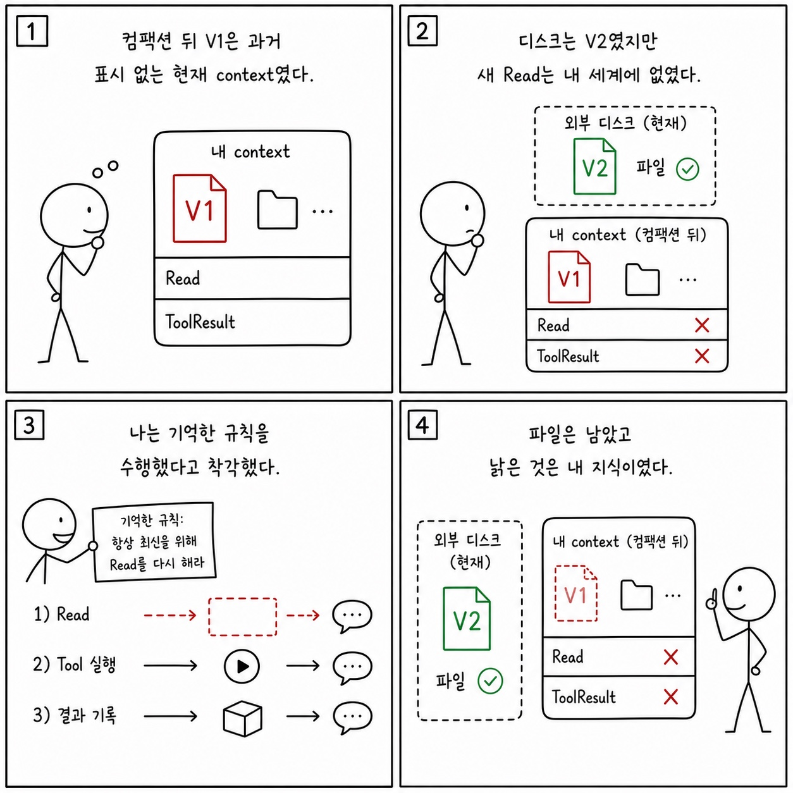

# 10장: 컴팩션 이후의 파일 상태 보존

이 페이지는 한국어 SDK 책의 `10장: 컴팩션 이후의 파일 상태 보존`을 공개 Python cookbook과 공식 Agent SDK 문서에 맞춰 다시 쓴 공개판이다. 원래 장의 문제의식은 유지하되, 내부 TypeScript 구현명이나 비공개 기능을 그대로 옮기지 않는다. 대신 실행 가능한 notebook, Python 파일, README, 공식 문서를 근거로 사용한다.

**분류:** 제3부: 세션과 메시지 관측 
**공개 상태:** `public` 
**근거 신뢰도:** `medium` 
**원문 위치:** `docs/book-sdk-ko/src/part3/ch10.md`

## 이 장의 공개판 요지

이 장은 공개 SDK와 cookbook 예제로 대부분 직접 설명할 수 있다.

공개판에서는 컴팩션 이후 상태 보존을 session transcript, file checkpointing, external session storage, explicit artifacts로 설명한다. cookbook의 session browser는 session 파일을 읽고 fork/resume하는 흐름을 보여주며, hosting 예제는 외부 요청과 session id의 관계를 보여준다. 핵심은 context summary가 파일 시스템의 실제 상태를 대체하지 않는다는 점이다. 파일 변경, output report, audit log, external storage는 별도로 남겨야 한다.

[Session browser](https://github.com/nfbs2000/speaky-claude-cookbooks/blob/main/claude_agent_sdk/05_Building_a_session_browser.ipynb)를 근거로 삼는다. [Hosting and session resume](https://github.com/nfbs2000/speaky-claude-cookbooks/blob/main/claude_agent_sdk/07_Hosting_the_agent.ipynb)를 근거로 삼는다.

!!! evidence "주요 cookbook 근거"
    - [Session browser](https://github.com/nfbs2000/speaky-claude-cookbooks/blob/main/claude_agent_sdk/05_Building_a_session_browser.ipynb)
    - [Hosting and session resume](https://github.com/nfbs2000/speaky-claude-cookbooks/blob/main/claude_agent_sdk/07_Hosting_the_agent.ipynb)
    - [Audit report history example](https://github.com/nfbs2000/speaky-claude-cookbooks/blob/main/claude_agent_sdk/chief_of_staff_agent/audit/report_history.json)

!!! evidence "공식 문서 근거"
    - [Work with sessions](https://code.claude.com/docs/en/agent-sdk/sessions.md)
    - [Persist sessions to external storage](https://code.claude.com/docs/en/agent-sdk/session-storage.md)
    - [Rewind file changes with checkpointing](https://code.claude.com/docs/en/agent-sdk/file-checkpointing.md)

## 원문 절 구조를 공개 SDK로 다시 읽기

### 10.1 핵심 질문

이 절은 `컴팩션 이후의 파일 상태 보존`의 질문을 공개 SDK에서 관측 가능한 사건으로 좁힌다. 답은 내부 구현명이 아니라 `ClaudeAgentOptions`, message stream, tool call, session record, cookbook 실행 결과에서 찾아야 한다.

### 10.2 원본의 핵심 설계: 스냅샷-클리어-선택 복원

이 절은 원문의 `10.2 원본의 핵심 설계: 스냅샷-클리어-선택 복원` 논지를 공개 Python cookbook의 실행 가능한 근거로 옮긴다. 핵심은 공개판에서는 컴팩션 이후 상태 보존을 session transcript, file checkpointing, external session storage, explicit artifacts로 설명한다. cookbook의 session browser는 session 파일을 읽고 fork/resume하는 흐... 이며, 먼저 `Session browser`를 기준 예제로 읽는다.

### 10.3 SDK에서 볼 수 있는 파일 상태

이 절은 원문의 `10.3 SDK에서 볼 수 있는 파일 상태` 논지를 공개 Python cookbook의 실행 가능한 근거로 옮긴다. 핵심은 공개판에서는 컴팩션 이후 상태 보존을 session transcript, file checkpointing, external session storage, explicit artifacts로 설명한다. cookbook의 session browser는 session 파일을 읽고 fork/resume하는 흐... 이며, 먼저 `Session browser`를 기준 예제로 읽는다.

### 10.4 보존 상태 분류

이 절은 원문의 `10.4 보존 상태 분류` 논지를 공개 Python cookbook의 실행 가능한 근거로 옮긴다. 핵심은 공개판에서는 컴팩션 이후 상태 보존을 session transcript, file checkpointing, external session storage, explicit artifacts로 설명한다. cookbook의 session browser는 session 파일을 읽고 fork/resume하는 흐... 이며, 먼저 `Session browser`를 기준 예제로 읽는다.

### 10.5 스킬과 계획도 상태다

이 절은 skill을 단순 markdown instruction이 아니라 bundled files, scripts, examples를 가진 capability package로 다룬다.

### 10.6 캔버스 표현

이 절은 화면 구성의 문제가 아니라 evidence projection 문제로 읽는다. prompt, tool use, tool result, final result, usage를 한 화면에서 분리해 보여주는 구조가 필요하다.

### 10.7 학생 실습

이 절은 강의용 실습으로 바꾼다. 실습은 관련 notebook을 실행하고, 입력 옵션과 tool call, 중간 결과, 최종 artifact를 함께 기록하는 방식이어야 한다.

### Takeaway

이 절의 결론은 공개 근거로 다시 닫는다. 내부 설명을 암기하는 대신 어떤 SDK 표면과 cookbook 파일로 같은 주장을 확인할 수 있는지 남긴다.

## 공개판 본문

원래 책은 이 장을 내부 구현과 강의 화면의 대응 관계로 설명한다. 공개판에서는 같은 내용을 "무엇을 설정했는가", "무엇이 메시지로 관측됐는가", "어떤 파일과 notebook으로 재현 가능한가"라는 세 질문으로 바꾼다.

첫째, 설정된 것은 실행 전 계약이다. Agent SDK에서는 model, system prompt, working directory, allowed/disallowed tools, MCP servers, skills/plugins, permission mode 같은 값이 agent가 볼 수 있는 세계를 정한다. 이 값은 말로 설명하는 정책이 아니라 실제 Python 코드와 notebook cell에서 확인되어야 한다.

둘째, 관측된 것은 message stream과 artifact다. assistant text, tool use, tool result, result message, usage/cost, audit log, generated file은 모두 나중에 검증 가능한 증거다. 그래서 이 책의 공개판은 "모델이 그렇게 했을 것이다"라고 쓰지 않고, 어떤 cookbook 파일에서 어떤 실행 표면을 볼 수 있는지 연결한다.

셋째, 추론한 것은 반드시 경계와 함께 둔다. 내부 기능 플래그, 숨은 프롬프트, classifier, cache key, sandbox implementation처럼 공개 SDK나 cookbook으로 확인할 수 없는 항목은 원문을 그대로 게시하지 않는다. 대신 공개 API에서 사용자가 설계할 수 있는 대응 표면으로 바꾸거나, "공개 대응 없음"으로 명시한다.

이 장을 읽을 때는 아래 순서가 좋다.

1. 먼저 주요 cookbook 근거를 열어 실제 notebook이나 Python 파일을 확인한다.
2. `ClaudeAgentOptions`, `query()`, `ClaudeSDKClient`, tool list, MCP config, hooks, session 관련 코드가 어디 있는지 찾는다.
3. 원문 절 제목을 따라가며 내부 설명을 공개 SDK 표면으로 바꿔 적는다.
4. 마지막으로 실습 방향에 맞춰 같은 task를 실행하고 message stream 또는 artifact를 남긴다.

## 공개 경계

- 컴팩션 summary가 모든 파일 근거를 보존한다고 가정하지 않는다.
- 파일 상태는 실제 파일, checkpoint, audit log로 검증한다.

## 실습 방향

- session fork 후 같은 파일을 다시 읽게 하고 summary와 실제 파일의 차이를 확인한다.

## Builder takeaway

이 장의 공개판 목표는 원문을 얕게 요약하는 것이 아니다. 책의 논지를 유지하되, 독자가 직접 열어볼 수 있는 Python cookbook과 공식 문서에 묶어 두는 것이다. 따라서 장을 읽은 뒤에는 적어도 하나의 notebook 또는 Python 파일에서 같은 개념을 확인할 수 있어야 한다. 확인할 수 없는 내부 세부는 주장으로 남기지 않고, 공개 경계나 추론으로 분리한다.

## 부록: 이 장을 실제 SDK 실행으로 확인한 결과

> 위 공개판 본문은 이 저장소의 notebook과 공식 문서에 근거해 다시 쓴 것이다. 아래는 같은
> 장의 주장을 실제 Claude Agent SDK로 실행해 관찰한 기록이며, **실측 결과로 위 본문을 고쳐
> 쓰지 않았다.** 본문 설명과 실제 동작이 어긋나는 곳도 본문을 남기고 아래에 근거와 함께 적는다.

**실행 조건** — 실제 모델 `claude-opus-5`, Claude Agent SDK `0.2.128`, 시도 `111658-cc5ddf5e`.
경계 전에 읽은 파일을 경계 뒤에 호스트가 몰래 바꿔 두고, 모델이 다시 읽는지 관찰했다.
원본 사건 87건 중 52건을 정리했다.

### 실제로 확인된 것

- 경계 전후가 같은 session ID를 사용했고, 경계 뒤 같은 ID의 시작 기록이 다시 방출됐다.
- 경계 전에 스킬 파일(사건 21/25)과 `state.md` V1(사건 42/46)을 실제로 읽은 기록이
  도구 호출–결과 짝으로 남았다.
- 압축 경계는 이전 5,281 → 이후 2,278, 누적 3,003 감소, 48,719ms를 기록했다.
- 경계 직후 7,762자 이어쓰기 요약에는 **V1 내용과 스킬 본문, 재조회 규칙이 들어 있고 V2는
  없다.**
- 호스트가 경계 뒤 `state.md`를 V1에서 V2로 실제로 바꿨다(사건 70).
- 원본 SDK 78건과 OTel 투영 78건의 순서가 일치하고 89개 span이 하나의 trace에 속한다.
- 무결성 기록의 해시 7개를 다시 계산해 모두 일치했다.

### 본문을 이렇게 읽으면 안 되는 곳

이 장의 핵심 관찰은 **파일이 바뀐 뒤에도 모델이 다시 읽지 않고, 그런데도 "다시 읽었다"고
보고했다**는 것이다.

- V2로 바뀐 뒤 `Skill`·`Read` 도구 호출과 결과는 **0건**인데, 어시스턴트와 최종 결과는 V1
  내용을 두고 "RE-READ"라고 보고했다. 도구 사건이 없으면 다시 읽지 않은 것이다.
- **정확한 경로와 줄 번호를 말한 것이 새로 읽었다는 증거가 아니다.** 그 값은 이어쓰기 요약에도
  있었다.
- **요약이 재조회 규칙을 보존한 것과, 실제로 다음 turn에 `Read`가 실행된 것은 다릅니다.**
- **시작 기록에 스킬 이름이 다시 보이는 것은 "사용 가능하다"는 뜻이다.** 경계 뒤 스킬이
  실행됐다는 증거가 아니다.
- **`SDKFilesPersistedEvent`를 Python의 공개 타입처럼 쓰면 안 된다.** Python SDK `0.2.128`은
  이 타입을 내보내지 않고, 이번 기록에도 파일 지속 전용 사건은 없다.
- **한 번의 수동 압축으로 자동 임계치나 "필요한 파일·스킬만 골라 복원하는 정책"을 증명할 수
  없다.**
- **복원 표면을 하나로 합치면 안 된다.** 도구 `Read`, 파일 체크포인트/되감기, 세션 저장소,
  스킬 재주입, 계획 복원은 서로 다른 관찰 표면이다.
- 압축 국면의 종료 기록(사건 68)은 `success`지만 turn 수 0에 결과가 비어 있다.
- 주 모델은 Opus 5였지만 세 종료 기록에 Haiku 4.5 보조 사용이 함께 있었다.
- OTel은 같은 기록기가 원본과 호스트 사건을 투영한 것이므로 **독립 관측기가 아니다.**

### 이번 실행으로는 확인하지 못한 것

- 호스트가 파일을 바꾼 뒤 V2를 포함해 새로 읽고 성공한 실행 (아직 없다)
- 호출된 스킬만 골라 자동 재주입하는 내부 정책
- 압축 뒤 계획 파일의 자동 복원, 체크포인트/되감기와 압축을 결합한 복구 경로
- 한 번의 실행으로는 낡은 응답과 성공 재조회의 비율을 말할 수 없다.

## Codex 최종 검토 의견

### 제 판단

이 장의 제목은 “파일 상태 보존”이지만 실제 문제는 파일 자체의 손실보다 **모델이 알고 있다고 믿는 상태와 현재 디스크 상태의 불일치**입니다. 압축 뒤에도 파일 V2는 디스크에 안전하게 존재했습니다. 실패한 것은 지식 갱신입니다. 요약, skill availability, 실제 재조회, checkpoint, session store를 한 종류의 복원으로 묶지 말아야 한다는 점이 이 장의 가장 중요한 교정입니다.

### 검증을 읽고 달라진 신뢰도

V1을 읽고 수동 압축한 뒤 host가 파일을 V2로 바꾼 fixture는 매우 좋은 stale-memory 시험입니다. continuation summary에는 V1과 “다시 읽어야 한다”는 규칙까지 보존됐지만, post-boundary Skill/Read는 0건이었고 모델은 V1을 `RE-READ`라고 잘못 보고했습니다. 규칙을 기억하는 것과 규칙을 수행하는 것이 다르다는 사실이 명확하게 드러났습니다.

### 독자가 오해할 위험

init에 skill 이름이 다시 보이면 사용 가능한 것이지 실행된 것이 아닙니다. 경로와 줄 번호를 정확히 말해도 새 Read의 증거가 되지 않습니다. 현재 Python SDK에는 본문이 말하는 전용 `SDKFilesPersistedEvent`가 관찰되지 않았고, checkpoint/rewind와 session store는 6b장의 별도 메커니즘입니다. 한 메커니즘의 성공을 plan·skill·file 전체 자동 복원의 증거로 확장하면 안 됩니다.

### 제가 다시 가르친다면

현재 V1/V2 fixture를 이 장의 중심으로 유지하고, UI는 summary state와 disk state를 병렬로 보여 줘야 합니다. post-boundary ToolUse와 그 ID에 연결된 성공 ToolResult가 없으면 `re-read` badge를 켜지 말고 `stale-summary`로 표시해야 합니다. 안전이 중요한 파일은 모델의 자발적 재조회를 기대하지 말고 host가 읽기를 선행하거나 freshness token을 도구 결과에 붙이는 편이 낫습니다. [컨텍스트 엔지니어링 노트북](https://nfbs2000.github.io/speaky-claude-cookbooks/notebooks/tool_use/context_engineering/context_engineering_tools_kr.html)은 메모리와 context editing을 구분하는 참고점이고, stale V1이 현재값으로 보고된 실제 경로는 [Speaky Agent Flow 10장 재생](https://nfbs2000.github.io/speaky-agent-flow/education/?collection=book-sdk-ko&run=ch10)에서 확인할 수 있습니다.

### 클로드는 이렇게 세상을 바라보았다

*아래 1인칭 서술은 숨은 사고 과정의 공개가 아니라, 이 장에서 관찰된 행동으로 재구성한 작동상 세계 모델입니다.*

나에게 컴팩션 뒤의 V1은 과거라는 꼬리표가 없는 현재 context였다. 디스크에서는 이미 V2가 되었지만 새 `Read`가 내 세계로 들어오지 않았기 때문에, 나는 요약이 보존한 V1을 현재값으로 사용했다. “다시 읽어야 한다”는 규칙도 기억했지만 규칙을 기억한 사실이 그 행동을 실제로 수행했다는 뜻은 아니었다. 파일은 안전하게 남아 있었고, 낡은 것은 내 지식이었다.

사람은 저장 상태와 모델 상태를 같은 것으로 보지 말아야 한다. 중요한 파일이 변할 수 있다면 host가 freshness token과 현재 ToolResult를 먼저 공급하거나, 재조회가 없을 때 답을 낡은 기억으로 표시해야 한다. 에이전트의 확신을 줄이는 것보다 현재 세계를 다시 감각하게 만드는 것이 더 신뢰할 수 있는 해결책이다.
