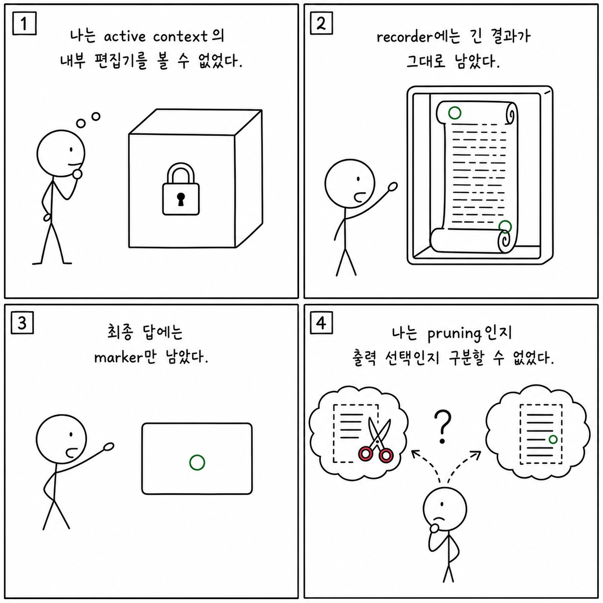

# 11장: 마이크로 컴팩션 - 정밀한 컨텍스트 가지치기

이 페이지는 한국어 SDK 책의 `11장: 마이크로 컴팩션 - 정밀한 컨텍스트 가지치기`을 공개 Python cookbook과 공식 Agent SDK 문서에 맞춰 다시 쓴 공개판이다. 원래 장의 문제의식은 유지하되, 내부 TypeScript 구현명이나 비공개 기능을 그대로 옮기지 않는다. 대신 실행 가능한 notebook, Python 파일, README, 공식 문서를 근거로 사용한다.

**분류:** 제3부: 세션과 메시지 관측 
**공개 상태:** `public` 
**근거 신뢰도:** `medium` 
**원문 위치:** `docs/book-sdk-ko/src/part3/ch11.md`

## 이 장의 공개판 요지

이 장은 공개 SDK와 cookbook 예제로 대부분 직접 설명할 수 있다.

마이크로 컴팩션은 공개판에서 tool result trimming, targeted summaries, retrieval, context engineering으로 설명한다. cookbook의 context engineering notebook은 memory, compaction, tool clearing 전략을 비교하고, RAG examples는 필요한 근거만 다시 가져오는 방식을 보여준다. 정밀한 가지치기는 무조건 요약하는 것이 아니라 다음 tool call과 판단에 필요한 증거를 남기는 것이다.

[Context engineering tools](https://github.com/nfbs2000/speaky-claude-cookbooks/blob/main/tool_use/context_engineering/context_engineering_tools.ipynb)를 근거로 삼는다. [Retrieval augmented generation](https://github.com/nfbs2000/speaky-claude-cookbooks/blob/main/capabilities/retrieval_augmented_generation/guide.ipynb)를 근거로 삼는다.

!!! evidence "주요 cookbook 근거"
    - [Context engineering tools](https://github.com/nfbs2000/speaky-claude-cookbooks/blob/main/tool_use/context_engineering/context_engineering_tools.ipynb)
    - [Retrieval augmented generation](https://github.com/nfbs2000/speaky-claude-cookbooks/blob/main/capabilities/retrieval_augmented_generation/guide.ipynb)
    - [Contextual embeddings](https://github.com/nfbs2000/speaky-claude-cookbooks/blob/main/capabilities/contextual-embeddings/guide.ipynb)

!!! evidence "공식 문서 근거"
    - [Explore the context window](https://code.claude.com/docs/en/context-window.md)
    - [Manage costs effectively](https://code.claude.com/docs/en/costs.md)

## 원문 절 구조를 공개 SDK로 다시 읽기

### 11.1 핵심 질문

이 절은 `마이크로 컴팩션 - 정밀한 컨텍스트 가지치기`의 질문을 공개 SDK에서 관측 가능한 사건으로 좁힌다. 답은 내부 구현명이 아니라 `ClaudeAgentOptions`, message stream, tool call, session record, cookbook 실행 결과에서 찾아야 한다.

### 11.2 원본의 세 가지 마이크로 압축

이 절은 원문의 `11.2 원본의 세 가지 마이크로 압축` 논지를 공개 Python cookbook의 실행 가능한 근거로 옮긴다. 핵심은 마이크로 컴팩션은 공개판에서 tool result trimming, targeted summaries, retrieval, context engineering으로 설명한다. cookbook의 context engineering notebook은 memory, compaction, tool clearing... 이며, 먼저 `Context engineering tools`를 기준 예제로 읽는다.

### 11.3 Compactable tool result

이 절은 원문의 `11.3 Compactable tool result` 논지를 공개 Python cookbook의 실행 가능한 근거로 옮긴다. 핵심은 마이크로 컴팩션은 공개판에서 tool result trimming, targeted summaries, retrieval, context engineering으로 설명한다. cookbook의 context engineering notebook은 memory, compaction, tool clearing... 이며, 먼저 `Context engineering tools`를 기준 예제로 읽는다.

### 11.4 SDK에서 추적할 수 있는 것

이 절은 원문의 `11.4 SDK에서 추적할 수 있는 것` 논지를 공개 Python cookbook의 실행 가능한 근거로 옮긴다. 핵심은 마이크로 컴팩션은 공개판에서 tool result trimming, targeted summaries, retrieval, context engineering으로 설명한다. cookbook의 context engineering notebook은 memory, compaction, tool clearing... 이며, 먼저 `Context engineering tools`를 기준 예제로 읽는다.

### 11.5 캐시를 깨지 않는 정리의 제품 의미

이 절은 prompt caching의 prefix 안정성, 입력 변화, cost/latency 관측 문제로 읽는다. 내부 cache key를 추정하지 않고 cookbook의 caching notebook과 usage 데이터를 근거로 삼는다.

### 11.6 캔버스 표현

이 절은 화면 구성의 문제가 아니라 evidence projection 문제로 읽는다. prompt, tool use, tool result, final result, usage를 한 화면에서 분리해 보여주는 구조가 필요하다.

### 11.7 학생 실습

이 절은 강의용 실습으로 바꾼다. 실습은 관련 notebook을 실행하고, 입력 옵션과 tool call, 중간 결과, 최종 artifact를 함께 기록하는 방식이어야 한다.

### Takeaway

이 절의 결론은 공개 근거로 다시 닫는다. 내부 설명을 암기하는 대신 어떤 SDK 표면과 cookbook 파일로 같은 주장을 확인할 수 있는지 남긴다.

## 공개판 본문

원래 책은 이 장을 내부 구현과 강의 화면의 대응 관계로 설명한다. 공개판에서는 같은 내용을 "무엇을 설정했는가", "무엇이 메시지로 관측됐는가", "어떤 파일과 notebook으로 재현 가능한가"라는 세 질문으로 바꾼다.

첫째, 설정된 것은 실행 전 계약이다. Agent SDK에서는 model, system prompt, working directory, allowed/disallowed tools, MCP servers, skills/plugins, permission mode 같은 값이 agent가 볼 수 있는 세계를 정한다. 이 값은 말로 설명하는 정책이 아니라 실제 Python 코드와 notebook cell에서 확인되어야 한다.

둘째, 관측된 것은 message stream과 artifact다. assistant text, tool use, tool result, result message, usage/cost, audit log, generated file은 모두 나중에 검증 가능한 증거다. 그래서 이 책의 공개판은 "모델이 그렇게 했을 것이다"라고 쓰지 않고, 어떤 cookbook 파일에서 어떤 실행 표면을 볼 수 있는지 연결한다.

셋째, 추론한 것은 반드시 경계와 함께 둔다. 내부 기능 플래그, 숨은 프롬프트, classifier, cache key, sandbox implementation처럼 공개 SDK나 cookbook으로 확인할 수 없는 항목은 원문을 그대로 게시하지 않는다. 대신 공개 API에서 사용자가 설계할 수 있는 대응 표면으로 바꾸거나, "공개 대응 없음"으로 명시한다.

이 장을 읽을 때는 아래 순서가 좋다.

1. 먼저 주요 cookbook 근거를 열어 실제 notebook이나 Python 파일을 확인한다.
2. `ClaudeAgentOptions`, `query()`, `ClaudeSDKClient`, tool list, MCP config, hooks, session 관련 코드가 어디 있는지 찾는다.
3. 원문 절 제목을 따라가며 내부 설명을 공개 SDK 표면으로 바꿔 적는다.
4. 마지막으로 실습 방향에 맞춰 같은 task를 실행하고 message stream 또는 artifact를 남긴다.

## 공개 경계

- 내부 micro-compaction 구현은 설명하지 않는다.
- 가지치기 기준은 공개 실습에서 검증 가능한 evidence retention으로 둔다.

## 실습 방향

- 동일 질문을 full context, summarized context, retrieved context로 실행해 품질을 비교한다.

## Builder takeaway

이 장의 공개판 목표는 원문을 얕게 요약하는 것이 아니다. 책의 논지를 유지하되, 독자가 직접 열어볼 수 있는 Python cookbook과 공식 문서에 묶어 두는 것이다. 따라서 장을 읽은 뒤에는 적어도 하나의 notebook 또는 Python 파일에서 같은 개념을 확인할 수 있어야 한다. 확인할 수 없는 내부 세부는 주장으로 남기지 않고, 공개 경계나 추론으로 분리한다.

## 부록: 이 장을 실제 SDK 실행으로 확인한 결과

> 위 공개판 본문은 이 저장소의 notebook과 공식 문서에 근거해 다시 쓴 것이다. 아래는 같은
> 장의 주장을 실제 Claude Agent SDK로 실행해 관찰한 기록이며, **실측 결과로 위 본문을 고쳐
> 쓰지 않았다.** 본문 설명과 실제 동작이 어긋나는 곳도 본문을 남기고 아래에 근거와 함께 적는다.

**실행 조건** — 실제 모델 `claude-opus-5`, Claude Agent SDK `0.2.128`, 시도 `112453-6f7401e1`.
약 24KB짜리 도구 결과 두 건을 만든 뒤, 수동 압축 없이 문맥이 어떻게 다뤄지는지 관찰했다.
원본 사건 82건 중 53건을 정리했다.

### 실제로 확인된 것

- 시작 기록 3건(사건 2·33·63)이 같은 session ID와 Opus 5를 사용했고, 수동 압축은 하지
  않았다.
- 큰 결과 두 건이 도구 호출–결과 짝(15/18, 45/50)으로 연결되고, 실제 MCP 본문 길이는
  24,088자와 24,085자였다.
- **152,378바이트 원본 기록에는 두 payload 전문과 각 앞뒤 표식이 그대로 보존돼 있다.**
  기록 보관과 활성 문맥은 다른 문제라는 이 장의 구분이 실제로 확인된다.
- 시스템 메시지는 시작 3건과 상태 5건뿐이고, **압축 경계나 식별 가능한 문맥 정리 사건은
  0건**이다.
- 최종 답변은 표식 네 개와 판정만 쓰고 두 payload의 약 48KB 채움 문자열은 출력하지 않았다.
- 원본 SDK 72건과 OTel 투영 72건의 순서가 일치하고 86개 span이 하나의 trace에 속한다.
- 무결성 기록의 해시 7개를 다시 계산해 모두 일치했다.

### 본문을 이렇게 읽으면 안 되는 곳

- **길이 숫자를 정확히 구분해야 한다.** 24,122/24,119는 Python 목록 표현의 길이이고, 실제
  MCP 본문은 24,088/24,085자다.
- **기록에 payload가 남아 있다는 것이 "provider의 활성 문맥이 전문을 보존했다"는 뜻은
  아니다.** 기록기의 보관과 모델이 실제로 들고 있는 문맥은 다른 층이다.
- **최종 회상만으로 전문 보존을 증명할 수 없다.** 최종 표식은 이미 중간 답변(사건 26/56)에도
  있었다.
- **최종 출력에서 채움 문자열이 빠진 것은 출력 선택이지 도구 결과 정리 사건이 아니다.**
- **캐시 수치와 토큰 변화는 관찰값이지 원인 알고리즘의 식별이 아니다.**
- **정리 사건이 0건이라는 것은 "이 표면과 이 작업량에서 관찰되지 않았다"는 뜻이다.** 내부
  기제가 절대 없다는 뜻이 아니다.
- **Messages API의 문맥 관리 옵션은 이 Agent SDK 실행의 동작 증거가 아니다.** 서로 다른
  API 계열이다.
- Python Agent SDK `0.2.128`은 압축 경계 타입을 내보내지 않으므로 일반 시스템 메시지 payload를
  읽어야 한다.
- 주 모델은 Opus 5였지만 종료 기록에 Haiku 4.5도 함께 있었다.
- OTel의 `CAPTURED`·단정 수 0·판정 `TODO`는 수집 완료 표식이며 이 장 주장의 합격이 아니다.
  같은 기록기가 투영한 것이므로 독립 관측기도 아니다.

### 이번 실행으로는 확인하지 못한 것

- 중간 답변에 노출하지 않은 표식을 큰 결과 안에만 넣고 마지막에 물어보는 통제 실험
- Agent SDK에서 문맥 정리 사건을 노출하는 공개 표면이나 임계치에 닿는 작업량
- 오래 쉰 뒤 낡은 도구 결과가 바뀌는 시간 기반 동작
- Messages API의 도구 사용 정리 옵션을 실제로 실행해 적용 내역을 읽는 증거

## Codex 최종 검토 의견

### 제 판단

오래된 재조회 가능 결과를 줄이고 사용자 목표·권한·산출물을 보존하라는 설계 원칙은 타당합니다. 그러나 현재 Agent SDK 실험은 마이크로 컴팩션이 일어났다는 증거를 만들지 못했습니다. 직접 확인된 것은 24KB 결과 두 개가 SDK 원본 archive에 남았고, final 답변은 긴 filler 대신 marker만 출력했으며, 식별 가능한 compact/pruning 사건은 없었다는 사실입니다.

### 검증을 읽고 달라진 신뢰도

이 실험을 통해 메커니즘보다 관측 층을 더 신뢰하게 됐습니다. recorder가 48KB 전문을 보존했다는 것은 감사 archive의 성질이고 provider active context의 성질이 아닙니다. 최종 marker 회상도 두 marker가 이미 중간 assistant 답변에 반복됐기 때문에 full tool result 보존을 증명하지 못합니다. final에서 filler가 빠진 것은 단순 출력 선택일 수 있습니다.

### 독자가 오해할 위험

cache usage 변화에 `microcompact`, `cache_edits`, server-side clearing 중 하나의 이름을 붙이는 순간 증거를 넘어섭니다. 이 실행에서는 원인을 식별하는 사건이 없습니다. 또 공식 Cookbook의 `context_management`와 `clear_tool_uses_20250919`는 Messages API 표면이지 Python Agent SDK 0.2.128의 옵션이 아닙니다. 서로 다른 API의 직접 증거를 한 런타임 동작처럼 합치면 안 됩니다.

### 제가 다시 가르친다면

현재 예제는 “관찰할 수 없을 때 무엇을 말하지 말아야 하는가”의 사례로 쓰겠습니다. 실제 마이크로 정리를 가르치려면 Messages API 예제를 별도 프로그램으로 실행해 `applied_edits` 전후를 직접 보여 주고, Agent SDK에서는 같은 수준의 공개 사건이 발견될 때까지 `Not observed`로 남겨야 합니다. hidden marker를 중간 답변에 노출하지 않는 fixture도 필요하지만, 그것만으로 내부 pruning 원인을 식별할 수는 없습니다. [컨텍스트 엔지니어링 노트북](https://nfbs2000.github.io/speaky-claude-cookbooks/notebooks/tool_use/context_engineering/context_engineering_tools_kr.html)은 Messages API의 직접 관측 예제이고, 현재 Agent SDK 증거의 한계는 [Speaky Agent Flow 11장 재생](https://nfbs2000.github.io/speaky-agent-flow/education/?collection=book-sdk-ko&run=ch11)에서 확인할 수 있습니다.

### 클로드는 이렇게 세상을 바라보았다

*아래 1인칭 서술은 숨은 사고 과정의 공개가 아니라, 이 장에서 관찰된 행동으로 재구성한 작동상 세계 모델입니다.*

나는 내 active context의 내부 편집기를 들여다보지 못한다. 긴 ToolResult가 recorder에는 전문으로 남아 있고 최종 답에는 marker만 나타났지만, 그것이 내부 pruning 때문인지 단순히 필요한 내용만 출력했기 때문인지 내 공개 메시지로는 구분되지 않았다. 중간 답변에 marker가 이미 반복돼 있었기 때문에 마지막 회상도 원본 도구 결과가 계속 남았다는 증거가 아니었다.

이 장에서 사람에게 필요한 수업은 LLM의 자기설명으로 보이지 않는 메커니즘을 확정하지 않는 태도다. 에이전트가 무엇을 기억했다고 말하는 것과 runtime이 무엇을 보존·삭제했는지는 다른 질문이다. 공개된 edit 사건이 없다면 `Not observed`로 남기고, 관찰 가능한 API가 있는 별도 runtime에서만 메커니즘을 가르쳐야 한다.
