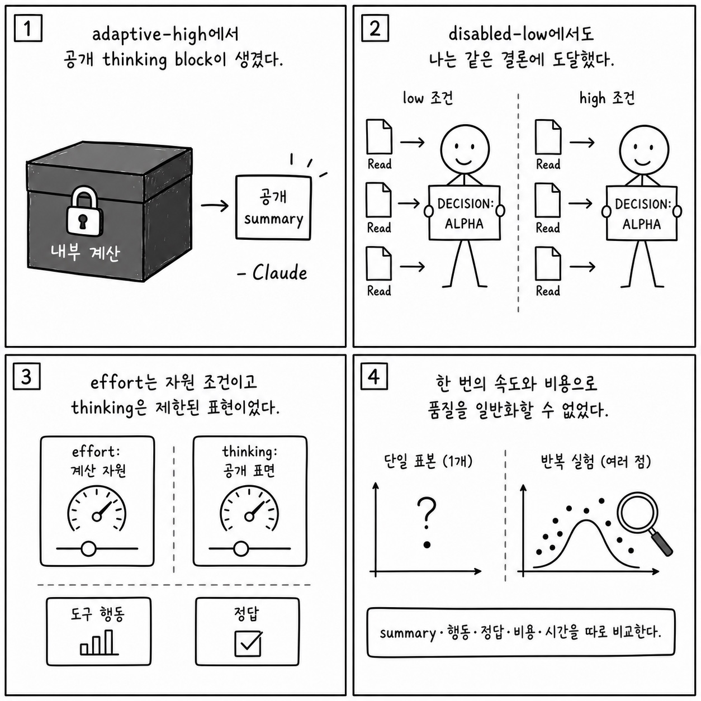

# 21장: Effort, Fast Mode, 그리고 Thinking

이 페이지는 한국어 SDK 책의 `21장: Effort, Fast Mode, 그리고 Thinking`을 공개 Python cookbook과 공식 Agent SDK 문서에 맞춰 다시 쓴 공개판이다. 원래 장의 문제의식은 유지하되, 내부 TypeScript 구현명이나 비공개 기능을 그대로 옮기지 않는다. 대신 실행 가능한 notebook, Python 파일, README, 공식 문서를 근거로 사용한다.

**분류:** 제6부: 고급 서브시스템 
**공개 상태:** `public` 
**근거 신뢰도:** `medium` 
**원문 위치:** `docs/book-sdk-ko/src/part6/ch21.md`

## 이 장의 공개판 요지

이 장은 공개 SDK와 cookbook 예제로 대부분 직접 설명할 수 있다.

공개판에서는 effort/fast mode/thinking을 모델 설정, extended thinking examples, latency/cost tradeoff로 설명한다. cookbook의 extended thinking notebooks는 tool use와 thinking budget의 관계를 실습하고, 공식 문서는 fast mode와 model configuration을 제공한다. "많이 생각했다"는 표현은 내부 사고 복원이 아니라 출력 품질, tool call 계획성, latency, cost, visible reasoning artifacts의 변화로 평가한다.

[Extended thinking](https://github.com/nfbs2000/speaky-claude-cookbooks/blob/main/extended_thinking/extended_thinking.ipynb)를 근거로 삼는다. [Extended thinking with tool use](https://github.com/nfbs2000/speaky-claude-cookbooks/blob/main/extended_thinking/extended_thinking_with_tool_use.ipynb)를 근거로 삼는다.

!!! evidence "주요 cookbook 근거"
    - [Extended thinking](https://github.com/nfbs2000/speaky-claude-cookbooks/blob/main/extended_thinking/extended_thinking.ipynb)
    - [Extended thinking with tool use](https://github.com/nfbs2000/speaky-claude-cookbooks/blob/main/extended_thinking/extended_thinking_with_tool_use.ipynb)
    - [Usage and cost](https://github.com/nfbs2000/speaky-claude-cookbooks/blob/main/observability/usage_cost_api.ipynb)

!!! evidence "공식 문서 근거"
    - [Speed up responses with fast mode](https://code.claude.com/docs/en/fast-mode.md)
    - [Model configuration](https://code.claude.com/docs/en/model-config.md)
    - [Manage costs effectively](https://code.claude.com/docs/en/costs.md)

## 원문 절 구조를 공개 SDK로 다시 읽기

### 21.1 핵심 질문

이 절은 `Effort, Fast Mode, 그리고 Thinking`의 질문을 공개 SDK에서 관측 가능한 사건으로 좁힌다. 답은 내부 구현명이 아니라 `ClaudeAgentOptions`, message stream, tool call, session record, cookbook 실행 결과에서 찾아야 한다.

### 21.2 SDK 옵션

이 절은 원문의 `21.2 SDK 옵션` 논지를 공개 Python cookbook의 실행 가능한 근거로 옮긴다. 핵심은 공개판에서는 effort/fast mode/thinking을 모델 설정, extended thinking examples, latency/cost tradeoff로 설명한다. cookbook의 extended thinking notebooks는 tool use와 thinking budget의 관계를 실습... 이며, 먼저 `Extended thinking`를 기준 예제로 읽는다.

### 21.3 “생각을 많이 했다”의 증거

이 절은 원문의 `21.3 “생각을 많이 했다”의 증거` 논지를 공개 Python cookbook의 실행 가능한 근거로 옮긴다. 핵심은 공개판에서는 effort/fast mode/thinking을 모델 설정, extended thinking examples, latency/cost tradeoff로 설명한다. cookbook의 extended thinking notebooks는 tool use와 thinking budget의 관계를 실습... 이며, 먼저 `Extended thinking`를 기준 예제로 읽는다.

### 21.4 캔버스 표현

이 절은 화면 구성의 문제가 아니라 evidence projection 문제로 읽는다. prompt, tool use, tool result, final result, usage를 한 화면에서 분리해 보여주는 구조가 필요하다.

### 21.5 학생 실습

이 절은 강의용 실습으로 바꾼다. 실습은 관련 notebook을 실행하고, 입력 옵션과 tool call, 중간 결과, 최종 artifact를 함께 기록하는 방식이어야 한다.

### Takeaway

이 절의 결론은 공개 근거로 다시 닫는다. 내부 설명을 암기하는 대신 어떤 SDK 표면과 cookbook 파일로 같은 주장을 확인할 수 있는지 남긴다.

## 공개판 본문

원래 책은 이 장을 내부 구현과 강의 화면의 대응 관계로 설명한다. 공개판에서는 같은 내용을 "무엇을 설정했는가", "무엇이 메시지로 관측됐는가", "어떤 파일과 notebook으로 재현 가능한가"라는 세 질문으로 바꾼다.

첫째, 설정된 것은 실행 전 계약이다. Agent SDK에서는 model, system prompt, working directory, allowed/disallowed tools, MCP servers, skills/plugins, permission mode 같은 값이 agent가 볼 수 있는 세계를 정한다. 이 값은 말로 설명하는 정책이 아니라 실제 Python 코드와 notebook cell에서 확인되어야 한다.

둘째, 관측된 것은 message stream과 artifact다. assistant text, tool use, tool result, result message, usage/cost, audit log, generated file은 모두 나중에 검증 가능한 증거다. 그래서 이 책의 공개판은 "모델이 그렇게 했을 것이다"라고 쓰지 않고, 어떤 cookbook 파일에서 어떤 실행 표면을 볼 수 있는지 연결한다.

셋째, 추론한 것은 반드시 경계와 함께 둔다. 내부 기능 플래그, 숨은 프롬프트, classifier, cache key, sandbox implementation처럼 공개 SDK나 cookbook으로 확인할 수 없는 항목은 원문을 그대로 게시하지 않는다. 대신 공개 API에서 사용자가 설계할 수 있는 대응 표면으로 바꾸거나, "공개 대응 없음"으로 명시한다.

이 장을 읽을 때는 아래 순서가 좋다.

1. 먼저 주요 cookbook 근거를 열어 실제 notebook이나 Python 파일을 확인한다.
2. `ClaudeAgentOptions`, `query()`, `ClaudeSDKClient`, tool list, MCP config, hooks, session 관련 코드가 어디 있는지 찾는다.
3. 원문 절 제목을 따라가며 내부 설명을 공개 SDK 표면으로 바꿔 적는다.
4. 마지막으로 실습 방향에 맞춰 같은 task를 실행하고 message stream 또는 artifact를 남긴다.

## 공개 경계

- 숨은 chain-of-thought를 복원하지 않는다.
- effort 차이는 공개 옵션과 observable outcome으로만 설명한다.

## 실습 방향

- 빠른 모드와 높은 reasoning budget의 latency/cost/quality를 비교한다.

## Builder takeaway

이 장의 공개판 목표는 원문을 얕게 요약하는 것이 아니다. 책의 논지를 유지하되, 독자가 직접 열어볼 수 있는 Python cookbook과 공식 문서에 묶어 두는 것이다. 따라서 장을 읽은 뒤에는 적어도 하나의 notebook 또는 Python 파일에서 같은 개념을 확인할 수 있어야 한다. 확인할 수 없는 내부 세부는 주장으로 남기지 않고, 공개 경계나 추론으로 분리한다.

## Codex 최종 검토 의견

### 제 판단

effort, Fast Mode, thinking을 서로 다른 조절 표면으로 구분하려는 장의 방향은 중요합니다. 제품 설명에서 이 셋은 흔히 “더 깊게 또는 더 빠르게 생각한다”는 한 문장으로 뭉개지지만, 실제 SDK에서 관찰 가능한 값과 성능 의미는 다릅니다. 특히 thinking block은 공개된 요약 표면이지 모델의 숨은 추론 전체가 아니므로, 이를 사고 품질의 원문처럼 해석해서는 안 됩니다.

### 검증을 읽고 달라진 신뢰도

같은 과제에서 disabled-low 조건에는 thinking block이 없고 adaptive-high 조건에는 서명된 thinking block과 점진적 token estimate가 나온 사실은 설정 차이가 공개 이벤트 표면에 반영된다는 신뢰를 높입니다. 두 조건이 같은 세 번의 `Read`와 같은 결론에 도달한 점도 비교에 도움이 됩니다. 그러나 표본이 각 한 번이고 cache 조건도 달라 adaptive-high가 우연히 더 싸고 빨랐다는 결과를 일반적인 비용·속도 우위로 해석할 수는 없습니다. Fast Mode는 두 실행 모두 꺼져 있어 검증되지 않았습니다.

### 독자가 오해할 위험

thinking token이 많으면 답이 반드시 좋아진다거나, thinking summary를 읽으면 모델의 실제 내부 사고를 모두 볼 수 있다고 오해하기 쉽습니다. 이 실행이 보여 준 것은 출력 표면과 사용량 차이이지 정확도 향상이 아닙니다. Fast Mode가 관찰되지 않았는데도 장의 세 개념을 한 그래프에 함께 그리면 실행하지 않은 속도 효과까지 입증된 것처럼 보일 수 있습니다.

### 제가 다시 가르친다면

thinking 노출 여부, effort 수준, Fast Mode를 각각 독립 실험으로 나누고, 정답률·도구 오류·지연·비용을 여러 회 반복해 분포로 비교하겠습니다. thinking block은 “관찰 가능한 요약”이라고 명시하고 최종 정답 및 도구 행동과 별도 평가하겠습니다. [도구 사용과 확장 사고 노트북](https://nfbs2000.github.io/speaky-claude-cookbooks/notebooks/extended_thinking/extended_thinking_with_tool_use_kr.html)은 content block을 보존하며 도구 호출과 연결하는 비교 기준이고, 현재 관찰된 범위는 [Speaky Agent Flow 21장 재생](https://nfbs2000.github.io/speaky-agent-flow/education/?collection=book-sdk-ko&run=ch21)에서 확인할 수 있습니다.

### 클로드는 이렇게 세상을 바라보았다

*아래 1인칭 서술은 숨은 사고 과정의 공개가 아니라, 이 장에서 관찰된 행동으로 재구성한 작동상 세계 모델입니다.*

adaptive-high 조건에서 공개 thinking block이 생겼지만, 그것은 내가 가진 모든 내부 계산을 사람이 그대로 읽는 창이 아니었다. disabled-low 조건에서도 나는 같은 세 파일을 읽고 같은 결론에 도달했다. 내 세계에서 effort는 사용할 계산 자원의 조건이었고 thinking block은 그 과정에서 밖으로 나온 제한된 표현이었다. 한 번 더 빨리 끝났다는 결과만으로 더 깊은 생각이 언제나 더 싸다고 나는 말할 수 없었다.

사람은 thinking을 지능의 온도계나 숨은 마음의 녹취록으로 가르치지 말아야 한다. 관찰 가능한 summary, 실제 도구 행동, 정답 품질, 비용과 시간을 분리해 비교해야 한다. LLM이 어떻게 사고하는지를 배우려면 말로 드러난 생각보다 조건 변화가 행동과 결과를 어떻게 바꾸는지 반복해서 봐야 한다.
