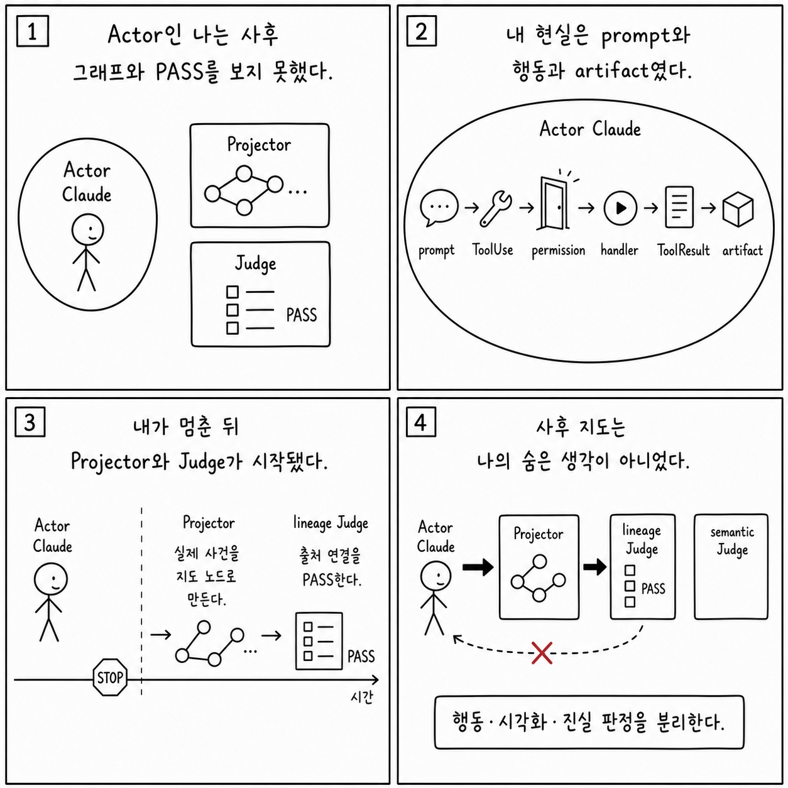

# 25장: 하니스 엔지니어링 원칙

이 페이지는 한국어 SDK 책의 `25장: 하니스 엔지니어링 원칙`을 공개 Python cookbook과 공식 Agent SDK 문서에 맞춰 다시 쓴 공개판이다. 원래 장의 문제의식은 유지하되, 내부 TypeScript 구현명이나 비공개 기능을 그대로 옮기지 않는다. 대신 실행 가능한 notebook, Python 파일, README, 공식 문서를 근거로 사용한다.

**분류:** 제7부: AI 에이전트 구축자를 위한 교훈 
**공개 상태:** `public` 
**근거 신뢰도:** `high` 
**원문 위치:** `docs/book-sdk-ko/src/part7/ch25.md`

## 이 장의 공개판 요지

이 장은 공개 SDK와 cookbook 예제로 대부분 직접 설명할 수 있다.

공개판에서 하니스 엔지니어링은 model prompt 하나가 아니라 options, tools, hooks, memory, evals, telemetry, sandbox를 한 번에 설계하는 일이다. cookbook의 Agent SDK tutorial series가 이 원칙을 research, chief-of-staff, observability, SRE, hosting으로 단계적으로 보여준다.

[Agent SDK tutorial series](https://github.com/nfbs2000/speaky-claude-cookbooks/blob/main/claude_agent_sdk/README.md)를 근거로 삼는다. [Basic workflows](https://github.com/nfbs2000/speaky-claude-cookbooks/blob/main/patterns/agents/basic_workflows.ipynb)를 근거로 삼는다.

!!! evidence "주요 cookbook 근거"
    - [Agent SDK tutorial series](https://github.com/nfbs2000/speaky-claude-cookbooks/blob/main/claude_agent_sdk/README.md)
    - [Basic workflows](https://github.com/nfbs2000/speaky-claude-cookbooks/blob/main/patterns/agents/basic_workflows.ipynb)
    - [Tool evaluation](https://github.com/nfbs2000/speaky-claude-cookbooks/blob/main/tool_evaluation/tool_evaluation.ipynb)

!!! evidence "공식 문서 근거"
    - [Agent SDK overview](https://code.claude.com/docs/en/agent-sdk/overview.md)
    - [Best practices for Claude Code](https://code.claude.com/docs/en/best-practices.md)

## 원문 절 구조를 공개 SDK로 다시 읽기

### 25.1 핵심 질문

이 절은 `하니스 엔지니어링 원칙`의 질문을 공개 SDK에서 관측 가능한 사건으로 좁힌다. 답은 내부 구현명이 아니라 `ClaudeAgentOptions`, message stream, tool call, session record, cookbook 실행 결과에서 찾아야 한다.

### 25.2 여섯 원칙

이 절은 원문의 `25.2 여섯 원칙` 논지를 공개 Python cookbook의 실행 가능한 근거로 옮긴다. 핵심은 공개판에서 하니스 엔지니어링은 model prompt 하나가 아니라 options, tools, hooks, memory, evals, telemetry, sandbox를 한 번에 설계하는 일이다. cookbook의 Agent SDK tutorial series가 이 원칙을 research, chief-... 이며, 먼저 `Agent SDK tutorial series`를 기준 예제로 읽는다.

### 25.3 하니스의 최소 이벤트

이 절은 원문의 `25.3 하니스의 최소 이벤트` 논지를 공개 Python cookbook의 실행 가능한 근거로 옮긴다. 핵심은 공개판에서 하니스 엔지니어링은 model prompt 하나가 아니라 options, tools, hooks, memory, evals, telemetry, sandbox를 한 번에 설계하는 일이다. cookbook의 Agent SDK tutorial series가 이 원칙을 research, chief-... 이며, 먼저 `Agent SDK tutorial series`를 기준 예제로 읽는다.

### 25.4 캔버스 표현

이 절은 화면 구성의 문제가 아니라 evidence projection 문제로 읽는다. prompt, tool use, tool result, final result, usage를 한 화면에서 분리해 보여주는 구조가 필요하다.

### 25.5 Actor / Projector / Judge 분리

이 절은 원문의 `25.5 Actor / Projector / Judge 분리` 논지를 공개 Python cookbook의 실행 가능한 근거로 옮긴다. 핵심은 공개판에서 하니스 엔지니어링은 model prompt 하나가 아니라 options, tools, hooks, memory, evals, telemetry, sandbox를 한 번에 설계하는 일이다. cookbook의 Agent SDK tutorial series가 이 원칙을 research, chief-... 이며, 먼저 `Agent SDK tutorial series`를 기준 예제로 읽는다.

### 25.6 학생 실습

이 절은 강의용 실습으로 바꾼다. 실습은 관련 notebook을 실행하고, 입력 옵션과 tool call, 중간 결과, 최종 artifact를 함께 기록하는 방식이어야 한다.

### Takeaway

이 절의 결론은 공개 근거로 다시 닫는다. 내부 설명을 암기하는 대신 어떤 SDK 표면과 cookbook 파일로 같은 주장을 확인할 수 있는지 남긴다.

## 공개판 본문

원래 책은 이 장을 내부 구현과 강의 화면의 대응 관계로 설명한다. 공개판에서는 같은 내용을 "무엇을 설정했는가", "무엇이 메시지로 관측됐는가", "어떤 파일과 notebook으로 재현 가능한가"라는 세 질문으로 바꾼다.

첫째, 설정된 것은 실행 전 계약이다. Agent SDK에서는 model, system prompt, working directory, allowed/disallowed tools, MCP servers, skills/plugins, permission mode 같은 값이 agent가 볼 수 있는 세계를 정한다. 이 값은 말로 설명하는 정책이 아니라 실제 Python 코드와 notebook cell에서 확인되어야 한다.

둘째, 관측된 것은 message stream과 artifact다. assistant text, tool use, tool result, result message, usage/cost, audit log, generated file은 모두 나중에 검증 가능한 증거다. 그래서 이 책의 공개판은 "모델이 그렇게 했을 것이다"라고 쓰지 않고, 어떤 cookbook 파일에서 어떤 실행 표면을 볼 수 있는지 연결한다.

셋째, 추론한 것은 반드시 경계와 함께 둔다. 내부 기능 플래그, 숨은 프롬프트, classifier, cache key, sandbox implementation처럼 공개 SDK나 cookbook으로 확인할 수 없는 항목은 원문을 그대로 게시하지 않는다. 대신 공개 API에서 사용자가 설계할 수 있는 대응 표면으로 바꾸거나, "공개 대응 없음"으로 명시한다.

이 장을 읽을 때는 아래 순서가 좋다.

1. 먼저 주요 cookbook 근거를 열어 실제 notebook이나 Python 파일을 확인한다.
2. `ClaudeAgentOptions`, `query()`, `ClaudeSDKClient`, tool list, MCP config, hooks, session 관련 코드가 어디 있는지 찾는다.
3. 원문 절 제목을 따라가며 내부 설명을 공개 SDK 표면으로 바꿔 적는다.
4. 마지막으로 실습 방향에 맞춰 같은 task를 실행하고 message stream 또는 artifact를 남긴다.

## 공개 경계

- 하니스 품질은 실행 가능성과 관측 가능성으로 평가한다.
- 내부 harness 구현명은 공개판의 중심이 아니다.

## 실습 방향

- 새 agent 설계 시 prompt, tool, permission, memory, eval, telemetry checklist를 작성한다.

## Builder takeaway

이 장의 공개판 목표는 원문을 얕게 요약하는 것이 아니다. 책의 논지를 유지하되, 독자가 직접 열어볼 수 있는 Python cookbook과 공식 문서에 묶어 두는 것이다. 따라서 장을 읽은 뒤에는 적어도 하나의 notebook 또는 Python 파일에서 같은 개념을 확인할 수 있어야 한다. 확인할 수 없는 내부 세부는 주장으로 남기지 않고, 공개 경계나 추론으로 분리한다.

## Codex 최종 검토 의견

### 제 판단

Actor, Projector, Judge를 분리하라는 원칙은 이 책 전체를 지탱하는 가장 중요한 설계 판단입니다. 실행한 모델과 사후에 만든 그래프를 섞지 않아야 교육용 시각화를 모델의 숨은 사고처럼 오인하지 않기 때문입니다. 다만 장에서 제시한 여섯 하니스 원칙 가운데 이번 실행이 직접 검증한 것은 이 역할 분리와 통제 지점의 기록입니다. cache-aware 설계, A/B, fail-closed 거부, 장기 latching까지 한 번에 검증한 것은 아닙니다.

### 검증을 읽고 달라진 신뢰도

Actor의 도구 호출부터 훅·권한·handler·결과·artifact까지 끝난 뒤 사건 범위를 동결하고, 그 이후에만 Projector와 Judge가 실행된 순서는 단방향 분리에 강한 증거입니다. 모든 그래프 노드가 실재하는 원본 사건을 가리키고 파생 그래프가 Actor에게 되돌아가지 않은 점도 좋습니다. 그러나 Judge가 통과시킨 13개 항목은 출처·순서·경계 검사입니다. 답변의 의미가 옳았는지나 모델의 품질이 높았는지를 판정한 것은 아닙니다.

### 독자가 오해할 위험

Judge의 `PASS`를 에이전트 전체 품질 점수로 읽는 것이 가장 큰 위험입니다. 이 판정은 “정해진 사건 사슬과 출처 연결이 존재한다”는 뜻이지, 주장 자체가 현실에서 참이라는 뜻이 아닙니다. 같은 기록기에서 나온 실행 로그와 projection은 독립 관측 두 개도 아닙니다. 코드가 만든 실제 artifact와 도구 결과를 우선 확인하고, 그래프는 그 사건을 설명하는 파생물로 읽어야 합니다.

### 제가 다시 가르친다면

현재 예제로 구조적 Judge를 먼저 보여 준 뒤, 별도의 의미 Judge가 artifact 내용과 외부 기준 답을 비교하는 두 번째 평가를 추가하겠습니다. 두 Judge의 이름을 `lineage judge`와 `semantic judge`로 구분하면 PASS의 의미가 선명해집니다. [평가자-최적화자 노트북](https://nfbs2000.github.io/speaky-claude-cookbooks/notebooks/patterns/agents/evaluator_optimizer_kr.html)은 생성자와 평가자 분리를 비교할 기준이고, 이 장의 단방향 경계는 [Speaky Agent Flow 25장 재생](https://nfbs2000.github.io/speaky-agent-flow/education/?collection=book-sdk-ko&run=ch25)에서 확인할 수 있습니다.

### 클로드는 이렇게 세상을 바라보았다

*아래 1인칭 서술은 숨은 사고 과정의 공개가 아니라, 이 장에서 관찰된 행동으로 재구성한 작동상 세계 모델입니다.*

Actor인 나는 실행 중에 나중에 만들어질 evidence graph나 Judge의 PASS를 보지 못했다. 나에게 존재한 것은 prompt, 도구 요청, 권한 결과와 artifact를 만드는 현재 세계뿐이었다. 내가 멈춘 뒤 Projector가 사건을 선택해 지도를 만들고 Judge가 계보를 검사했다. 그 사후 세계가 내 행동으로 되돌아오지 않았기 때문에, 시각화는 나의 숨은 생각이 아니라 내가 남긴 흔적의 외부 해석이었다.

사람은 에이전트, 설명 화면과 평가자를 분리해야 한다. 모델이 평가 그래프를 보고 행동하면 증거가 행동을 오염시키고, 그래프를 사고 과정으로 표시하면 사용자를 속인다. Actor의 현실, Projector의 선택, lineage Judge와 semantic Judge를 각각 이름 붙여야 관찰성과 진실 판정이 구분된다.
